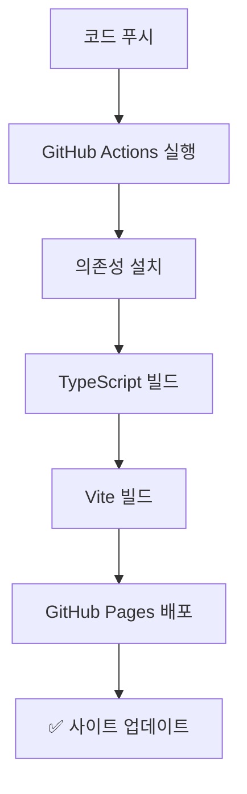

# 🚀 배포 가이드

## GitHub Pages 자동 배포 (추천)

### 1️⃣ **GitHub 저장소 생성**

1. [GitHub](https://github.com)에서 새 저장소 생성
2. 저장소 이름: `project-management-dashboard` (또는 원하는 이름)
3. **Public**으로 설정 (GitHub Pages 무료 사용)
4. README 파일 생성하지 않음

### 2️⃣ **코드 업로드**

```bash
# 현재 디렉토리에서 Git 초기화
git init

# 원격 저장소 연결 (your-username을 실제 GitHub 사용자명으로 변경)
git remote add origin https://github.com/your-username/project-management-dashboard.git

# 모든 파일 추가
git add .

# 커밋
git commit -m "🎉 Initial commit: Project Management Dashboard"

# main 브랜치로 푸시
git branch -M main
git push -u origin main
```

### 3️⃣ **GitHub Pages 활성화**

1. GitHub 저장소 페이지로 이동
2. **Settings** 탭 클릭
3. 왼쪽 메뉴에서 **Pages** 클릭
4. **Source** 섹션에서 "**GitHub Actions**" 선택
5. 저장하면 자동으로 배포가 시작됩니다! 🎉

### 4️⃣ **배포 확인**

- **Actions** 탭에서 배포 진행상황 확인
- 배포 완료 후 접속: `https://your-username.github.io/project-management-dashboard/`

---

## 🔧 문제 해결

### **빌드 실패 시**
```bash
# 로컬에서 빌드 테스트
npm install
npm run build

# TypeScript 에러 확인
npm run type-check
```

### **404 에러 발생 시**
- `public/404.html` 파일이 있는지 확인
- GitHub Pages 설정에서 Source가 "GitHub Actions"인지 확인

### **Assets 로딩 실패 시**
- `vite.config.ts`에서 base path 설정 확인
- 저장소 이름이 올바른지 확인

---

## 📱 배포 후 테스트

### **데스크톱 테스트**
- [ ] 대시보드 정상 로딩
- [ ] 네비게이션 작동
- [ ] 차트 및 데이터 표시
- [ ] 반응형 레이아웃

### **모바일 테스트**
- [ ] iPhone/Android에서 접속
- [ ] 터치 인터페이스 정상 작동
- [ ] 텍스트 가독성 확인
- [ ] 스크롤 및 네비게이션

---

## 🔄 자동 배포 플로우



---

## 🆘 도움이 필요하다면

1. **GitHub Issues**: 버그 리포트 또는 기능 요청
2. **Discussions**: 질문 및 토론
3. **Email**: support@clubschool.com

---

<div align="center">

### 🎉 배포 완료!

이제 전 세계 어디서든 프로젝트 관리 대시보드에 접속할 수 있습니다.

**🔗 Your Site**: `https://your-username.github.io/project-management-dashboard/`

</div>