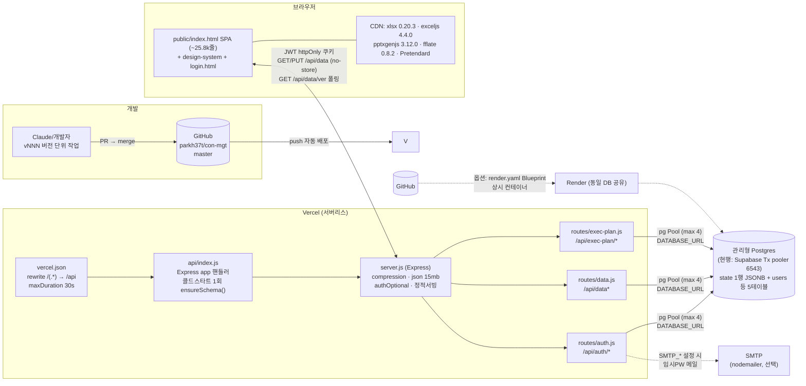

# Converge SaaS — 통합 핸드오프 (전체 포함 · 단일 파일)

> 이 한 파일에 Converge(=con-mgt) SaaS 서비스화 + 창수(Troy) 과제의 **모든 것**이 들어 있습니다.
> 팀 산출물 13종(①~⑬) + **con-mgt 실물 원본 6종(부록 A~G)** 통짜 포함. 다른 환경엔 이 파일 하나만 주면 됩니다.
> ⚠ 부록(con-mgt 원본)에는 실 인프라 서술이 포함됩니다(실이메일은 마스킹). 외부 공유 시 주의.


## 목차

### 팀 산출물 (이어서 일할 컨텍스트)
1. ① 핸드오프 지도(SSOT·완료물·다음 액션)
2. ② 제품 종합안(전략)
3. ③ 패키징 방안(con-mgt 정합·에디션·배포·End-State)
4. ④ Phase 1 멀티테넌트 코어 설계(DDL·settings·RLS)
5. ⑤ Phase 2 온보딩 마법사 화면설계
6. ⑥ 창수 과제 정의서(Global-Ready)
7. ⑦ 창수 킥오프 안내문
8. ⑧ 창수 워크스페이스 안내(README)
9. ⑨ D1 도메인 용어집(한↔영·번역 SSOT)
10. ⑩ D2 i18n 설계서(템플릿)
11. ⑪ D4·D5 i18n 개발 가이드
12. ⑫ D6 AI 활용 플레이북(템플릿)
13. ⑬ D7 경력증빙(템플릿)

### 부록 — con-mgt 실물 원본 (깊은 참조)
- 부록 A · con-mgt README(개요)
- 부록 B · 01 사용자 매뉴얼
- 부록 C · 02 관리자 매뉴얼
- 부록 D · 03 아키텍처
- 부록 E · 04 데이터 구조
- 부록 F · 05 SaaS 전환 설계
- 부록 G · 06 배포·운영 노하우

---


<!-- ==================== ① 핸드오프 지도(SSOT·완료물·다음 액션) ==================== -->


# ① 핸드오프 지도(SSOT·완료물·다음 액션)

> 원본 위치: `PROJECT/Convergence_SaaS/클로드코워크-핸드오프.md`


# 클로드 코워크 핸드오프 — Converge SaaS (과제 #3)

> 이 문서 하나로 다른 환경(클로드 코워크)이 **콜드 스타트로도** 이 과제를 이어받게 한다.
> 규율: `.claude/rules/handoff.md`. 언어 한국어.

## 핸드오프: 컨버전스1팀 세션 → 클로드 코워크

### 무엇을 이어받나
1. **Converge 제품** — 사내 실적관리 도구 **con-mgt**(vanilla JS + Express + PostgreSQL JSONB, v234, 라이브)를 멀티테넌트 SaaS로 서비스화.
2. **창수(Troy) 과제** — "Converge Global-Ready": AI를 페어로 한국형 SaaS를 **영문/글로벌 대응**으로 기획·설계·개발(산출물 D1~D7).

### ⚠ 반드시 알 전제 (혼동 방지)
- 상품화 실제 대상은 **con-mgt**. 이 저장소의 **clubschool(React+localStorage)은 별개 참고 코드**다.
- 앞 종합안의 "M0 버그(`data/mockData.ts`)"는 clubschool 것 → con-mgt엔 해당 없음(con-mgt 선행 리스크는 `01-architecture/Phase1…` §7.3).

### 단일 진실 원천 (SSOT)
- **con-mgt 실물 명세:** `PROJECT/Convergence_SaaS/_source-package/`(01~06 매뉴얼·아키텍처·데이터구조·SaaS전환·배포). 원본 훼손 금지, 읽기 전용.
- **멀티테넌시 계약:** `01-architecture/Phase1-멀티테넌트-코어-설계.md`(tenants DDL·`settings` 키 계약·RLS).
- **온보딩 화면:** `02-planning/Phase2-온보딩-마법사-화면설계.md`.
- **번역 SSOT:** `_과제운영/창수-워크스페이스/D1_용어집_한영.md`.

### 완료한 것 (파일)
| 영역 | 파일 |
| --- | --- |
| 전략 | `00-strategy/00_종합안.md`, `01_패키징-방안.md`(§10 End-State) |
| 아키텍처 | `01-architecture/Phase1-멀티테넌트-코어-설계.md` |
| 기획 | `02-planning/Phase2-온보딩-마법사-화면설계.md` |
| 과제/경력 | `_과제운영/과제정의서…`, `킥오프_안내_창수.md`, `창수-워크스페이스/`(D1 시드·D2·D4-5·D6·경력증빙) |
| 보고 | `DELIVERABLES/Convergence_SaaS/00_보고/`(경영 PPTX·실무 DOCX·1pager) |

### 코워크에서 이어서 할 일 (택1)
- **Troy 과제 실행:** `창수-워크스페이스/README.md`대로 D1(용어집 ⚠12개 검수)→D2→D4-5→D6. AI 초안→창수 검수→팀 리뷰.
- **제품 개발 착수:** `Phase1…` §7·§8대로 tenants/RLS/settings 구현(단, con-mgt 실저장소 필요).

### 미해결 / 리스크
- con-mgt 실저장소는 이 세션·저장소에 없음 → 실제 코드 구현은 저장소 연결 필요(i18n 슬라이스는 자체완결 HTML로 우회 가능).
- 결정 대기: 격리 방식·요금·slug 정책·통화 표기(환산 vs 표기)·언어 범위.
- 대외비: `_source-package/`는 실 인프라 서술 포함(실이메일은 마스킹됨). 외부 공유 시 주의.

### 다음 단계 권장 (우선순위)
1. Troy가 D1 용어집 ⚠12개 검수 커밋(`troyk0725@gmail.com`).
2. D2 i18n 설계(통화/날짜/언어전환) → D4 슬라이스 개발.
3. 병행: 경영 결정 회수(§8 목록).

### 영향받는 파일/타입
- (con-mgt) `db.js`·`middleware/auth.js`·`routes/data.js`·`seed.js`·`public/index.html`(i18n·하드코딩)·`utils/mailer.js`.
- (계약) `tenants.settings` 키(§2 Phase1) · D1 용어집(번역 값).

---

## 코워크로 전달하는 방법 (택1)
1. **GitHub 연결(권장):** 저장소 `parkh37t/clubschool` · 브랜치 `claude/wizardly-cray-7zbhom` · **PR #9**. 코워크가 GitHub 연결을 지원하면 이 브랜치를 붙이면 전체가 그대로 온다.
2. **폴더 zip 업로드:** `PROJECT/Convergence_SaaS/` 통째 zip(자체완결)을 코워크 프로젝트에 업로드. (별도 전달)
3. **이 문서만 붙여넣기:** 최소 컨텍스트만 필요하면 본 `클로드코워크-핸드오프.md` 하나를 붙여넣어도 시작 가능.


---


<!-- ==================== ② 제품 종합안(전략) ==================== -->


# ② 제품 종합안(전략)

> 원본 위치: `PROJECT/Convergence_SaaS/00-strategy/00_종합안.md`


# Convergence SaaS — 제품 기획 종합안 (Executive)

> 컨버전스 SaaS(과제 #3) · 팀 워크플로우 산출

# Convergence SaaS 제품 기획 종합안 (Executive Summary + 통합 플랜)

> 대상: 경영진 의사결정용 · 제품명 가칭 **Converge** · 기준일 2026-07-07
> 근거: 현황 매핑(A/B) + 6개 설계(멀티테넌시·온보딩·AI·전략·GTM·보안)

---

## 1. 한 줄 요약

**"엑셀로 흩어진 인력 가동률·맨먼스·유휴비용을 여러 회사가 각자의 데이터로 5분 만에 보고, AI가 다음 투입 결정까지 도와주는 한국형 Lite PSA SaaS"** — 이미 실조직(56명)에서 검증된 계산 엔진을 멀티테넌트로 전환해 2개 분기 내 파일럿 5~10개 확보를 목표로 한다.

---

## 2. 비전 / 해결 문제

**비전:** 사람의 시간을 팔아 매출을 내는 프로젝트 조직이, 인력 가동을 실시간으로 가시화하고 투입 의사결정을 근거 기반으로 빠르게 내리게 한다.

**해결 문제 (3대 손실):**
1. **유휴/과투입 비가시성** — 누가 벤치이고 누가 초과투입인지 월말에야 안다 → 유휴 인건비가 마진을 깎는다.
2. **느린 투입 의사결정** — 가동률·맨먼스 여력·단가가 흩어져 "일단 되는 사람"으로 배정된다.
3. **재무와 단절된 가동률** — 가동률(%)이 유휴비용·매출기여로 환산되지 않아 경영 언어로 보고되지 못한다.

**핵심 Aha:** "우리 팀이 지금 낭비하는 유휴비용이 월 ○○○만원"을 처음 **금액으로** 봤을 때.

---

## 3. 타깃 ICP

| 축 | 1차 타깃 (Beachhead) |
| --- | --- |
| 업종 | 디지털 에이전시 → SI/SM 개발사 → 컨설팅/리서치 대행 → 사내 PMO |
| 규모 | **20~200명 (스윗스팟 30~120명)** — 엑셀은 한계, 해외 PSA는 과함 = 빈 시장 |
| 구조 | 본부/그룹 2~3단계, 목표 가동률(예: 90%)을 관리하는 관리자 존재 |
| 챔피언 / 바이어 | PM·PMO·사업관리팀장 / 본부장·COO·대표 |
| 구매 트리거 | 50명 넘어 엑셀 붕괴 · 경영진의 가동률 보고 요구 · 신규 수주 투입 시뮬 필요 |
| Anti-ICP | 프리랜서, 빌러블 없는 상시운영·제조/유통, 5명 이하, 이미 Kantata급 보유 대기업 |

---

## 4. 제품 개요 (멀티테넌트 + 기준데이터 온보딩 + AI)

세 기둥으로 구성된다.

- **① 멀티테넌트 코어** — 한 브라우저 단일 도구를, 다수 회사가 격리된 데이터로 쓰는 B2B SaaS로 전환. 재사용 자산(도메인 타입 20여 종, 맨먼스↔가동률↔유휴비용 계산 규칙, `useDataStore` 단일 진입점, shadcn UI, 승인 워크플로우)을 그대로 살리고 `tenantId`·인증·서버만 신설한다.
- **② 기준데이터 온보딩** — 하드코딩(그룹 5종·근무일 22·8h·70,000원·목표 90%)을 **테넌트가 CRUD하는 마스터 데이터**로 승격. 회사 → 조직/그룹 → 구성원(CSV/수기/샘플) → 요율·근무캘린더 4단계 위저드로 "빈 화면에서 첫 대시보드까지" TTV를 최소화한다.
- **③ AI 레이어** — Claude가 핵심 가치가 되는 자연어 질의·자동 브리핑을 얹되, **재무 수치는 앱이 결정론적으로 계산하고 Claude는 서사·추론·추천만** 담당(환각 구조적 차단).

**차별화 3축:** 한국형 맨먼스 네이티브 · 가동률의 유휴비용(금액) 환산 · 5분 셋업(해외 PSA 대비 마찰 1/10).

---

## 5. MVP 범위

**목표:** "한 회사가 스스로 가입 → 조직 세팅 → 가동률·유휴비용 대시보드 도달"을 도움 없이 완주.

**포함 (In-Scope)**

| # | 범위 | 왜 MVP인가 |
| --- | --- | --- |
| **M0** | **정합성 버그 선(先)수정** — 파생계산이 모듈 상수(`mockMembers`/`mockMemberManmonths`)를 직접 참조하는 버그를 인자 주입으로 전환 | **협상 불가 선행조건.** 안 고치면 편집해도 가동률·비용이 목데이터로 고정 → 재무 신뢰 붕괴 |
| M1 | 멀티테넌시 최소 — 전 엔티티 `tenantId`, 단일 DB + RLS 격리 | SaaS 전제 |
| M2 | 인증 + 최소 RBAC(관리자/편집자/뷰어), 신원 주입 | 격리·승인·과금 기반 |
| M3 | 온보딩 위저드 — 조직/그룹→멤버(CSV+수기)→캘린더/목표 | TTV 핵심 |
| M4 | 대시보드 + 가동률/유휴비용(파생계산 서버 이전) | 핵심 가치(Aha) |
| M5 | 인력·프로젝트·투입 CRUD + 승인 워크플로우 | 대시보드 채우는 실데이터 경로 |
| M6 | **AI 1종 — 유휴 인력 → 적합 프로젝트 배정 추천** | 차별화 데모 + 온보딩 직후 "다음 액션" |

**제외 (v1+ 연기):** 결제 자동화(파일럿 무료), 화이트라벨, 3단계+ 조직 계층, SSO/SAML·감사로그 심화, 대량 마이그레이션 도구(CSV로 대체), 서버 사전집계, 네이티브 앱, 다통화/다국어.

---

## 6. 아키텍처 요지 (격리 · 인증 · 데이터계층)

**최종 권고 한 줄:** *Vercel(프론트) + Supabase Seoul(공유 Postgres + Auth + RLS)로, `tenant_id` row-level 격리와 Owner/Admin/Editor/Viewer RBAC를 깔고, `useDataStore`를 `DataSource` 추상화로 감싸 파생계산을 서버로 이전, 시트 기반 미터링으로 과금하되 엔터프라이즈는 전용 DB로 승격하는 하이브리드.*

- **격리:** 공유 DB + row-level `tenant_id` + **Postgres RLS**(DB가 최종 방어선) + 앱 계층 tenant-scoped repository(2중 방어). 클라이언트는 `tenant_id`를 절대 전송하지 않고 서버가 JWT에서 도출. 규제 고객만 전용 DB로 승격(에스케이프 해치). 소데이터·다수테넌트·소규모운영 조건에서 비용/운영이 압도적 유리.
- **인증/인가:** Supabase Auth(이메일/매직링크 + Google·**Kakao**, 엔터프라이즈 SSO). **시스템 역할(Owner/Admin/Editor/Viewer)을 직무(`Member.role`)와 분리.** 승인 워크플로우(draft→review→approved)를 실 권한과 결합. `createdBy`/`reviewerId`/`approvedBy`는 인증 신원에서 서버 주입(현 하드코딩 제거). 요율·유휴비용은 **필드레벨 권한**으로 뷰어에게 마스킹.
- **데이터계층:** `useDataStore` 시그니처 유지 + 내부를 `DataSource` 인터페이스로 교체(LocalStorage→ApiDataSource, 플래그 전환·즉시 롤백). 파생계산(맨먼스·비용·집계)은 **서버(SQL 뷰/RPC)로 이전** — 일관성·감사가능성·성능·단가 보호 4가지 이유. 계산 파라미터(근무일·시간·단가)는 테넌트 설정에서 주입.
- **보안 P0:** 요율·개인정보 클라이언트 평문 저장 제거, `importData(any)` 스키마 검증화(zod), TLS 전구간, 감사로그(append-only), PIPA 대응.

---

## 7. AI 로드맵 (MVP AI → 차기)

**정직성 원칙:** Claude를 빼도 성립하면 "AI 장식". 진짜 코어는 자연어·서사이고, 재무 숫자는 앱이 계산한다.

**MVP AI (현재 데이터로 즉시 가능 · Claude 대체불가):**
- **F5 자동 주간/월간 인사이트 브리핑** (난이도 낮음, 1순위) — 앱이 지표 델타 계산 → Claude가 핵심변화 3·리스크 2·액션 3 서술. 리텐션 훅.
- **F4 자연어 질의 → 리포트/차트** (난이도 중간, 2순위) — 질문 → Claude가 쿼리 스펙(JSON) 생성 → 앱의 결정론 집계기 실행 → Recharts + 해설. SaaS 차별화 핵심.
- **F3 유휴·과부하 이상탐지 경보** — 규칙/통계 코어 + Claude 우선순위화. F5 브리핑의 리스크 섹션 공급(번들).
- (전략서의 M6 배정추천은 F2로, MVP에서 규칙 기반으로 데모 제공)

**차기 1 (결정론 엔진 + Claude 서술):** F8 비용 최적화 시뮬(what-if), F2 인력 최적 배치 추천.

**차기 2~3 (ML/통계 + Claude, 기간 스냅샷 모델 선행):** F6 프로젝트 리스크/지연 예측, F1 가동률·수요 예측, F7 채용·외주 의사결정 보조. **시계열 이력이 없어** 월별 스냅샷 모델(YYYY-MM 기준월)이 6~12개월 쌓인 뒤 유의미 → SaaS의 기간 모델 도입과 동일 인프라에 묶는다.

**전제:** Claude API 키는 클라이언트에 둘 수 없음 → 최소 서버 프록시(Edge Function)가 F4/F5의 조건. 즉 AI MVP는 백엔드 착수와 자연스럽게 합류한다.

---

## 8. GTM / 가격 요지

- **포지셔닝:** "빌러블 팀을 위한, 가볍고 한국형인 가동률·리소스 대시보드(Lite PSA)."
- **과금 축:** Seat(관리 대상 구성원) × 티어. 뷰어는 무료(바이럴 확장).
- **가격표(연납):** Free(10명, 3개월 이력) → **Pro ₩9,900/명·월** → **Business ₩19,000/명·월** → Enterprise 견적. **Converge AI 애드온 +₩4,000/명·월**(또는 테넌트 정액). 프리미엄 + Business 14일 무카드 트라이얼 하이브리드.
- **PLG:** 5분 TTV(첫 대시보드)·10분 유휴비용 각성. 페이월은 인원(11번째)·이력(3개월 초과)·유휴비용 클릭·승인·권한 지점에 배치.
- **획득 채널(0→1):** ① 엑셀 템플릿 리드마그넷 + SEO("가동률 관리 엑셀", "맨먼스 계산법"), ② 디스콰이엇/제품헌트·커뮤니티 런칭, ③ "유휴비용 30분 진단" 아웃바운드(본부장·PMO).
- **랜딩 헤드라인:** "우리 팀이 지금 얼마나 놀고 있는지, 5분 만에 금액으로 봅니다."
- **정직성 게이트:** SSO·RBAC·API·AI는 로드맵 기능 → 랜딩/가격표에 출시/베타 배지, 미구현 가치 확정 약속 금지. 고객 로고·수치는 파일럿 확보 후 교체.

---

## 9. 단계 로드맵 (분기별)

의존성 순서: **M0 버그수정 → 테넌시/인증 → API/DB → 온보딩/대시보드 → AI**. `useDataStore` 시그니처 유지 전략으로 화면 코드 변경 최소화.

**MVP — 2026 Q3~Q4 (파일럿 5~10개 테넌트)**
- **Q3:** M0(정합성 버그) → M1(테넌시·`tenantId`·RLS) → Supabase+Postgres 구축, `useDataStore` 내부 API 교체 → M2(인증+최소 RBAC). 보안 P0(평문저장 제거·import 검증·TLS) 동반.
- **Q4:** M3(온보딩 위저드) → M4(대시보드·유휴비용, 파생계산 서버 이전) → M5(CRUD·승인) → M6(AI 배정추천) + **F5 브리핑**. 기존 localStorage 데이터를 첫 테넌트로 import. 파일럿 온보딩·인터뷰.
- **게이트:** type-check/lint(--max-warnings 0)/build 통과 + 테넌트 격리 자동 테스트(A토큰으로 B 데이터 0건).

**v1 — 2027 Q1~Q2 (상용화, 유료 30개 테넌트)**
- **Q1:** 결제/구독(Stripe/Paddle·좌석 과금), 온보딩 개선(TTV 15분), 서버 사전집계·성능, 유휴/과투입 임계 알림.
- **Q2:** AI 2종째(**F4 자연어 질의** 정식화 + 월별 가동률 예측 착수), 경영보고 PDF/월마감, **기간(period) 모델 정식화**(YYYY-MM·월 마감 lock) → 예측군 인프라 확보.

**v2 — 2027 Q3~Q4 (스케일·엔터프라이즈)**
- **Q3:** 다본부/다지사 가변 계층, 화이트라벨, SSO/SAML·감사로그 심화, 전용 DB 에스케이프 해치.
- **Q4:** 원가/정산·급여 시스템 연동, AI 3종(자동 리밸런싱·수요예측·채용/외주 보조), 다통화/국제화, 오픈 API·웹훅.

---

## 10. 핵심 리스크 · 가정

| # | 가정(검증 대상) | 리스크 | 완화책 |
| --- | --- | --- | --- |
| A1 | 30~200명 조직이 "가동률→유휴비용 자동화"에 **월 단위로 지불**한다 | PMF 실패(페인은 있으나 지불의사 약함) | 파일럿에서 지불의사·ARPA를 v1 전 검증, ROI 케이스화 |
| A2 | 온보딩을 **30분 내 스스로 완주** | 셋업 무거워 이탈 → TTV 실패 | CSV 임포트·샘플/데모·기본 프리셋, 완주율 60% 게이트 |
| **A3** | **데이터 정합성이 재무 신뢰의 전제** | **M0 버그·clamp가 초과투입/비용오차를 가림 → 숫자 불신 시 즉시 이탈** | **M0 선수정 필수**, 계산을 서버 단일 진실로, 초과투입 검증 서버 규칙화 |
| A4 | 단일 DB+RLS로 테넌트 격리 충분 | 격리 결함 = 타사 데이터 노출(치명적·법적) | 전 쿼리 tenant 스코프 강제 + 격리 자동 테스트 |
| A5 | 단가·비용 다루므로 권한 분리가 판매 조건 | 뷰어가 민감정보 열람 | 최소 RBAC + 필드레벨 마스킹을 MVP에 포함 |
| A6 | AI 배정추천이 실제 채택될 만큼 유용 | 추천이 뻔하거나 틀림 | 규칙 기반 시작, 채택률 20% 관찰, "제안일 뿐 결정은 사람" |
| A7 | 목데이터 비결정성(Math.random) 제거 가능 | 재현 불가·QA 저하 | 결정론적 시드로 대체 |

**PO/경영 결정 필요(가정 금지):** ① 격리 방식(단일 DB+RLS 권고 vs 스키마/DB 분리) ② 요금 모델(좌석당 vs 정액 vs 구간제) ③ 조직 계층 깊이(2~3단계 고정 권고 vs 가변) ④ 기존 localStorage 사용자 이관 범위 ⑤ 컴플라이언스 목표(ISMS-P/SOC2 시점) ⑥ 교차테넌트 벤치마킹 상품화 여부(공유 DB 선택 강화).

---

## 11. 즉시 다음 액션 (착수 순서)

1. **[블로커] M0 정합성 버그 수정** — `data/mockData.ts`의 파생계산 함수(`calculateUtilizationData`/`getGroupSummary` 등) 모듈 상수 참조를 인자 주입 순수함수로 전환, `Math.random` 시드 제거. 모든 후속(실데이터·AI·서버계산)의 전제.
2. **타입 계약 확정** — `types/index.ts`에 `Tenant/User/Membership/Role`·전 엔티티 `tenantId`·`updatedAt` 추가(미사용 상태로 먼저). API 계약 단일 원천 확정.
3. **`DataSource` 추상화 도입** — `useDataStore` 리팩터(시그니처 유지, LocalStorage 구현 이관). 순수 리팩터로 사용자 무영향.
4. **경영 결정 4건 회수** — 격리 방식·요금 모델·조직 계층·기존 데이터 이관 → GTM/아키텍처 확정에 필요(위 미해결 항목).
5. **인프라 셋업** — Supabase 프로젝트(Seoul, ap-northeast-2) 생성, `tenant_id`+RLS 스키마 초안, 배포 일원화(Vercel 단일, GitHub Pages 스크립트 정리).
6. **파일럿 3~5개사 사전 접촉** — "유휴비용 진단" 훅으로 지불의사·ARPA 인터뷰 시작(A1 검증), 엑셀 템플릿 리드마그넷 제작.
7. **화면 정의 인계** — 온보딩 위저드 4단계·테넌트/권한 설정·AI 배정추천 UX를 `VIEW_NAMES`→`ViewRenderer`→네비 절차로 구체화(service-planning).

**영향 핵심 파일:** `types/index.ts`(계약) · `hooks/useDataStore.ts`(단일 진입점) · `data/mockData.ts`(계산 인자화·랜덤 제거) · `constants/views.ts`+`components/ViewRenderer.tsx`(온보딩/설정 뷰) · `components/ProjectReview.tsx`(승인 신원 결합).


---


<!-- ==================== ③ 패키징 방안(con-mgt 정합·에디션·배포·End-State) ==================== -->


# ③ 패키징 방안(con-mgt 정합·에디션·배포·End-State)

> 원본 위치: `PROJECT/Convergence_SaaS/00-strategy/01_패키징-방안.md`


# 컨버전스 SaaS — 패키징 방안 (con-mgt 실제 코드베이스 기준)

> 입력: 사용자 업로드 `ClubSchool_SaaS_Package_20260707.zip`(6개 문서 + 스크린샷 22장) = **현재 SaaS 대상 실물 모델**.
> 원본 편입: `PROJECT/Convergence_SaaS/_source-package/`(01~06 + README). 기준 코드: con-mgt master **v234**(회귀 188/188).
> 목적: "이 실물 모델을 어떻게 상품으로 패키징할 것인가"를 산출물·제품·배포·온보딩·로드맵 5층위로 정리.

---

## 0. ⚠ 선행 정합: 대상 코드베이스 정정 (가장 중요)

두 코드베이스가 혼재해 있었습니다. **상품화 대상은 con-mgt**이며, 앞선 종합안이 분석한 clubschool은 별개입니다.

| 구분 | **con-mgt** (실제 SaaS 대상) | clubschool (이 저장소) |
| --- | --- | --- |
| 정체 | 라이브 운영 중 손익관리 대시보드 (con-mgt-ruddy.vercel.app) | React 실적관리 대시보드(참고/실험) |
| 프론트 | **vanilla JS SPA** `public/index.html` ~26,000줄 | React 18 + TS + Vite |
| 백엔드 | **Node.js + Express** (`server.js`·`routes/*`·`middleware/*`) | 없음(프론트 전용) |
| 저장 | **PostgreSQL — `state.payload` JSONB 단일 행** + JWT 인증 | localStorage + `useDataStore` |
| 성숙도 | 승인제 가입·28 API·회귀 188개·v234·실운영 | 목데이터 기반 |

**정정 결론**
- 앞 종합안의 **"M0 버그(`data/mockData.ts` 파생계산 모듈상수 참조)"는 clubschool 것** → con-mgt에는 **해당 없음**.
- con-mgt의 "상품화 선행조건(정정된 M0급)"은 **다른 세트**입니다(§7). 04 문서 §5.6 근거.
- **여전히 유효한 종합안 결론:** Row-per-Tenant + RLS 격리 · 최소 온보딩 데이터셋 · AI 3티어 · 좌석+조직 과금 · 포지셔닝. (con-mgt의 단일-JSONB-행 구조가 오히려 "행 하나 추가 = 테넌트 추가"로 이 방향을 **더 강하게** 뒷받침.)

> 앞서 만든 경영/실무 보고서(`DELIVERABLES/Convergence_SaaS/00_보고/`)는 전략·시장·가격 골격으로는 유효하나, **기술 근거는 con-mgt 기준으로 개정 필요**(개정판 v2를 별도 산출 권장).

---

## 1. "패키징"의 5개 층위 (이 문서의 골격)

| 층위 | 질문 | 산출 |
| --- | --- | --- |
| A. 산출물 패키징 | 이 실물 모델을 저장소에 어떻게 편입·버전관리하나 | §2 |
| B. 제품(에디션) 패키징 | 무엇을 묶어 파나 (Starter/Pro/Enterprise + AI) | §3 |
| C. 배포 형태 패키징 | 어떻게 전달하나 (SaaS/단일VM/온프레미스) | §4 |
| D. 온보딩 패키징 | 고객이 어떻게 "바로 시작"하나 (5종 데이터·마법사·데모) | §5 |
| E. 전환 로드맵 패키징 | 어떤 순서로 만드나 (Phase 0~4 + 첫 스프린트) | §6·§7 |

---

## 2. A. 산출물 패키징 (저장소 편입 구조)

```
PROJECT/Convergence_SaaS/
├─ _source-package/          ← 업로드 원본 6문서(SSOT). con-mgt 진실 원천.
│   ├─ 01_사용자_매뉴얼.md   02_관리자_매뉴얼.md   03_아키텍처.md
│   ├─ 04_데이터_구조.md     05_SaaS_전환_설계.md   06_배포_운영_노하우.md
│   └─ README.md
├─ 00-strategy/
│   ├─ 00_종합안.md          ← clubschool 기준(전략 골격 유효, 기술 개정 필요)
│   └─ 01_패키징-방안.md     ← (본 문서) con-mgt 기준 통합 패키징
└─ 01-architecture/          ← 멀티테넌시·보안(개정 대상)
```

- **원칙:** `_source-package/`는 **읽기 전용 SSOT**(원본 훼손 금지). 파생 결정은 `00-strategy/`·`01-architecture/`에 기록.
- **스크린샷 22장(9.2MB):** 매뉴얼·데모·영업자료 자산이나 바이너리 비대화를 고려해 **git 미편입(보류)**. 필요 시 `_source-package/screenshots/`로 별도 커밋(승인 후).
- **보고 세트 연결:** 기존 3종(PPTX/DOCX/1pager)은 전략용으로 유지하되, 본 정정을 반영한 **개정판 v2**를 후속 산출.

---

## 3. B. 제품(에디션) 패키징 — 무엇을 묶어 파나

con-mgt가 이미 증명한 **가치 루프**를 에디션으로 계층화 (05 §1·§9, 04 근거):

```
결산 엑셀 업로드 1회 → 월별 손익 자동집계(본부별/통합, 관리·재무 이중뷰)
  → 미래월 예측(계획원가 시뮬) → BEP 캐치업 시나리오(영업·인력·프로젝트 3레버)
  → 인력 가동/유휴 관리 → 보고서 원클릭(경영회의 PPTX 20장 + 트래커 Excel)
```

| 에디션 | 대상 | 묶음(패키지) | 근거 |
| --- | --- | --- | --- |
| **Starter** | 팀 1개·10명·프로젝트 20건 | 코스트/맨파워 대시보드 + 결산 엑셀 업로드 + 기본 보고서 | 05 §9 |
| **Pro** | 본부 N개·50명 | + 12개월 예측 · BEP 시나리오 · 자동 알림 5단계 · 보고서 세트 전체(PPTX 20장+트래커) | 05 §7 Core/Reports |
| **Enterprise** | 대형/규제 | + 온프레미스/전용 DB · SSO(SAML/OIDC) · 브랜드 덱 템플릿 제작 · **LLM 기능** | 05 §9, 06 §4.3 |
| **AI 애드온** | 전 에디션 | LLM 내러티브·이상감지 설명·자연어 질의·임의양식 엑셀 자동매핑 | 05 §7 LLM |

- **핵심 락인 = 보고서.** "시스템이 곧 월간회의 자료를 만든다"가 킬러 기능 → **보고서 생성은 미터링하지 않고 무제한**(과금축은 좌석 + 조직단위 수). (05 §1·§9)
- **AI 3티어 구조**(05 §7): **Core(규칙기반, 완성)** → **Reports(생성, 완성·템플릿 갤러리화만)** → **LLM(확장, Phase 3)**. LLM 데이터 계약: 입력은 payload 요약뷰(실명 옵트인), 출력은 "사람이 승인하는 초안"(현 미리보기→적용 패턴 재사용).

---

## 4. C. 배포 형태 패키징 — 어떻게 전달하나

동일 코드가 **3가지 배포 형태**로 나가도록 패키징(06 문서 근거). `DATABASE_URL`만 바꾸면 격리 강도가 달라지는 것이 이 구조의 강점.

| 형태 | 구성 | 격리 | 대상 |
| --- | --- | --- | --- |
| **SaaS(현행)** | Vercel(서버리스) + 관리형 Postgres(Supabase/Neon/RDS) | 공유 DB + `tenant_id` + **RLS** | Starter·Pro |
| **단일 VM** | Node+PM2+Nginx(TLS)+Postgres | 인스턴스 격리 | 중견 |
| **온프레미스** | Docker Compose(app+postgres+backup) | **DB-per-Tenant / 폐쇄망** | Enterprise·공공 |

**배포 패키징 시 반드시 포함할 것 (06 근거):**
- **환경변수 계약:** `DATABASE_URL`(필수) · `JWT_SECRET`(프로덕션 32자+ 강제) · `NODE_ENV=production` · `ADMIN_INITIAL_PASSWORD`(seed) · 선택 `SMTP_*`·`LOGIN_URL`. → **`ADMIN_INITIAL_EMAIL` 신설**(현재 seed.js에 실계정 이메일 하드코딩 → 제거, 06 §5.1).
- **온프레미스 선행작업(필수):** CDN 4종(xlsx/exceljs/pptxgenjs/fflate) + Pretendard 폰트 **self-host**(폐쇄망 로드 실패 방지, 06 §4.1).
- **백업 패키지:** `state.payload` 1행 JSON 덤프 + `pg_dump -Fc` 일일 백업 컨테이너, **백업 파일 암호화**(손익·실명 포함, 06 §5.2).
- **SSO 연계 포인트 4곳** 사전 문서화(토큰 수용부 `authOptional`·로그인 진입부·프로비저닝·비번 라우트 비활성 — 06 §4.3) → Enterprise 세일즈 자산.

---

## 5. D. 온보딩 패키징 — "기준 데이터만 넣으면 시작"

**최소 입력 5종**(이 이하 불가·이 이상 불요, 05 §5). 완료 시 ①코스트 ②맨파워 ③예측(12개월) ④보고서 4개가 즉시 동작.

| # | 데이터 | 최소 필드 | 입력법 |
| --- | --- | --- | --- |
| 1 | 회사·조직 | 회사명·로고·본부/팀(1+) | 폼 3분 |
| 2 | 관리자 | 관리자 1명(이후 승인제 가입) | 폼 1분 |
| 3 | 프로젝트 | 이름·본부·계약액·기간·단계 | 엑셀/폼 |
| 4 | 인력 | 이름·본부·역할·등급·투입PJ·기간 | 엑셀/폼 |
| 5 | 목표 | 연 매출·영업이익(월 균등 자동) | 폼 2분 |

**온보딩 마법사 5단계**(05 §6) — 3·4단계는 **검증된 결산 업로드 UX 재사용**(미리보기→적용, 인식 0건 차단, 파일명·시트 규칙). 각 단계 건너뛰기 허용 + **데모 테넌트 원클릭 주입**(업로드 패키지의 합성 데이터·스크린샷 데이터셋)으로 "빈 화면 공포" 제거.

> 온보딩 = **하드코딩→settings 추출이 끝나야 성립**(§7). 즉 온보딩 패키징의 실제 선행작업은 Phase 1이다.

---

## 6. E. 전환 로드맵 패키징 (Phase 0~4)

| Phase | 내용 | 규모 | 상태 |
| --- | --- | --- | --- |
| **0. 정리** | 문서·매뉴얼·스키마·배포노하우 패키징 | — | ✅ (본 업로드 = 완료) |
| **1. 멀티테넌트 코어** | tenants/`tenant_id`/RLS · **하드코딩→settings** · 서브도메인 라우팅 | 2~4주 | ← **첫 스프린트** |
| **2. 온보딩 마법사** | 5단계 마법사 + 템플릿 엑셀 2종 + 데모 주입 | 2~3주 | |
| **3. AI 고도화** | LLM 내러티브/질의 · 덱 템플릿 갤러리 · (대형)정규테이블 분리 | 지속 | |
| **4. 상용화** | 과금(플랜/좌석) · 감사로그 · SLA·백업 자동화 · 온프레미스 Docker 패키지 | 지속 | |

---

## 7. 첫 스프린트 (Phase 1) 작업 명세 — 04 §5 하드코딩 추출 목록 = 작업지시서

**목표:** 신규 테넌트 = `tenants` 1행 + `state` 1행 + `users` 1행. "코드 = 공통 로직, settings = 회사가 다른 모든 것".

### 7.1 멀티테넌시 스키마 (05 §3)
```sql
tenants(id, slug, name, plan, created_at, settings JSONB)
users( ... , tenant_id FK)
state(tenant_id PK, payload JSONB)      -- CHECK(id=1) 제거, 테넌트당 1행
pending_signups / password_resets / login_attempts (+ tenant_id)
```
- 모든 쿼리에 `tenant_id` 필터(미들웨어가 JWT tenant claim 강제) + **Postgres RLS 이중 방어**.
- URL: `{slug}.clubschool.io` 서브도메인 → slug→tenant_id 해석.

### 7.2 하드코딩 → tenants.settings 추출 (04 §5, 우선순위)
| 순위 | 카테고리 | 현재 하드코딩 | settings 키(안) |
| --- | --- | --- | --- |
| 1 | 조직 구조 | `DIV_2/DIV_3`(2본부 고정)·`ORG_DEFAULT_*` | `orgUnits[]`(N개 가변, 문자열키→ID키) |
| 1 | 관리자/브랜딩 | seed 이메일·메일 발신자·`LOGIN_URL` | `ADMIN_INITIAL_EMAIL`·`branding{}` |
| 2 | 사업계획 baseline | `SAJEONG_BASELINE`(SG&A 손익에 직접 사용) | `plan.baseline`·`plan.targets`·`plan.laborByUnit` |
| 2 | 프로젝트 매핑 | 업로드 파서 `KMAP`/`KMAP_PB` | 제거 → projects 마스터 이름매칭 + 확인 UI |
| 3 | 인사·단가 | `HQ_PEOPLE_MASTER`·`PEOPLE_SEED`·`STANDARD_RATES` | manpower/standardRates를 SSOT로 승격, 시드 제거 |
| 3 | 고용형태 | `empType==='와일리'` 리터럴 판정 | `empType:'internal'|'external'` 중립코드 |
| 3 | 정적 시드 번들 | `EXEC_FILE_MAP`+`pnl_data.json`·`WOORI_PLAN`·`defaultContractSalesSeed` | 전부 업로드 기반으로, 실명/실계약 시드 제거 |

### 7.3 con-mgt 선행 리스크 (정정된 "M0급" — 상품화 전 필수, 04 §5.6)
1. **`xmin` 동시성 토큰 제거** → 명시적 `version` 컬럼 낙관적 잠금(현재 Postgres 전용 시스템컬럼 의존).
2. **클라이언트 마이그레이션 → 서버 마이그레이션 이관.** 현 `_seedVersion` 블록은 **비단조(non-monotonic) 배치 버그 실재**(상위 버전이 먼저 올려 하위 블록 사문화) — "읽는 클라이언트가 데이터를 변형"하는 구조 자체가 다중테넌트에 부적합.
3. **admin 이메일 하드코딩 제거**(seed.js 실계정 이메일 → `ADMIN_INITIAL_EMAIL` env).
4. (성장 테넌트) **단일 JSONB(10MB 캡) → 도메인 테이블 분해** 및 엑셀 raw base64 → 파일 스토리지. Phase 1에선 유지 가능, Phase 3 분기.
5. **본부 참조-스왑(`_divData`) → division 차원 정규화**(루트 미러 이중표현·참조공유 버그 부채 제거).

> clubschool의 "M0(mockData 파생계산)"과 con-mgt의 이 선행 리스크는 **별개**다. 상품화는 con-mgt 리스크가 기준.

---

## 8. 결정 필요 (팀 권고 · 확정은 경영)

| # | 결정 | 팀 권고 |
| --- | --- | --- |
| 1 | 상품화 베이스 코드 | **con-mgt 확정**(성숙·실운영). clubschool은 참고 종료 or UI 리서치용 분리 |
| 2 | 첫 스프린트 착수 대상 | Phase 1 멀티테넌트 코어(§7.1~7.2) + 선행 리스크 1·3(§7.3) 동반 |
| 3 | 배포 우선 형태 | SaaS(Vercel+RLS) 우선, 온프레미스는 Enterprise 딜 확정 시 |
| 4 | 스크린샷 22장 git 편입 | 보류(비대화) — 데모/영업 자산으로 별도 관리 권장 |
| 5 | 보고서 v2 개정 | con-mgt 기준으로 경영/실무 보고서 기술 근거 개정 |

---

## 9. 즉시 다음 액션 (착수 순서)
1. **결정 1·2 회수** — 베이스 코드 con-mgt 확정, 첫 스프린트 범위 승인.
2. **Phase 1 설계** — `tenants` 스키마 + settings 키 계약 확정(§7.1·7.2), RLS 정책 초안.
3. **선행 리스크 1·3 병행** — `version` 컬럼 전환 + admin 이메일 env화(작고 안전, 즉시).
4. **온보딩 데이터 계약** — 5종 최소 데이터셋 스키마 + 엑셀 템플릿 2종(프로젝트·인력) 확정.
5. **보고서 v2** — 본 정정 반영 경영/실무 보고서 개정판.

**영향 핵심 파일(con-mgt):** `db.js`(SCHEMA/PATCH·풀) · `middleware/auth.js`(JWT·tenant claim·RLS) · `routes/data.js`(xmin→version·tenant 필터) · `public/index.html`(하드코딩 상수·클라 마이그레이션) · `seed.js`(admin 이메일 env) · `utils/mailer.js`(브랜딩).

---

## 10. SaaS 최종 형태 (End-State) — 이렇게 바뀐다

패키징이 끝나면 con-mgt는 "**한 회사 전용 도구**"에서 "**여러 회사가 스스로 가입해 쓰는 멀티테넌트 제품**"으로 형태가 바뀝니다. 전환 전/후 대조:

| 축 | 현재 con-mgt (단일 조직) | SaaS 형태 (전환 후) |
| --- | --- | --- |
| **테넌시** | `state.id=1` 고정, 한 회사 데이터가 JSONB 1행 | `tenants` 테이블 + `state(tenant_id PK)` 테넌트당 1행. **신규 회사 = 3테이블 각 1행** |
| **조직 분리** | payload 내부 `_divData` 객체 스왑(본부 2개 고정) | 테넌트 하위 `orgUnits[]` N개 가변(division 차원 정규화) |
| **격리** | 없음(단일) | JWT `tenant` claim 미들웨어 강제 + **Postgres RLS** 이중 방어 |
| **진입** | 관리자 시드 계정 1개 | `{slug}.clubschool.io` 서브도메인 · **셀프서브 가입** + 승인제 |
| **회사 고유값** | 코드에 하드코딩(본부·단가·사업계획·브랜드) | **`tenants.settings`(JSONB)** — 온보딩에서 입력·수정 |
| **온보딩** | 개발자 시드 | **최소 5종 데이터 + 5단계 마법사**(데모 원클릭 주입) → 5분 셋업 |
| **동시성** | Postgres `xmin` 시스템컬럼 | 명시적 `version` 컬럼 낙관적 잠금 |
| **마이그레이션** | 클라이언트가 payload 변형(비단조 버그) | 서버 순차 마이그레이션(단조 증가) |
| **배포** | Vercel + 관리형 Postgres 1개 | 동일 코드가 **① SaaS(공유DB+RLS) ② 단일VM ③ 온프레미스 Docker(DB-per-Tenant)** |
| **상품 구성** | 무료 사내 도구 | **Starter / Pro / Enterprise + AI 애드온**, 좌석+조직단위 과금(보고서 무제한) |
| **AI** | Core(규칙)·Reports(생성) 내장 | + **LLM 티어**(내러티브·자연어질의·이상감지·엑셀 자동매핑, 사람 승인 초안) |

**전환 후 신규 고객의 Day-1 흐름 (셀프서브):**
```
회사 가입({slug}.clubschool.io)  →  온보딩 마법사 5단계
  STEP1 회사·조직(로고·본부)   → tenants + settings 생성
  STEP2 목표(연 매출/영업이익)  → plan (월 균등 자동)
  STEP3 프로젝트(엑셀/폼)        ┐ 검증된 결산 업로드 UX 재사용
  STEP4 인력(엑셀/폼)            ┘ (미리보기→적용, 인식 0건 차단)
  STEP5 확인 → "시작하기"
        ↓  (5종 데이터 입력 완료 시점)
  ✅ 코스트 대시보드 · ✅ 맨파워(가동/유휴) · ✅ 12개월 예측 · ✅ 보고서 다운로드  즉시 동작
```

**한 줄 형태 정의:** *동일 코드베이스 위에서 `tenant_id`+RLS로 회사를 격리하고, 회사가 다른 모든 것을 `settings`로 뽑아, 5종 데이터만 넣으면 5분 안에 대시보드·예측·보고서가 도는 — 셀프서브 멀티테넌트 + 온프레미스 겸용 SaaS.*

> 이 형태에 도달하는 **최소 임계점 = Phase 1**(§7). Phase 1이 끝나면 "신규 회사 추가"가 코드 변경 없이 데이터 추가만으로 가능해지고, Phase 2(온보딩)가 셀프서브를, Phase 3(AI)·4(과금)가 상품 완성을 얹는다.


---


<!-- ==================== ④ Phase 1 멀티테넌트 코어 설계(DDL·settings·RLS) ==================== -->


# ④ Phase 1 멀티테넌트 코어 설계(DDL·settings·RLS)

> 원본 위치: `PROJECT/Convergence_SaaS/01-architecture/Phase1-멀티테넌트-코어-설계.md`


# Phase 1 — 멀티테넌트 코어 상세 설계 (con-mgt 기준 착수 문서)

> 대상: 백엔드/DB 구현팀. 근거: `_source-package/04_데이터_구조.md`(현 DDL·payload), `05_SaaS_전환_설계.md`(§3·§4), `06_배포_운영_노하우.md`(§1·§5). 상위: `00-strategy/01_패키징-방안.md` §7·§10.
> 목표 한 줄: **신규 회사 = `tenants` 1행 + `state` 1행 + `users` 1행**. "코드=공통 로직, `settings`=회사가 다른 모든 것."

---

## 0. 범위 (In / Out)

**In (Phase 1):**
- 스키마: `tenants` 신설 · 전 테이블 `tenant_id` · `state` 단일행(id=1)→테넌트당 1행 · `xmin`→명시적 `version` 컬럼.
- 격리: JWT `tenant` claim + Postgres **RLS**(2중 방어) + 앱계층 tenant-scope.
- 테넌트 라우팅: `{slug}.clubschool.io` 서브도메인 → tenant 해석.
- 하드코딩 → `tenants.settings` 추출(우선순위 1·2군, §3).
- 선행 리스크 병행: `version` 전환(리스크1) · `ADMIN_INITIAL_EMAIL` env화(리스크3).
- 기존 단일 테넌트(현 운영 데이터) → 첫 테넌트로 이관.
- 격리 자동 테스트(게이트).

**Out (후속 Phase):** 온보딩 마법사(Phase 2) · LLM(Phase 3) · 과금/좌석(Phase 4) · 단일 JSONB→도메인 테이블 분해(성장 테넌트, Phase 3) · 클라이언트→서버 마이그레이션 완전 이관(리스크2, 점진).

---

## 1. 스키마 설계 (idempotent DDL)

현 `ensureSchema()`(SCHEMA + SCHEMA_PATCH, `db.js`) 패턴을 유지 — 콜드스타트/기동 시 `CREATE TABLE IF NOT EXISTS` + `ALTER … ADD COLUMN IF NOT EXISTS`로 멱등 적용.

### 1.1 tenants (신설)
```sql
CREATE EXTENSION IF NOT EXISTS pgcrypto;   -- gen_random_uuid()

CREATE TABLE IF NOT EXISTS tenants (
  id         UUID PRIMARY KEY DEFAULT gen_random_uuid(),
  slug       TEXT UNIQUE NOT NULL,           -- 서브도메인 키 ({slug}.clubschool.io)
  name       TEXT NOT NULL,
  plan       TEXT NOT NULL DEFAULT 'starter',-- starter|pro|enterprise
  status     TEXT NOT NULL DEFAULT 'active', -- active|suspended
  settings   JSONB NOT NULL DEFAULT '{}'::jsonb,  -- §2 계약
  created_at TIMESTAMPTZ NOT NULL DEFAULT NOW(),
  updated_at TIMESTAMPTZ NOT NULL DEFAULT NOW()
);
```

### 1.2 users (tenant_id 추가 · username 유니크 범위 변경)
```sql
ALTER TABLE users ADD COLUMN IF NOT EXISTS tenant_id UUID REFERENCES tenants(id) ON DELETE CASCADE;
-- 현재 username 전역 UNIQUE → 테넌트별 UNIQUE 로 전환(서브도메인 로그인 전제)
ALTER TABLE users DROP CONSTRAINT IF EXISTS users_username_key;
CREATE UNIQUE INDEX IF NOT EXISTS uq_users_tenant_username ON users(tenant_id, lower(username));
CREATE INDEX IF NOT EXISTS idx_users_tenant ON users(tenant_id);
```
- `role`(admin|member)·`perms`(cost/report/manpower/project/exec × none/read/write) 구조는 **그대로 유지** — 테넌트 내부 권한으로 재사용(05 §2). admin은 이제 "테넌트 관리자"(전역 아님).

### 1.3 state (핵심: 단일행 → 테넌트당 1행, xmin → version)
```sql
-- 신규 배포: tenant_id PK. (기존 DB 이관은 §5)
CREATE TABLE IF NOT EXISTS state (
  tenant_id  UUID PRIMARY KEY REFERENCES tenants(id) ON DELETE CASCADE,
  payload    JSONB NOT NULL,
  version    BIGINT NOT NULL DEFAULT 1,      -- xmin 대체(낙관적 잠금, §4)
  updated_at TIMESTAMPTZ NOT NULL DEFAULT NOW(),
  updated_by INTEGER REFERENCES users(id) ON DELETE SET NULL
);
```
- **`CHECK(id=1)` 제거**가 핵심 변경. payload 스키마(months/projects/manpower/… — 04 §2)는 **불변**이라 프론트 렌더 코드 영향 최소.
- 10MB 캡(413)·완전중복 제거(`name|project|joinedAt|leftAt`)·`Cache-Control:no-store` 원칙 유지(04 §1.2, 06 §5.6).

### 1.4 인증 부속 테이블 (tenant_id 추가)
```sql
ALTER TABLE pending_signups  ADD COLUMN IF NOT EXISTS tenant_id UUID REFERENCES tenants(id) ON DELETE CASCADE;
ALTER TABLE password_resets  ADD COLUMN IF NOT EXISTS tenant_id UUID REFERENCES tenants(id) ON DELETE CASCADE;
ALTER TABLE login_attempts   ADD COLUMN IF NOT EXISTS tenant_id UUID;  -- FK 생략(고빈도·정리대상)
-- rate-limit 키를 테넌트로 분리: attempt_key = 'tenant_id|username|ip'
CREATE INDEX IF NOT EXISTS idx_pending_tenant ON pending_signups(tenant_id, status);
CREATE INDEX IF NOT EXISTS idx_preset_tenant  ON password_resets(tenant_id, status);
```

---

## 2. `tenants.settings` 키 계약 (하드코딩 추출의 목적지)

현 코드의 회사 고유 상수(04 §5)를 이 JSONB 하나로 이전한다. **런타임 로직은 이 계약만 읽는다.**

```jsonc
{
  "orgUnits": [                              // ← DIV_2/DIV_3, ORG_DEFAULT_DIVISIONS (개수 가변)
    { "id": "u1", "name": "본부 A", "order": 1 },
    { "id": "u2", "name": "본부 B", "order": 2 }
  ],
  "roles":  ["PM","PMO","LEADER","기획","디자인","퍼블리싱","개발"],  // ← ORG_DEFAULT_ROLES
  "grades": ["초급기술자","중급기술자","고급기술자","특급기술자"],
  "roleAliases": { "PA": "기획", "CD": "디자인" },                     // ← _normRole 하드코딩
  "employmentTypes": { "internalLabel": "정직원" },                    // ← empType==='와일리' 판정 중립화
  "branding": {                              // ← utils/mailer.js, 덱 표지, 회사명
    "companyName": "회사명",
    "logo": "https://…",
    "palette": { "primary": "#…", "accent": "#…" },
    "coverText": "월간 경영보고",
    "loginUrl": "https://slug.clubschool.io",
    "mailFromName": "회원 시스템"
  },
  "plan": {                                  // ← SAJEONG_BASELINE, TARGET_*, BONBU_LABOR_PLAN
    "targets": { "2026": { "revenue": 0, "opProfit": 0 } },
    "baseline": {                            // 조직×항목 사업계획(연도별)
      "2026": {
        "byUnit": { "u1": { "rev":0,"oi":0,"gp":0,"cogs":0,"sga":0 } },
        "total":  { "rev":0,"oi":0,"gp":0,"cogs":0,"sga":0 }
      }
    },
    "laborByUnit": { "u1": [0,0,0,0,0,0,0,0,0,0,0,0] }  // 본부×월 정직원 인건비 계획(forecast 근거)
  },
  "accounting": {                            // ← 진행매출 인식·SG&A 배부·마감월
    "recognition": "progress",               // progress|invoice
    "sgaAllocation": "even",                 // SG&A = 판관비−인건비, 균등/12
    "closedMonthDefault": null               // fallback '4' 제거 → 명시값만
  },
  "standardRatesDefault": {                  // ← STANDARD_RATES_DEFAULT (테넌트 기본값만; 편집본은 payload.standardRates 유지)
    "PM": { "특급":0,"고급":0,"중급":0,"초급":0 }
  },
  "uploadTemplate": {                        // ← 결산/실행 엑셀 양식 결합(04 §5.5)
    "version": "v2",
    "settlementSheets": { "인건비":"labor","세금계산서|발행매출":"invoice","입금":"payment","턴키|매입":"purchase","직접비":"expense","손익|요약":"summary","진행매출":"projects3" },
    "execCells": { "maxRows": 19 }           // ← EXEC_MAX_ROWS
  }
}
```

**추출 원칙**
- **제거(시드→데이터):** `KMAP`/`KMAP_PB`(→projects 이름매칭+확인 UI) · `EXEC_FILE_MAP`+`pnl_data.json` · `WOORI_PLAN` · `PEOPLE_SEED` · `HQ_PEOPLE_MASTER` · `defaultContractSalesSeed`(실계약) · 마이그레이션 내 실명/실프로젝트.
- **중립화:** `empType==='와일리'` → `settings.employmentTypes.internalLabel` 비교, 또는 `empType:'internal'|'external'` 코드.
- **payload 유지:** `standardRates`·`orgConfig`는 이미 payload 편집 가능 → 테넌트 **기본값만** settings에서 시드, 이후 편집본은 payload에.
- **문자열키→ID키:** 본부를 이름 문자열이 아니라 `orgUnits[].id`로 참조(참조-스왑 `_divData` 부채 제거는 리스크5, 점진).

---

## 3. 하드코딩 추출 착수 순서 (스프린트 분해)

| 순번 | 작업 | 대상 상수/파일 | 완료 기준 |
| --- | --- | --- | --- |
| 1 | 조직 구조 데이터화 | `DIV_2/DIV_3`·`ORG_DEFAULT_*`·`_PROJ_DIV_CANON` (index.html) | 본부 N개 가변, 문자열키→`orgUnits[].id` |
| 2 | 관리자/브랜딩 env·settings화 | `seed.js:18`(admin 이메일)·`utils/mailer.js:9-11` | `ADMIN_INITIAL_EMAIL` 신설, 메일/URL은 `settings.branding` |
| 3 | 사업계획 baseline 데이터화 | `SAJEONG_BASELINE`·`TARGET_*`·`BONBU_LABOR_PLAN` | `settings.plan`에서 주입, SG&A 산식 옵션화 |
| 4 | 프로젝트 매핑 일반화 | `KMAP`/`KMAP_PB` | 이름 유사도 매칭 + 확인 UI, projects3 동적화 |
| 5 | 인사·단가·고용형태 | `HQ_PEOPLE_MASTER`·`PEOPLE_SEED`·`empType==='와일리'` | manpower를 SSOT로, 시드 제거, 고용형태 중립코드 |
| 6 | 정적 시드 번들 제거 | `EXEC_FILE_MAP`·`pnl_data.json`·`WOORI_PLAN` | 전부 업로드 기반(execPnLBaseline) |

---

## 4. `version` 낙관적 잠금 (xmin 대체 · 리스크1)

현: GET이 `xmin::text AS ver` 반환, PUT이 `baseVer==xmin`일 때만 UPDATE(409 시 최신 반환) — `routes/data.js:11,69-86`. Postgres 전용 시스템컬럼 의존 제거.

```sql
-- GET /api/data  (tenant 스코프 + RLS)
SELECT payload, version AS ver FROM state WHERE tenant_id = current_setting('app.current_tenant')::uuid;

-- PUT /api/data  (baseVer 일치 시에만)
UPDATE state
   SET payload = $1, version = version + 1, updated_at = NOW(), updated_by = $2
 WHERE tenant_id = current_setting('app.current_tenant')::uuid
   AND version = $baseVer
RETURNING version AS ver;
-- 0행 → 409 Conflict + 최신 payload/ver 반환 (기존 "먼저 저장 우선" 정책 유지)
```
- 경량 폴링 `GET /api/data/ver`도 `xmin` → `version`으로 교체.
- 서버측 완전중복 제거(routes/data.js:36-53)는 그대로.

---

## 5. 격리 강제 흐름 (JWT → 세션 GUC → RLS 2중 방어)

**핵심 규칙: 클라이언트는 `tenant_id`를 절대 전송하지 않는다. 서버가 JWT/서브도메인에서 도출한다.**

### 5.1 토큰·요청 파이프라인
```
{slug}.clubschool.io 요청
  → (a) 서브도메인 slug → tenants.id 해석(캐시)
  → (b) authOptional: JWT 검증(middleware/auth.js). JWT payload에 tenant_id 포함.
        signToken(user) = { id, username, role, tenant_id }   ← 확장
  → (c) 가드: JWT.tenant_id === 서브도메인 tenant_id 아니면 401 (토큰 교차 재사용 차단)
  → (d) req 스코프 DB 트랜잭션마다:
        SELECT set_config('app.current_tenant', $tenantId, true);  -- 트랜잭션 로컬(local=true)
        … 실제 쿼리 …
```
> ⚠ **풀러 주의:** 서버리스 + Supabase Transaction pooler(6543)에서는 세션 GUC가 커넥션 간 누수 위험 → 반드시 `set_config(…, true)`(트랜잭션 로컬) + 쿼리를 같은 트랜잭션(BEGIN/COMMIT)으로 감쌀 것. `db.js` 풀 `max:4`·pooler 필수 조건(06 §2.2)과 함께 관리.

### 5.2 RLS 정책 (DB 최종 방어선)
```sql
ALTER TABLE state           ENABLE ROW LEVEL SECURITY;
ALTER TABLE users           ENABLE ROW LEVEL SECURITY;
ALTER TABLE pending_signups ENABLE ROW LEVEL SECURITY;
ALTER TABLE password_resets ENABLE ROW LEVEL SECURITY;

CREATE POLICY tenant_isolation_state ON state
  USING      (tenant_id = current_setting('app.current_tenant', true)::uuid)
  WITH CHECK (tenant_id = current_setting('app.current_tenant', true)::uuid);
-- users/pending_signups/password_resets 동일 패턴으로 각각 생성.
```
- 앱 계층(tenant-scoped 쿼리) + RLS(정책) = **2중 방어**. 앱 코드에 필터를 빠뜨려도 DB가 차단.
- 마이그레이션/시드 등 관리 작업은 `BYPASSRLS` 롤 또는 `SET app.current_tenant`로 대상 테넌트 지정.
- `tenants`·`login_attempts`는 RLS 미적용(전자는 slug 해석용 공개 최소필드, 후자는 앱 로직이 tenant 키로 스코프).

---

## 6. 기존 데이터 이관 (단일 테넌트 → 첫 테넌트)

현 운영 DB는 `state(id=1)` 단일행 + 전역 users. Phase 1 배포 시 1회 이관:
```sql
-- 1) 첫 테넌트 생성
INSERT INTO tenants(slug, name, plan) VALUES ('conv', '컨버전스', 'pro')
  ON CONFLICT (slug) DO NOTHING;
-- 2) 기존 payload 승계 (id=1 → tenant_id)
INSERT INTO state(tenant_id, payload, version, updated_at, updated_by)
  SELECT (SELECT id FROM tenants WHERE slug='conv'), payload, 1, updated_at, updated_by
  FROM state_legacy WHERE id = 1;   -- 구 테이블 리네임 후
-- 3) 기존 users 전원 이 테넌트로
UPDATE users SET tenant_id = (SELECT id FROM tenants WHERE slug='conv') WHERE tenant_id IS NULL;
```
- 이관 스크립트는 멱등·백업 선행(`SELECT payload FROM state WHERE id=1 > 백업.json`, 06 §5.2) 후 실행.
- 본부(`_divData` 2·3본부)는 이관 후에도 payload 내부 구조라 그대로 동작 → `orgUnits`로의 정규화는 리스크5(점진).

---

## 7. 영향 파일 · 변경 요약

| 파일 | 변경 |
| --- | --- |
| `db.js` | SCHEMA/PATCH에 tenants·tenant_id·version·RLS DDL 추가. 트랜잭션 헬퍼(`withTenant(tenantId, fn)`)로 GUC 설정 |
| `middleware/auth.js` | `signToken`에 tenant_id 포함, `authOptional`이 req.tenantId 세팅 + 서브도메인 일치 가드 |
| `routes/data.js` | GET/PUT을 `withTenant` 트랜잭션으로, `xmin`→`version`, tenant 필터 |
| `routes/auth.js` | 가입/승인/로그인/rate-limit 키에 tenant_id, `sanitizePerms` 재사용 |
| `seed.js` | `ADMIN_INITIAL_EMAIL` env화, 첫 테넌트 생성 + 이관 로직 |
| `utils/mailer.js` | 발신명·LOGIN_URL을 `settings.branding`에서 |
| `public/index.html` | 하드코딩 상수(§3) → 서버가 내려주는 `settings` 소비. 렌더 로직 골격 불변 |
| (신설) `middleware/tenant.js` | 서브도메인 slug→tenant 해석·캐시 |

---

## 8. 완료 게이트 (머지 조건)

- [ ] `npm run type-check`/`lint(--max-warnings 0)`/`build` 통과, 회귀 188개 유지·통과.
- [ ] **테넌트 격리 자동 테스트**: 테넌트 A 토큰으로 B의 `state`/`users`/가입큐 조회 시 **0행**(앱 필터 제거해도 RLS가 차단됨을 별도 케이스로 검증).
- [ ] `version` 낙관적 잠금: baseVer 불일치 PUT → 409 + 최신 반환(동시편집 시뮬).
- [ ] 이관 스크립트 멱등: 재실행해도 중복/손상 없음, 이관 후 기존 대시보드·예측·보고서 동일 렌더.
- [ ] 신규 테넌트 e2e: `tenants`+`state`+`users` 각 1행 생성만으로 빈 대시보드 진입.
- [ ] `settings` 미설정 테넌트도 기본값으로 크래시 없이 렌더(빈/누락 상태 방어).

---

## 9. 다음(Phase 2) 인계 포인트
- 온보딩 마법사 5단계는 이 `settings` 계약(§2)과 최소 데이터 5종(패키징 §5)에 직접 기록. 3·4단계는 검증된 결산 업로드 UX 재사용.
- 화면 정의(`service-planning`): 테넌트 생성·조직/브랜딩·목표 설정·멤버 초대 화면.

> 결정 대기(상위 §8): username 유니크 범위(테넌트별 권고) · slug 정책 · 첫 테넌트 slug('conv' 예시) · RLS 적용 테이블 범위.


---


<!-- ==================== ⑤ Phase 2 온보딩 마법사 화면설계 ==================== -->


# ⑤ Phase 2 온보딩 마법사 화면설계

> 원본 위치: `PROJECT/Convergence_SaaS/02-planning/Phase2-온보딩-마법사-화면설계.md`


# Phase 2 — 온보딩 마법사 화면설계서 (service-planning)

> 대상: 디자인(차도안)·프론트 구현팀. 근거: `01-architecture/Phase1-멀티테넌트-코어-설계.md`(settings 계약·API), `00-strategy/01_패키징-방안.md` §5(최소 5종), `_source-package/05_SaaS_전환_설계.md` §6, `06_배포_운영_노하우.md` §5.5(검증된 결산 업로드 UX).
> 목표: **가입 직후 도움 없이 5종 데이터 입력 → 대시보드 도달(TTV 5분)**, 완주율 60% 게이트(가정 A2).

> ⚠ 아키텍처 주의: con-mgt는 **vanilla JS 단일 SPA(`public/index.html`)** — clubschool의 `VIEW_NAMES`/`ViewRenderer` 라우팅이 아니다. 아래 "화면키"는 SPA 내부 온보딩 네임스페이스(`onboarding.*`)이며, 데이터는 `dataStore`가 아니라 **`tenants.settings`(회사 고유값) + `state.payload`(업무 데이터)**에 매핑한다.

---

## 1. IA / 내비게이션

**온보딩 게이트:** 로그인 후 `settings._onboardingComplete !== true`이면 대시보드 대신 마법사로 진입.
```
[로그인] → settings._onboardingComplete?
   ├ true  → 대시보드(기존 SPA)
   └ false → onboarding.welcome (전체화면 스텝 플로우, 좌측 진행 스테퍼 0/5)
진입점: (a) 신규 테넌트 가입 직후  (b) 설정 > 온보딩 다시 실행(admin)
권한: 테넌트 admin(Owner)만. member는 승인제 초대로 이후 합류.
```

**화면 목록 (화면키)**
| 단계 | 화면키 | 이름 |
| --- | --- | --- |
| W0 | `onboarding.welcome` | 웰컴·시작 방식 선택 |
| W1 | `onboarding.company` | 회사·조직 |
| W2 | `onboarding.goals` | 목표(사업계획) |
| W3 | `onboarding.projects` | 프로젝트 올리기 |
| W4 | `onboarding.people` | 인력 올리기 |
| W5 | `onboarding.review` | 확인·시작 |
| — | `onboarding.done` | 완료 → 대시보드 |
| 보조 | `onboarding.uploadPreview` | 업로드 미리보기(공통 모달) |
| 보조 | `onboarding.demoConfirm` | 데모 데이터 주입 확인 |

---

## 2. 사용자 플로우 (분기·예외)

```
W0 웰컴
 ├ [샘플로 둘러보기] → demoConfirm → 데모 데이터 주입 → W5(확인) → 완료
 └ [직접 설정 시작] → W1 → W2 → W3 → W4 → W5 → [시작하기] → 완료 + 팀원 초대
공통 컨트롤: [이전] · [저장하고 나가기](진행 보존) · [건너뛰기](W3·W4만)
업로드 서브플로우(W3·W4): 파일선택 → 파싱(로딩) → 미리보기(인식 n건)
        → 인식 0건이면 [적용] 차단 → 유효행만/전체 적용 → 다음
```

---

## 3. 화면 정의서

### 화면: 웰컴 (onboarding.welcome / W0)
- **목적/진입:** 온보딩 안내·예상 소요(5분)·시작 방식(직접/데모) 선택. 로그인 게이트에서 진입.
- **표시 데이터:** `settings.branding`(없으면 기본 문구), 진행 상태 `settings._onboarding.progress`(이어서 하기).
- **액션:** [직접 설정]→W1 · [샘플로 둘러보기]→`demoConfirm` · [이어서 하기](진행 있으면)→저장 단계.
- **상태:** 로딩(테넌트 로드) / 빈(첫 진입=기본) / 오류(로드 실패→재시도) / 권한없음(member→"관리자에게 온보딩 요청").
- **예외·정책:** 일부 진행 이력 있으면 "이어서/처음부터" 분기. 이미 완주 테넌트면 대시보드로 리다이렉트.

### 화면: 회사·조직 (onboarding.company / W1) — 필수
- **목적/진입:** 회사 정보 + 조직단위(본부/팀) 정의. W0에서 진입.
- **표시→매핑:** 회사명·로고 → `settings.branding.{companyName,logo}` / 조직단위 리스트 → `settings.orgUnits[]{id,name,order}` / 회계연도 시작월(기본 1월) → `settings.accounting`.
- **액션:** `PUT /api/tenant/settings`(부분 병합) · 조직단위 추가/삭제/순서변경.
- **상태:** 로딩(저장중) / 빈(조직 0개 → 추가 유도, [다음] 비활성) / 오류(저장 실패 → 낙관적 롤백·재시도) / 권한없음.
- **예외·정책:** 회사명 1~50자, 조직단위 **최소 1개**·이름 1~30자·중복 불가, 로고 용량/포맷 제한. 조직 삭제 시 이후 참조 경고(온보딩 중엔 아직 참조 없음).
- **신규 필드:** `settings.orgUnits`, `settings.branding`(Phase 1 계약).

### 화면: 목표(사업계획) (onboarding.goals / W2) — 필수
- **목적/진입:** 연 매출·영업이익 목표 설정(대시보드 목표선·유휴비용 산정 근거).
- **표시→매핑:** 회계연도·연 매출목표·연 영업이익목표 → `settings.plan.targets[YYYY]` / 조직단위별 배분(선택) → `plan.baseline`(미입력 시 **월 균등 자동**) / 정직원 인건비 계획(선택) → `plan.laborByUnit`.
- **액션:** `PUT /api/tenant/settings`(plan).
- **상태:** 로딩 / 빈(목표 미입력 → [다음] 비활성) / 오류 / 권한없음.
- **예외·정책:** 금액 ≥0·콤마 허용, 영업이익 ≤ 매출. 조직별 배분 합 ≠ 총액이면 경고 + 자동보정 옵션. 월 분해는 균등 기본·이후 수정 가능.

### 화면: 프로젝트 올리기 (onboarding.projects / W3) — 건너뛰기 허용
- **목적/진입:** 프로젝트 마스터 초기 적재.
- **표시→매핑:** 업로드/폼 입력 → `state.payload.projects[]`(04 §2.3). `id` 자동생성, `division`=orgUnit, `phase`(수행/영업/제안).
- **입력 방법 3:** (a) **엑셀 템플릿**(다운로드→작성→업로드) (b) 폼 수기 1건 (c) [건너뛰기](나중에).
- **액션:** `POST /api/onboarding/projects/preview`(파싱) → `.../apply`(적용). **결산 업로드 UX 재사용**(미리보기→적용, 인식 0건 차단).
- **상태:** 로딩(파싱) / 빈(0건 → "샘플 넣기"·"건너뛰기") / 오류(파싱 실패·**인식 0건 → 적용 차단**) / **부분성공**(오류 행 표시, 유효행만 적용 선택) / 권한없음.
- **예외·정책:** 프로젝트명 필수·중복 경고, 본부는 `orgUnits` 내(불일치 시 **매칭 확인 UI**), 날짜 `YYYY-MM-DD`, 금액 ≥0, 단계 화이트리스트. 대량(수백건) 페이지네이션.

### 화면: 인력 올리기 (onboarding.people / W4) — 건너뛰기 허용
- **목적/진입:** 인력 로스터 초기 적재.
- **표시→매핑:** 업로드/폼 → `state.payload.manpower.people[]`(04 §2.4). 투입프로젝트는 `projects[].name` 매칭. 정직원 = `settings.employmentTypes.internalLabel`.
- **입력 방법 3:** 엑셀 템플릿 / 폼 / 건너뛰기.
- **액션:** `POST /api/onboarding/people/preview` → `.../apply` + **프로젝트 매칭 확인 UI**(05 §6).
- **상태:** 로딩 / 빈 / 오류(인식 0건 차단) / 부분성공 / 권한없음.
- **예외·정책:** 이름 필수·NFC 정규화, 역할/등급은 `settings.roles/grades` 사전 내(`roleAliases` 적용), 날짜·단가 ≥0, **중복키(`name|project|joinedAt|leftAt`) 제거**. 투입프로젝트가 `projects`에 없으면 "새로 생성/매칭/보류". 단가 미입력 → `standardRatesDefault` 자동.

### 화면: 확인·시작 (onboarding.review / W5)
- **목적/진입:** 입력 요약 + 대시보드 미리보기 → 완주 확정.
- **표시→매핑:** 조직 n·목표·프로젝트 n건·인력 n명 요약 + **4개 산출물 미리보기**(코스트/맨파워/예측/보고서 썸네일 — 전부 `settings`+`payload`로 렌더).
- **액션:** [시작하기] → `PUT settings._onboardingComplete=true` → 대시보드 · [팀원 초대] → `POST /api/tenant/invite`(승인제 링크) · [이전 수정].
- **상태:** 로딩(집계 계산) / 빈(데이터 부족 경고: 예측·유휴비용은 인력·목표 필요) / 오류 / 권한없음.
- **예외·정책:** 필수(회사·목표) 미충족이면 **완주 차단** + 해당 스텝 이동. 프로젝트/인력 0건이어도 완주 허용(빈 대시보드 시작)하되 경고.

### 화면: 완료 (onboarding.done)
- 대시보드 진입 + **"다음 액션" 배너**(결산 엑셀 업로드 / AI 배정추천 안내 — Phase 3 인계).

---

## 4. 공통 정책·규칙

| 항목 | 규칙 |
| --- | --- |
| 진행 저장/재개 | `settings._onboarding.progress{step,updatedAt}` 저장, 로그인 시 이어서 |
| 건너뛰기 | W3·W4만 허용(W1·W2는 대시보드 전제라 필수) |
| 데모 테넌트 | 패키지 합성 데이터셋 원클릭 주입(`POST /api/onboarding/demo`) → 즉시 W5, "데모 지우고 시작" 옵션 |
| 권한 | 온보딩은 테넌트 admin(Owner)만. member는 read-only 안내 |
| 검증 게이트 | 업로드 인식 0건이면 적용 차단(빈 덮어쓰기 방지, 결산 UX 계승) · `no-store` |
| 완주율 KPI | 60% 게이트. 스텝별 이탈·완주 이벤트 로깅(→ kpi-event-tracking/고지표 인계) |
| 되돌림 | apply 전 미리보기, apply 후 스텝 재편집 가능. 데모→실데이터 전환은 리셋 확인 |
| 저장 실패 | Phase 1 `version` 낙관적 잠금 재사용(409 시 최신 반환·재시도, 25초 타임아웃·백오프) |

---

## 5. 예외·엣지 케이스 카탈로그

| 케이스 | 처리 |
| --- | --- |
| 파일 형식/시트 없음 | 안내 + 템플릿 재다운로드 유도 |
| 인식 0건 | [적용] 비활성 + "빈 파일/양식 불일치" 안내(결산 UX와 동일) |
| 부분 파싱 실패 | 행별 오류 표시, "유효행만 적용/취소" 선택 |
| 본부 불일치 | 매칭 확인 UI(드롭다운으로 `orgUnits` 지정) |
| 프로젝트 매칭 실패(인력) | "새 프로젝트 생성/기존 매칭/보류" 3택 |
| 중복 인력 | `name|project|joinedAt|leftAt` 키로 자동 제거·건수 표시 |
| 목표 > 매출 / 배분합 불일치 | 경고 + 자동보정 옵션 |
| 조직 0개 | [다음] 비활성 + 추가 유도 |
| 네트워크 저장 실패(409/타임아웃) | 낙관적 롤백·재시도, localStorage 임시 보존 |
| 권한 없음(member) | 온보딩 진입 차단 + "관리자에게 요청" |
| 이미 완주 테넌트 재진입 | 대시보드 리다이렉트(설정에서만 재실행) |
| 대량 업로드/로고 초과 | 페이지네이션 / 용량·포맷 검증 후 거부 |

---

## 6. 완료 정의(DoD) — "바로 세팅"의 판정

5종 입력 완료 시 **① 코스트 대시보드 ② 맨파워(가동/유휴) ③ 예측(12개월) ④ 보고서(기본 템플릿)** 4개가 즉시 렌더(05 §5). 빈/부분 데이터도 크래시 없이 방어. 완주율 ≥60%.

---

## 7. 데이터 계약 — 엑셀 템플릿 2종 (컬럼 스펙)

**프로젝트 템플릿** → `payload.projects[]`
| 컬럼 | 필수 | 매핑/규칙 |
| --- | --- | --- |
| 프로젝트명 | ✅ | `name`, 중복 경고 |
| 소속본부 | | `division` ← `orgUnits[].name`(불일치 시 매칭) |
| 계약금액 | | `expectedRevenue`, ≥0 |
| 시작일/종료일 | | `startDate`/`endDate` `YYYY-MM-DD` |
| 단계 | | `phase` (수행/영업/제안) |
| PM | | `pm`(회원 매핑용 실명) |
| Tier/구분 | | `tier`/`category` |

**인력 템플릿** → `payload.manpower.people[]`
| 컬럼 | 필수 | 매핑/규칙 |
| --- | --- | --- |
| 이름 | ✅ | `name`, NFC 정규화 |
| 본부 | | `division` |
| 역할 | | `role` (`roleAliases` 적용) |
| 등급 | | `grade`/`rateGrade` |
| 투입프로젝트 | | `project` ← `projects[].name` 매칭 |
| 투입일/철수일 | | `joinedAt`/`leftAt` |
| 고용형태 | | `empType` (정직원/외주 → 중립코드) |
| 단가 | | `rate`, 미입력 시 표준단가 자동 |

---

## 8. 신규 API·필드 (구현 계약)

**API(전부 tenant-scoped `withTenant` + admin 권한):**
- `GET/PUT /api/tenant/settings` — 부분 병합
- `POST /api/onboarding/projects/preview` · `/apply`
- `POST /api/onboarding/people/preview` · `/apply`
- `POST /api/onboarding/demo` — 데모 데이터 주입
- `POST /api/tenant/invite` — 팀원 초대(승인제)

**신규 필드:** `settings._onboardingComplete`(bool), `settings._onboarding.progress{step,updatedAt}`.
(projects/manpower는 기존 payload 구조 재사용 — 신규 스키마 없음.)

---

## 9. 인계
- **디자인(ui-review·차도안):** 좌측 스테퍼·업로드 미리보기 모달·매칭 확인 UI·빈/부분 상태 패턴. 기존 결산 업로드 UI 컴포넌트 재사용.
- **데이터(고지표):** 스텝별 이탈·완주율 이벤트(kpi-event-tracking) → 60% 게이트 측정.
- **Phase 3(AI):** 완주 직후 "유휴 인력 배정추천" 배너 진입점.
- **결정 대기:** 데모 데이터셋 범위(스크린샷 합성본 재사용) · 초대 승인 흐름(기존 pending_signups 재사용 권고) · 목표 필수 vs 나중에 허용.


---


<!-- ==================== ⑥ 창수 과제 정의서(Global-Ready) ==================== -->


# ⑥ 창수 과제 정의서(Global-Ready)

> 원본 위치: `PROJECT/Convergence_SaaS/_과제운영/과제정의서_Converge서비스화_기획설계.md`


# 과제 정의서 — Converge Global-Ready (AI 페어 · 영문 글로벌화)

> 목적: 한국형 Converge SaaS를 **영어권에서도 쓸 수 있게** 기획·설계·개발하는 것을 정식 과제로 운영하고,
> **창수(Troy)가 AI를 페어로 활용해 개발+기획+번역을 관통**하며 경력 실적으로 남긴다.
> 상위: `00-strategy/01_패키징-방안.md`, `01-architecture/Phase1…`, `02-planning/Phase2…`.

> ✅ 확정: 방향 **개발자/종합** · 방법 **AI 페어(Claude 등) 적극 활용** · 커밋 계정 **troyk0725@gmail.com** · 참여 **오너십 + 팀 리뷰**.

---

## 1. 과제 개요

| 항목 | 내용 |
| --- | --- |
| 과제명 | **Converge Global-Ready** (과제 #3의 실행 트랙) |
| 슬러그 | `Converge_Global` |
| 배경 | 제품·문서·UI가 한국어에 결합. 글로벌(영문) 대응은 **실제 개발(i18n) + 도메인 번역 + 시장 기획**이 필요 |
| 목표 | ① 한국형 SaaS를 영문 대응 가능하게 기획·설계·**일부 구현** ② 창수의 **개발·AI 협업 포트폴리오** 확보 |
| 성공 기준 | 한 화면 이상이 **ko/en 토글로 실제 동작** + 도메인 용어집·i18n 설계서 리뷰 통과 + AI 활용 플레이북 완성 |

**컨셉 한 줄:** *"AI를 페어로 삼아, 한국형 SaaS를 영문/글로벌 대응으로 기획·설계·개발한다."*

**왜 이 과제인가:** i18n은 범위 조절이 쉬운 실무 개발(1화면→N화면→N언어) · AI 활용이 자연스러운 핵심(번역·코드·카피 초안을 AI가, 창수는 **도메인 오역을 잡는 검수자**) · 성취가 눈에 보임(EN 렌더 여부) · 번역이 곧 도메인 학습.

---

## 2. 산출물 (D1~D7)

| # | 산출물 | 계열 | AI 역할 | 오너 |
| --- | --- | --- | --- | --- |
| **D1** | 한↔영 **도메인 용어집**(번역 SSOT) | 기획 | 초안 → 창수 검수 | 창수 |
| **D2** | **i18n 설계서**(문자열 외부화·ko/en 리소스·통화/날짜/숫자 로케일·언어전환 UX) | 설계 | 옵션 비교 | 창수 |
| **D3** | **영문 1-pager**(글로벌 포지셔닝·랜딩 카피) | 기획 | 카피 초안 → 검수 | 창수 |
| **D4** | **i18n 스캐폴드 구현**(한 화면 문자열 분리 + `t(key)` + 언어 토글) | 개발 | 코드 생성 페어 | 창수 |
| **D5** | **영문 화면 프로토타입**(EN 렌더, 자체완결 HTML/JS) | 개발 | 코드 생성 페어 | 창수 |
| **D6** | **AI 활용 플레이북**(프롬프트·워크플로우 + AI 오역 검수 사례) | 방법 | (대상) | 창수 |
| **D7** | **경력증빙**(역량 매핑·사인오프·회고·포트폴리오) | 경력 | — | 창수 |

---

## 3. R&R — AI 페어 × 팀 리뷰

```
① 팀(에이전트)  →  골격: 용어 시드·설계 템플릿·개발 스펙·체크리스트
② 창수(Troy)   →  AI를 페어로 초안 생성 → 도메인 검수·구현 → 본인 이름 커밋
③ 팀           →  리뷰: 번역(고지표·기획) · 설계(백연동) · 코드(구동민) · 품질(한도전) → 사인오프
```
- **AI 페어 원칙:** AI가 초안(번역·코드·카피)을 만들고, 창수가 **판단·검수·수정**한다. AI 산출물을 그대로 쓰지 않고 **오역/오류를 잡은 근거를 D6에 기록** = 핵심 역량 증빙.

---

## 4. 일정 · 마일스톤 (3주 기준, 조정 가능)

| Phase | 산출물 | 게이트 |
| --- | --- | --- |
| A 기획/설계 | D1 용어집 → D2 i18n 설계서 | 번역 QA + 설계 리뷰 |
| B 개발 | D4 i18n 슬라이스 → D5 영문 프로토타입 | 동작·검증·일관성 게이트 |
| C 정리 | D3 영문 1-pager + D6 AI 플레이북 + D7 경력증빙 | 한도전 품질 게이트 → 사인오프 |

---

## 5. 경력으로 남기는 메커니즘
- **귀속 커밋**(`troyk0725@gmail.com`) → git 히스토리가 증거.
- **역량 매핑표**(D7): 산출물 → 역량(i18n 개발·글로벌 기획·AI 협업·번역 QA) → 근거파일@커밋.
- **AI 플레이북**(D6): "AI를 어떻게 써서 무엇을 잡았나" = AI 시대 핵심 역량 그 자체.
- 리뷰 사인오프 + 회고.

---

## 6. 리스크 · 전제
| # | 전제 | 리스크 | 완화 |
| --- | --- | --- | --- |
| 1 | AI 번역이 도메인 정확 | 오역(퍼블리싱·본부·진행매출 등) | 창수 검수 필수, D1 용어집을 SSOT로 강제 |
| 2 | i18n 슬라이스 자체완결 가능 | con-mgt 실저장소 미보유 | 자체완결 HTML/JS로, 실통합은 후속 |
| 3 | 주 5~10h | 지연 | Phase B(개발)를 1화면으로 최소화 |

---

## 7. 확정 · 잔여
- ✅ Global-Ready 트랙 · AI 페어 · 개발 포함 · 커밋 계정 확정.
- 잔여(선택): 첫 대상 화면(기본=온보딩 STEP1 또는 코스트 대시보드 헤더) · 언어 범위(기본 ko/en) · 기간.

> 스타터 킷 발행: `창수-워크스페이스/`(README·D1 용어집 시드·D2 설계서·D4-5 개발가이드·D6 플레이북·D7 경력증빙).


---


<!-- ==================== ⑦ 창수 킥오프 안내문 ==================== -->


# ⑦ 창수 킥오프 안내문

> 원본 위치: `PROJECT/Convergence_SaaS/_과제운영/킥오프_안내_창수.md`


# 창수님께 — Converge Global-Ready 과제 킥오프 🚀

안녕하세요, 창수님(Troy). 이번에 맡아주실 과제를 한 장으로 정리했어요.

## 뭘 하는 과제인가
우리 사내 실적관리 도구(con-mgt)를 여러 회사가 쓰는 SaaS **"Converge"** 로 키우는 중인데,
그중 **"영어권에서도 쓸 수 있게 만드는" 파트**를 창수님이 맡습니다.
핵심은 하나예요 — **AI를 페어(짝)로 써서, 한국형 SaaS를 영문으로 기획·설계·개발한다.**

## 왜 창수님에게 좋은가
- 요즘 제일 값나가는 스킬 두 개 — **AI 활용 개발**과 **i18n(다국어) 실무** — 을 한 번에 익힘.
- 결과가 눈에 보임: 화면이 **영어로 도느냐 안 도느냐**.
- 끝나면 포트폴리오에 *"AI로 SaaS를 영문 기획하고 다국어 코드까지 구현"* 한 줄이 **근거(파일+커밋)와 함께** 남음.

## 만들 것 (3단계)
| 단계 | 산출물 |
| --- | --- |
| A 기획 | D1 용어집 검수 → D2 i18n 설계서 |
| B 개발 | D4 다국어 코드(ko/en 토글) → D5 영문 프로토타입 |
| C 정리 | D3 영문 1-pager → D6 AI 플레이북 → D7 경력증빙 |

## 지금 첫 할 일 (딱 이것부터)
`D1_용어집_한영.md`를 열어 **⚠ 표시된 "직역하면 틀리는 용어 12개"를 확정**해 주세요.
AI가 초안을 이미 채워놨으니, 창수님은 **맞는지 검수**하면 됩니다.
> 예: `퍼블리싱`은 Publishing ❌ → **Front-end Markup** ✅ / `본부`는 HQ ❌ → **Division/BU** ✅
>
> 이게 이 과제의 핵심 방식이에요 — **AI가 초안, 창수님이 검수.**

## 일하는 방식
1. 팀이 골격(템플릿·스펙)을 깔아둠 → **이미 준비됨**.
2. 창수님이 **AI 페어로 초안** 만들고 `[작성]`·`[검수]`를 채움.
3. 막히면 리뷰 요청 — 용어=고지표 / 설계=백연동 / 코드=구동민 / 품질=한도전.
4. 본인 이름으로 커밋 → 자동으로 경력 근거가 쌓임.

## 커밋하는 법 (본인 계정으로)
```bash
cd PROJECT/Convergence_SaaS/_과제운영/창수-워크스페이스/
# 파일 수정 후:
git add D1_용어집_한영.md
git commit --author="Troy(창수) <troyk0725@gmail.com>" -m "Feat: 용어집 오역 위험어 12개 검수 (창수)"
```
> 본인 PC라면 최초 1회: `git config user.name "Troy"; git config user.email "troyk0725@gmail.com"`
> 커밋 하나하나가 `경력증빙_템플릿.md`에 근거로 연결됩니다.

## 어디를 보면 되나
- **시작:** `창수-워크스페이스/README.md`
- **첫 작업:** `창수-워크스페이스/D1_용어집_한영.md`
- **전체 과제:** `과제정의서_Converge서비스화_기획설계.md`

막히면 언제든 편하게 물어봐 주세요. **첫 커밋 기대하고 있을게요!** 🙌


---


<!-- ==================== ⑧ 창수 워크스페이스 안내(README) ==================== -->


# ⑧ 창수 워크스페이스 안내(README)

> 원본 위치: `PROJECT/Convergence_SaaS/_과제운영/창수-워크스페이스/README.md`


# 창수(Troy) 워크스페이스 — Converge Global-Ready 과제

> 여기는 **창수의 오너십 산출물** 공간. 상위 정의서: `../과제정의서_Converge서비스화_기획설계.md`.
> 컨셉: **AI를 페어로 삼아, 한국형 SaaS를 영문/글로벌 대응으로 기획·설계·개발.**
> 원칙: AI가 초안(번역·코드·카피) → 창수가 **검수·구현·판단** → 팀 리뷰·사인오프 → **본인 이름 커밋**.

## 아웃풋 (D1~D7)

**① 과정 산출물**
| 파일 | 계열 | 상태 |
| --- | --- | --- |
| `D1_용어집_한영.md` | 기획 | 🟡 **AI 시드 완료 → 창수 검수부터 시작** |
| `D2_i18n_설계서_템플릿.md` | 설계 | ⬜ 템플릿 |
| `D4-D5_i18n_개발가이드.md` (→ 코드 산출) | 개발 | ⬜ 가이드 |
| `D3 영문 1-pager` | 기획 | ⬜ (Phase C) |

**② 경력 산출물**
| 파일 | 내용 |
| --- | --- |
| `D6_AI활용_플레이북_템플릿.md` | AI로 뭘 만들고 뭘 잡았나(핵심 역량 증빙) |
| `경력증빙_템플릿.md` | 역량 매핑·사인오프·회고·포트폴리오 |

## 작업 사이클 (산출물 1건당)
1. 팀이 골격(용어 시드·설계 템플릿·개발 스펙)을 둔다.
2. 창수가 **AI 페어로 초안 → 검수/구현**. `[작성]`·`[검수]`를 채운다.
3. 본인 이름으로 커밋 (계정 `troyk0725@gmail.com`):
   ```bash
   git commit --author="Troy(창수) <troyk0725@gmail.com>" -m "Feat: 용어집 검수 v1 (창수)"
   # 본인 로컬이면 최초 1회: git config user.name "Troy"; git config user.email "troyk0725@gmail.com"
   ```
4. 팀 리뷰(고지표·백연동·구동민·한도전) → 보완 → **사인오프**를 `경력증빙_템플릿.md`에 기록.

## 지금 시작 (Phase A)
`D1_용어집_한영.md`를 열어 **⚠ 표시 12개(오역 위험)부터 `[검수]` 확정**. 이어서 D2 설계서.
```bash
cd PROJECT/Convergence_SaaS/_과제운영/창수-워크스페이스/
# D1 검수 → D2 작성 → (Phase B) D4-D5 개발가이드대로 코드 → (Phase C) D3·D6·D7
```


---


<!-- ==================== ⑨ D1 도메인 용어집(한↔영·번역 SSOT) ==================== -->


# ⑨ D1 도메인 용어집(한↔영·번역 SSOT)

> 원본 위치: `PROJECT/Convergence_SaaS/_과제운영/창수-워크스페이스/D1_용어집_한영.md`


# D1. 도메인 용어집 (한↔영) — 번역 SSOT · 오너: Troy(창수)

> Converge의 모든 영문화(UI·문서·카피)가 참조하는 **단일 진실 원천**. AI가 초안을 냈고, 창수가 **검수·확정**한다.
> 사용법: `주의/검수` 열의 `[검수]`를 창수가 확정(✅)하거나 수정한다. 빈 행은 AI 페어로 이어서 채운다.
> ⚠ 이 도메인은 **직역하면 틀리는 용어가 많다**(아래 ⚠ 표시). 그걸 잡는 게 이 산출물의 핵심 가치.

## 1. 조직 · 사람

| 한국어 | English (권장) | 구분 | 주의 / 검수 |
| --- | --- | --- | --- |
| 본부 | Division / Business Unit (BU) | 조직 | ⚠ "Headquarters(HQ)" 오역 주의 — 여기선 사업 단위. [검수] |
| 그룹 / 팀 | Team | 조직 | [검수] |
| 직무 | Role | 사람 | [검수] |
| 직급(호칭) | Level / Title | 사람 | Growth Partner/Leader/… 는 고유 → 유지 or 매핑. [검수] |
| 등급(초·중·고·특급) | Grade — Junior / Mid / Senior / Expert | 사람 | 또는 Level 1–4. 회사 관례 확인. [검수] |
| PM | PM (Project Manager) | 직무 | 그대로. |
| 기획 | Planner / Product Planner | 직무 | ⚠ 문맥상 "Service Planner". [검수] |
| 디자인 | Designer | 직무 | |
| 퍼블리싱 | Front-end Markup (Web Publishing) | 직무 | ⚠⚠ "Publishing" 완전 오역 — 한국 웹 관례어(HTML/CSS 마크업). [검수] |
| 개발 | Developer / Engineering | 직무 | |
| 정직원 | Full-time (Internal) | 고용 | ⚠ 코드의 `empType='와일리'` → 중립 `internal`. [검수] |
| 외주 | Subcontractor / External | 고용 | [검수] |

## 2. 인력 운영 (핵심)

| 한국어 | English (권장) | 구분 | 주의 / 검수 |
| --- | --- | --- | --- |
| 맨먼스 (MM) | Man-Month (MM) | 지표 | 1.0 = 한 명 한 달 풀가동. [검수] |
| 가동률 | Utilization Rate | 지표 | ⚠ "Operation rate" 아님. PSA 표준어. [검수] |
| 유휴 | Idle / Bench | 상태 | ⚠ "Leisure/Spare" 아님. [검수] |
| 유휴비용 | Idle Cost / Bench Cost | 금액 | 핵심 가치어 — 신중히. [검수] |
| 투입 | Allocation / Staffing | 액션 | [검수] |
| 철수 | Roll-off | 액션 | ⚠ "Withdrawal" 어색 — HR/PSA선 roll-off. [검수] |
| 투입일 / 철수일 | Start (Join) / End (Roll-off) date | 필드 | |
| 맨파워 | Staffing / Resourcing | 화면 | ⚠ "Manpower"도 통용되나 현대어는 Staffing. [검수] |

## 3. 재무 · 실적 (직역 위험 큼)

| 한국어 | English (권장) | 구분 | 주의 / 검수 |
| --- | --- | --- | --- |
| 실적관리 | Performance / Actuals Management | 도메인 | [검수] |
| 손익 | P&L (Profit & Loss) | 재무 | |
| 진행매출 | Recognized Revenue (POC) | 재무 | ⚠⚠ "Progress sales" 오역. 진행기준(percentage-of-completion) 인식매출. [검수] |
| 발행매출 | Invoiced Revenue / Billings | 재무 | ⚠ 세금계산서 발행 기준. [검수] |
| 계약매출 | Contract Value / Bookings | 재무 | [검수] |
| 매출총이익 (GP) | Gross Profit (GP) | 재무 | |
| 영업이익 (OI) | Operating Profit / Income | 재무 | |
| 판관비 | SG&A | 재무 | Selling, General & Administrative. |
| 직접비 / 간접비 | Direct Cost / Indirect Cost (Overhead) | 재무 | [검수] |
| 인건비 | Labor Cost | 재무 | |
| 매입 (턴키) | Purchase / COGS (Turnkey) | 재무 | [검수] |
| 표준단가 | Standard Rate (bill/cost rate) | 마스터 | [검수] |
| 사업계획 (baseline) | Business Plan / Annual Baseline | 계획 | [검수] |
| 결산 | Monthly Close (Financial Close) | 프로세스 | ⚠ "Settlement" 아님. [검수] |
| 마감월 | Closed Period / Last Closed Month | 상태 | [검수] |
| BEP 캐치업 | Break-even Catch-up | 시나리오 | [검수] |

## 4. 제품 · SaaS

| 한국어 | English (권장) | 구분 | 주의 / 검수 |
| --- | --- | --- | --- |
| 코스트 대시보드 | Cost Dashboard | 화면 | |
| 맨파워 대시보드 | Staffing Dashboard | 화면 | [검수] |
| 승인제 가입 | Approval-based Sign-up | 인증 | [검수] |
| 테넌트 | Tenant | SaaS | |
| 온보딩 | Onboarding | SaaS | |
| 기준 데이터 | Master / Baseline Data | 온보딩 | [검수] |
| 보고자료 (경영회의) | Report (Executive/Board Deck) | 산출물 | [검수] |

## 5. 로케일 표기 규칙 (D2 설계서와 연동)

| 항목 | ko | en | 검수 |
| --- | --- | --- | --- |
| 통화 | ₩ (원) | $ (USD) 또는 표기만 · 환산은 별도 | ⚠ **환산 vs 표기만** 결정 필요. [검수] |
| 숫자 | 1,234만 · 억 단위 | 1,234K / M (단위 체계 다름) | ⚠ "억/만" ↔ "M/K" 로직. [검수] |
| 날짜 | YYYY년 M월 | MMM YYYY / YYYY-MM | [검수] |
| 회계연도 | 1월 시작 가정 | 테넌트별 가변 | [검수] |

---

## 검수 진행 (창수)
- [ ] ⚠ 표시 12개(오역 위험)를 우선 확정
- [ ] 회사 관례어(등급·직급) 확인
- [ ] 통화/숫자 표기 방식 결정 → D2에 반영
- [ ] 빈 행 추가(화면 캡처·매뉴얼에서 미수록 용어 수집)
- [ ] 완료 후 고지표(데이터)·정우선(PO) 리뷰 요청 → D7 사인오프


---


<!-- ==================== ⑩ D2 i18n 설계서(템플릿) ==================== -->


# ⑩ D2 i18n 설계서(템플릿)

> 원본 위치: `PROJECT/Convergence_SaaS/_과제운영/창수-워크스페이스/D2_i18n_설계서_템플릿.md`


# D2. i18n(다국어) 설계서 (템플릿) — 오너: Troy(창수)

> 목적: Converge를 ko/en으로 대응하기 위한 **문자열 외부화·리소스 구조·로케일 규칙·전환 UX**를 설계.
> `[작성]`을 AI 페어로 초안 → 창수가 결정. D1 용어집을 문자열 값의 SSOT로 사용.

## 1. 문자열 외부화 전략
- 현행: 문자열이 코드에 하드코딩(con-mgt `index.html`, clubschool 컴포넌트). 
- 전략: `t('key')` 헬퍼 + 언어별 리소스 파일. **키 네이밍 규칙** 정의: [작성] 예 `onboarding.company.title`.
- 범위(Phase B): [작성] — 첫 대상 화면 1개의 문자열만(전면 X).

## 2. 리소스 구조 (제안 → 결정)
```
i18n/
  ko.json   { "onboarding.company.title": "회사·조직", ... }
  en.json   { "onboarding.company.title": "Company & Org", ... }
```
- 포맷: [작성] (flat key vs nested) · 누락 키 폴백: [작성] (en 없으면 ko? key?).
- 복수형/변수 치환 필요 여부: [작성] (예 `{count}명` → `{count} people`).

## 3. 로케일 규칙 (D1 §5 확정 반영)
| 항목 | 규칙 결정 |
| --- | --- |
| 통화 | [작성] — 표기만 vs 환산(환율 출처?) |
| 숫자 단위 | [작성] — 억/만 ↔ M/K 변환 로직 |
| 날짜 | [작성] — ko `YYYY년 M월` / en `MMM YYYY` |
| 정렬/문장 | [작성] — 조사 없는 영어 문장 재구성(직역 금지) |

## 4. 언어 전환 UX
- 전환 위치: [작성] (헤더 · 설정 · 온보딩) · 저장: [작성] (localStorage `lang` · 테넌트 설정 · 사용자 프로필).
- 기본 언어 결정: [작성] (브라우저 `navigator.language` · 테넌트 기본).

## 5. 구현 인계 (→ D4)
- `t(key)` 헬퍼 시그니처: [작성] `t(key, vars?)`.
- 대상 화면의 문자열 키 목록(초안): [작성] — D1과 대조해 값 채움.

## 6. 게이트
백연동(설계)·구동민(프론트) 리뷰 — 확장성(N언어)·폴백·로케일 규칙 타당성. → D7 사인오프.


---


<!-- ==================== ⑪ D4·D5 i18n 개발 가이드 ==================== -->


# ⑪ D4·D5 i18n 개발 가이드

> 원본 위치: `PROJECT/Convergence_SaaS/_과제운영/창수-워크스페이스/D4-D5_i18n_개발가이드.md`


# D4·D5. i18n 개발 가이드 — 한 화면 다국어 구현 + 영문 프로토타입 · 오너: Troy(창수)

> 목표: D1 용어집·D2 설계를 **실제 동작 코드**로. con-mgt가 vanilla JS라 **자체완결 HTML/JS**로 저장소 없이 구현 가능.
> AI 페어: 뼈대·반복 코드는 AI로 생성, 창수는 **키 매핑·검증·동작 확인**을 책임. AI가 넣은 오역/버그를 잡아 D6에 기록.

## 대상 화면 (택1, 기본=온보딩 STEP1)
회사·조직 화면 또는 코스트 대시보드 헤더 — 문자열 10~20개 규모로 시작.

## D4 — i18n 스캐폴드 구현 (`D4_i18n_slice.html` 등)
**구현 스펙**
```js
// 1) 리소스 (D2 구조)
const dict = {
  ko: { "onboarding.company.title": "회사·조직", "btn.next": "다음", /* … */ },
  en: { "onboarding.company.title": "Company & Org", "btn.next": "Next", /* … */ }
};
// 2) 헬퍼
let lang = localStorage.getItem('lang') || 'ko';
const t = (k, v={}) => (dict[lang][k] ?? dict.ko[k] ?? k)
  .replace(/\{(\w+)\}/g, (_, n) => v[n] ?? '');
// 3) 렌더: 모든 텍스트를 t('key')로. 언어 토글 버튼 → lang 교체 → 재렌더.
```
**체크리스트**
- [ ] 대상 화면의 하드코딩 문자열을 **전부** `t(key)`로 치환(누락 0)
- [ ] `en.json` 값이 **D1 용어집과 일치**(진행매출→Recognized Revenue 등)
- [ ] 언어 토글 → 즉시 전환, 새로고침 후 유지(localStorage)
- [ ] 누락 키 폴백 동작(en 없으면 ko 또는 key)

## D5 — 영문 화면 프로토타입 (`D5_en_prototype.html`)
**목표:** D4를 얹어 그 화면이 **영어로 자연스럽게 렌더**되고, 로케일(통화·숫자·날짜) 규칙이 적용되게.
**추가 구현**
- 통화/숫자: D2 결정대로(예 `₩1,234만` ↔ `$…` 또는 표기 규칙) 포맷 함수.
- 날짜: `YYYY년 M월` ↔ `MMM YYYY`.
- (선택) 검증 메시지·빈/오류 상태도 t() 적용.
**체크리스트**
- [ ] EN 화면에 한글 잔존 0(문자열·라벨·에러 포함)
- [ ] 숫자/통화/날짜가 로케일 규칙대로
- [ ] 직역투 문장 없음(D1 뉘앙스 반영) — AI 초안을 창수가 다듬음
- [ ] 콘솔 에러 0, 외부 CDN 없이 열림

## 커밋 (본인 이름)
```bash
git commit --author="Troy(창수) <troyk0725@gmail.com>" -m "Feat: 온보딩 STEP1 i18n 슬라이스 (D4)"
```
## 게이트
구동민(프론트) 리뷰 — 동작·키 커버리지·용어 일치·확장성. → D7 사인오프.

## AI 페어 기록(→ D6)
- 사용한 프롬프트(리소스 생성·번역·포맷 함수)
- AI가 틀린 것(예: "퍼블리싱→Publishing", "본부→HQ") 과 창수의 수정


---


<!-- ==================== ⑫ D6 AI 활용 플레이북(템플릿) ==================== -->


# ⑫ D6 AI 활용 플레이북(템플릿)

> 원본 위치: `PROJECT/Convergence_SaaS/_과제운영/창수-워크스페이스/D6_AI활용_플레이북_템플릿.md`


# D6. AI 활용 플레이북 (템플릿) — 오너: Troy(창수)

> 목적: "AI를 어떻게 페어로 써서 무엇을 만들고 무엇을 잡았나"를 기록. **AI 시대 개발자 핵심 역량**을 그대로 증빙한다.
> 이 문서 자체가 포트폴리오. `[작성]`을 과제 진행하며 실시간으로 채운다.

## 1. AI를 쓴 작업과 프롬프트
| 작업 | 쓴 도구 | 핵심 프롬프트(요약) | AI 산출 | 창수 조치 |
| --- | --- | --- | --- | --- |
| 용어 번역 초안(D1) | [작성] | [작성] | [작성] | 검수·수정 |
| i18n 리소스 생성(D4) | [작성] | [작성] | [작성] | 키 확인 |
| 영문 카피(D3) | [작성] | [작성] | [작성] | 톤 조정 |

## 2. AI가 틀린 것 → 창수가 잡은 것 (가장 중요)
> 도메인 오역·버그를 잡은 사례. 이게 "검수자 역량"의 증거.

| # | AI 산출(오류) | 왜 틀렸나 | 창수 수정 | 근거 |
| --- | --- | --- | --- | --- |
| 1 | 예: 퍼블리싱 → "Publishing" | 한국 웹 관례어(HTML 마크업) | "Front-end Markup" | D1 용어집 |
| 2 | [작성] | [작성] | [작성] | |
| 3 | [작성] | | | |

## 3. 잘 통한 워크플로우 / 함정
- **효과적:** [작성] (예: 용어집을 먼저 주고 번역시키니 일관성↑)
- **함정:** [작성] (예: 문맥 없이 시키면 직역/환각)
- **다음에 이렇게:** [작성]

## 4. 한 줄 결론 (포트폴리오용)
> [작성] 예: "AI로 초안 속도를 N배 올리되, 도메인 검수로 품질을 지키는 페어 방식을 체득."

## 게이트
한도전(품질) 리뷰 — 재현 가능·정직(과장 없음)·검수 사례 구체성. → D7 사인오프.


---


<!-- ==================== ⑬ D7 경력증빙(템플릿) ==================== -->


# ⑬ D7 경력증빙(템플릿)

> 원본 위치: `PROJECT/Convergence_SaaS/_과제운영/창수-워크스페이스/경력증빙_템플릿.md`


# 경력 증빙 — 창수(Troy) · Converge 서비스화 과제

> 이 파일 하나가 창수의 **경력 산출물**입니다. 산출물이 하나씩 끝날 때마다 채워지고, 과제 종료 시
> 그대로 **이력서·포트폴리오·면접 자료**로 인용됩니다. (근거는 항상 파일 경로 + 커밋 해시로 추적)

---

## 1. 역량 매핑표 (산출물 → 역량 → 근거 → 사인오프)

| 산출물 | 계열 | 증명한 역량 | 근거(파일 @커밋) | 리뷰어 사인오프 | 상태 |
| --- | --- | --- | --- | --- | --- |
| D1 도메인 용어집 | 기획 | 도메인 이해·번역 QA | `D1_용어집_한영.md @______` | 고지표·정우선 · [ ] | 🟡 |
| D2 i18n 설계서 | 설계 | 국제화 설계·시스템 사고 | `D2_i18n_설계서.md @______` | 백연동 · [ ] | ⬜ |
| D4 i18n 슬라이스 | 개발 | 프론트 구현·i18n | `D4_i18n_slice.html @______` | 구동민 · [ ] | ⬜ |
| D5 영문 프로토타입 | 개발 | 로케일·구현 완성 | `D5_en_prototype.html @______` | 구동민 · [ ] | ⬜ |
| D6 AI 활용 플레이북 | 방법 | **AI 협업·검수 역량** | `D6_AI활용_플레이북.md @______` | 한도전 · [ ] | ⬜ |

> 상태: ⬜ 작성 전 · 🟡 작성·리뷰 중 · ✅ 사인오프 완료.

## 2. 리뷰 사인오프 로그 (품질 증빙)

| 일자 | 산출물 | 리뷰어 | 결과(통과/보완) | 핵심 피드백 |
| --- | --- | --- | --- | --- |
| [작성] | S6 | 정우선 | [작성] | [작성] |

## 3. 회고 (KPT — 과제 종료 시 창수 작성)

- **Keep (잘된 것):** [작성]
- **Problem (아쉬운 것):** [작성]
- **Try (다음에 시도할 것):** [작성]
- **습득 역량 한 줄:** [작성]

## 4. 포트폴리오 1-pager (최종 경력 아웃풋 — 이력서에 그대로)

```
[과제] Converge Global-Ready — 한국형 SaaS의 영문/글로벌 대응 (AI 페어 · 기획·설계·개발)
[기간] 20__.__ ~ 20__.__ · [역할] 개발/종합 · AI 페어 프로그래밍 · 팀 협업
[한 줄] AI를 페어로 삼아 한국형 실적관리 SaaS를 영문 대응 가능하게 기획·설계하고 한 화면을 i18n으로 실제 구현.

[기여 · 성과]
- [기획] 한↔영 도메인 용어집 구축: AI 초안의 도메인 오역 __건을 잡아 번역 SSOT 확정
- [설계] i18n 설계서: 문자열 외부화·ko/en 리소스·통화/날짜/숫자 로케일·언어전환 UX
- [개발] 온보딩 화면 i18n 구현: t(key) 헬퍼 + ko/en 토글 실제 동작, 영문 프로토타입 완성
- [AI 협업] AI 활용 플레이북: 프롬프트·워크플로우 + AI 오역/버그 검수 사례 문서화

[증명 역량] i18n 프론트 개발 · 국제화 설계 · 도메인 번역 QA · AI 페어 프로그래밍 · 팀 협업
[근거] github.com/parkh37t/clubschool · _과제운영/창수-워크스페이스/ (troyk0725@gmail.com 커밋 이력)
```

## 5. 사용법
- 산출물 하나 사인오프될 때마다 §1·§2를 즉시 갱신(미루면 근거 추적이 어려움).
- `@______`에는 커밋 해시(`git log --oneline`)를 기입.
- 과제 종료 시 §3·§4를 완성 → 이 파일을 PDF로 내보내면 그대로 포트폴리오.


---


<!-- ==================== 부록 A · con-mgt README(개요) ==================== -->


# 부록 A · con-mgt README(개요)

> 원본 위치: `PROJECT/Convergence_SaaS/_source-package/README.md`


# Club School SaaS 전환 패키지 — con-mgt 산출물

> **목적**: 컨버전스 손익관리 대시보드(con-mgt, https://con-mgt-ruddy.vercel.app/)를 체계적으로 문서화하고, **Club School 브랜드의 SaaS형 AI 실적·인력관리 서비스**로 재구축하기 위한 기준 산출물을 패키징합니다.
> 다른 회사(또는 프로젝트)가 최소한의 데이터만 넣으면 바로 세팅되는 서비스가 최종 목표입니다.

## 패키지 구성

| 문서 | 내용 | 대상 |
|---|---|---|
| [01_사용자_매뉴얼.md](01_사용자_매뉴얼.md) | 로그인부터 화면별 사용법까지 (전 화면 스크린샷 포함) | 일반 사용자 |
| [02_관리자_매뉴얼.md](02_관리자_매뉴얼.md) | 계정·권한 운영, 월 결산 절차(엑셀 업로드), 보고자료, 문제 해결 | 관리자 |
| [03_아키텍처.md](03_아키텍처.md) | 기술 스택, GitHub→Vercel→Postgres 관계도, 인증·보안, API 전수, 프론트 구조 | 개발팀 |
| [04_데이터_구조.md](04_데이터_구조.md) | DB 테이블 DDL, state.payload JSONB 전체 스키마, 데이터 흐름, 하드코딩 추출 목록 | 개발팀 |
| [05_SaaS_전환_설계.md](05_SaaS_전환_설계.md) | 멀티테넌시 설계, 최소 온보딩 데이터셋, 온보딩 마법사, AI 기능 패키지, 로드맵 | 사업·개발 |
| [06_배포_운영_노하우.md](06_배포_운영_노하우.md) | 환경변수 전수, 클라우드(Vercel/VM)·온프레미스(Docker) 배포, 백업·운영 | 운영팀 |
| [screenshots/](screenshots/) | 전 화면 캡처 22장 (로그인~권한관리, 본부 토글/통합 뷰 포함) | 공통 |

## 스크린샷 안내

- 캡처는 **동일 코드베이스를 로컬(Postgres 시드 + 합성 데이터)로 기동**해 촬영했습니다 — 실계정·실데이터는 포함되어 있지 않습니다(실명·실재무 비노출, SaaS 데모 데이터로 재사용 가능).
- 화면 자체(레이아웃·기능·버튼)는 라이브(https://con-mgt-ruddy.vercel.app/)와 동일합니다.

## 시스템 한 줄 요약

- **프론트**: vanilla JS SPA — `public/index.html` 단일 파일(~26,000줄) + design-system 자산, 차트/PPTX/Excel 전부 클라이언트 생성
- **백엔드**: Node.js + Express (`server.js`, `routes/*`, `middleware/*`), JWT 쿠키 인증, 회원가입 승인제
- **DB**: PostgreSQL — 사용자/인증 테이블 + **`state.payload` JSONB 단일 문서**(모든 업무 데이터)
- **배포**: GitHub `master` push → Vercel 자동 배포(서버리스), DB는 `DATABASE_URL` 로 연결
- **개발 방식**: 버전 단위(vNNN) + 단위/회귀 테스트 `_v*_test.cjs` 188개 + jsdom 하네스

## 읽는 순서 (권장)

1. 사업 관점: `05_SaaS_전환_설계.md` → `01/02 매뉴얼`(현재 기능 파악)
2. 개발 관점: `03_아키텍처.md` → `04_데이터_구조.md` → `06_배포_운영_노하우.md`

---
*생성일: 2026-07-07 · 기준 코드: master (v234, 회귀 188/188)*


---


<!-- ==================== 부록 B · 01 사용자 매뉴얼 ==================== -->


# 부록 B · 01 사용자 매뉴얼

> 원본 위치: `PROJECT/Convergence_SaaS/_source-package/01_사용자_매뉴얼.md`


# 01. 사용자 매뉴얼

> **대상 독자**: 컨버전스 손익관리 대시보드를 일반 사용자(멤버)로 이용하시는 분.
> 관리자 전용 기능(회원 승인, 권한 관리, 결산 엑셀 업로드, 시스템 운영)은 `02_관리자_매뉴얼.md`를 참고해 주세요.
> 본 문서의 모든 기능 설명은 실제 코드(`public/index.html`, `public/login.html`, `routes/*`) 기준으로 작성되었습니다.

---

## 목차

1. [시작하기](#1-시작하기)
   - 1.1 [로그인](#11-로그인)
   - 1.2 [회원가입 (승인제)](#12-회원가입-승인제)
   - 1.3 [비밀번호 찾기](#13-비밀번호-찾기)
   - 1.4 [마이 페이지 · 비밀번호 변경](#14-마이-페이지--비밀번호-변경)
2. [공통 UI](#2-공통-ui)
   - 2.1 [좌측 내비게이션](#21-좌측-내비게이션)
   - 2.2 [상단 헤더 — 검색 · 자동 저장 · 월 선택](#22-상단-헤더--검색--자동-저장--월-선택)
   - 2.3 [본부 토글 (2본부 ↔ 3본부)](#23-본부-토글-2본부--3본부)
   - 2.4 [예측 ON/OFF](#24-예측-onoff)
   - 2.5 [표 ↔ 그래프 전환 · 단위 전환](#25-표--그래프-전환--단위-전환)
   - 2.6 [키보드 단축키](#26-키보드-단축키)
   - 2.7 [권한에 따른 화면 차이](#27-권한에-따른-화면-차이)
3. [화면별 가이드](#3-화면별-가이드)
   - 3.1 [코스트 대시보드 — 기존(분리) 뷰](#31-코스트-대시보드--기존분리-뷰)
   - 3.2 [코스트 대시보드 — 현행(통합) 뷰](#32-코스트-대시보드--현행통합-뷰)
   - 3.3 [코스트 대시보드 — 본부 전환(3본부)](#33-코스트-대시보드--본부-전환3본부)
   - 3.4 [인건비](#34-인건비)
   - 3.5 [매출세금계산서](#35-매출세금계산서)
   - 3.6 [입금](#36-입금)
   - 3.7 [매입(턴키)](#37-매입턴키)
   - 3.8 [직접비 / 간접비](#38-직접비--간접비)
   - 3.9 [25년 이월 · 26년 계약 매출](#39-25년-이월--26년-계약-매출)
   - 3.10 [프로젝트 실행관리](#310-프로젝트-실행관리)
   - 3.11 [주간보고 / 이슈관리](#311-주간보고--이슈관리)
   - 3.12 [프로젝트 / 영업 현황](#312-프로젝트--영업-현황)
   - 3.13 [맨파워 대시보드](#313-맨파워-대시보드)
   - 3.14 [역할별 투입 일정](#314-역할별-투입-일정)
   - 3.15 [월별 투입실적](#315-월별-투입실적)
   - 3.16 [표준단가](#316-표준단가)
   - 3.17 [보고자료](#317-보고자료)
4. [자주 묻는 질문 (FAQ)](#4-자주-묻는-질문-faq)

---

## 1. 시작하기

### 1.1 로그인


- 손익·실명 데이터는 **임직원 전용**입니다. 로그인 전에는 모든 메뉴가 잠기고 중앙에 로그인 카드가 표시됩니다.
- **이메일(계정 ID)** 과 **비밀번호**를 입력하고 로그인하시면 됩니다. 로그인 성공 시 전체 화면이 새로 로딩되며, 본인 권한에 맞는 메뉴가 열립니다.
- 로그인 카드 하단의 **「회원가입 · 비밀번호 찾기 →」** 링크로 `/login` 페이지의 회원가입/비밀번호 찾기 화면으로 이동할 수 있습니다.
- 알아두실 점:
  - 로그인 실패가 **10분 안에 7회** 누적되면 잠시 로그인이 차단됩니다(무차별 대입 방지). 안내된 시간(약 N분) 후 다시 시도해 주세요.
  - **첫 로그인이거나 임시 비밀번호를 사용 중**이면 비밀번호 변경 화면으로 자동 이동합니다(변경 전에는 서비스 이용 불가). 새 비밀번호는 **8자 이상, 영문+숫자 포함**이어야 합니다.
  - 로그인 세션(토큰)은 3일간 유효하며, 계속 사용 중이면 자동 연장됩니다. 세션이 만료되면 로그인 화면으로 안내됩니다.

### 1.2 회원가입 (승인제)

본 시스템은 **관리자(Admin) 승인제**입니다. 누구나 가입 요청은 할 수 있지만, 승인 후에만 로그인할 수 있습니다.

1. 로그인 페이지(`/login`)에서 **「📝 회원가입 요청」** 을 선택합니다.
2. 필수 항목 **이메일 · 이름 · 본부 · 직책(PM/PMO/리더 등)** 을 입력하고, 필요 시 매핑 인력·비고를 함께 적어 제출합니다.
3. 이후 흐름:
   - 관리자가 **회원 관리** 화면에서 요청을 검토하고 승인/거절합니다.
   - 승인 시 **임시 비밀번호가 자동 발급**되며, 관리자가 이메일 또는 직접 전달로 알려 드립니다.
   - 임시 비밀번호로 첫 로그인하면 **비밀번호 변경이 강제**됩니다.
   - 신규 승인 계정의 기본 권한은 관리자가 승인 시 지정합니다(일괄 승인 시 기본 「모두 읽기」).
- 이미 가입된 이메일이거나 이미 승인 대기 중인 요청이 있으면 중복 요청은 접수되지 않습니다.

### 1.3 비밀번호 찾기

비밀번호 재설정도 **관리자 승인 방식**입니다. 자동 재설정 링크가 아니라, 관리자가 임시 비밀번호를 재발급해 전달해 드립니다.

1. 로그인 페이지에서 **「🔑 비밀번호 찾기」** 를 선택하고 가입 이메일을 입력합니다.
2. 요청이 접수되면(보안상 계정 존재 여부는 화면에 표시되지 않습니다) 관리자에게 재발급 요청이 등록됩니다.
3. 관리자가 처리하면:
   - **임시 비밀번호가 새로 발급**되고 기존 비밀번호는 즉시 무효화됩니다.
   - 임시 비밀번호는 이메일 자동 발송 또는 관리자 직접 전달로 받게 됩니다.
   - 임시 비밀번호로 로그인하면 **새 비밀번호 설정이 강제**됩니다.
- 처리가 지연되면 관리자(본부 운영 담당)에게 직접 요청 사실을 알려 주시는 것이 가장 빠릅니다.

### 1.4 마이 페이지 · 비밀번호 변경


상단 헤더 오른쪽의 **본인 이름(사용자 pill)** 을 클릭하면 마이 페이지 모달이 열립니다.

- **프로필**: 직책 · 본부 · 매핑 인력 · 계정 상태 · 가입일 · 마지막 로그인을 확인할 수 있습니다.
- **표시 이름**: 다른 사용자에게 보이는 이름을 직접 변경할 수 있습니다(최대 40자, 「저장」 즉시 반영). 로그인 ID(이메일)·본부·직책 변경은 관리자에게 요청해 주세요.
- **비밀번호 변경**: 현재 비밀번호 + 새 비밀번호(8자 이상, 영문+숫자) + 확인 입력 후 「비밀번호 변경」.
- **접근 권한**: 실적(코스트) · 임원보고 · 맨파워 · 프로젝트 · 실행관리 5개 영역에 대한 본인 권한(없음/읽기/쓰기)을 확인할 수 있습니다. 권한 변경은 관리자에게 요청하는 방식입니다.
- 하단 **로그아웃** 버튼으로 로그아웃할 수 있습니다(헤더의 「로그아웃」 버튼과 동일).

---

## 2. 공통 UI


로그인하면 **코스트 대시보드**(또는 본인이 마지막으로 보던 화면)가 열립니다. 화면은 크게 **좌측 내비게이션 + 상단 헤더 + 본문 패널**로 구성됩니다.

### 2.1 좌측 내비게이션

메뉴는 5개 그룹으로 나뉘며, 그룹 제목에는 현재 선택된 본부(예: 「실적 · 컨버전스 2본부」)가 함께 표시됩니다.

| 그룹 | 메뉴 |
|---|---|
| **실적** | 코스트 대시보드 · 인건비 · 매출세금계산서 · 입금 · 매입(턴키) · 직접비/간접비 · 25년이월·26년계약 |
| **프로젝트 / 영업** | 주간보고/이슈관리 · 프로젝트/영업 현황 · 프로젝트 실행관리 |
| **맨파워** | 맨파워 대시보드 · 역할별 투입 일정 · 월별 투입실적 · 표준단가 |
| **보고** | 보고자료 |
| **운영 관리** | 회원 관리 · 권한 관리 (**관리자에게만 표시**) |

- 그 외에 **디자인 시스템(UIUX 가이드)** 메뉴, 하단의 **🔎 글자 크게**(전체 글자 크기 확대, 설정 유지) · **🕰 이전 화면 보기**(`/classic` 레거시 UI) · **⌨ 단축키 팔레트** 링크가 있습니다.
- 본인 권한이 「없음」인 영역의 메뉴는 **아예 표시되지 않습니다**. 메뉴가 안 보이면 권한이 없는 것이니 관리자에게 요청해 주세요.
- 메뉴 이동 시 URL 해시(`#dashboard` 등)가 동기화되어 **브라우저 뒤로가기 = 이전 화면**으로 동작하고, 새로고침하면 마지막에 보던 화면이 복원됩니다.

### 2.2 상단 헤더 — 검색 · 자동 저장 · 월 선택

- **🔍 검색·이동·동작 (⌘K)**: 클릭(또는 `⌘K`/`Ctrl+K`)하면 **명령 팔레트**가 열립니다. 화면 이동, 「N월로 이동」 등 명령을 검색해 바로 실행할 수 있습니다.
- **자동 저장 표시(save pill)**: 편집 권한이 있는 사용자에게만 표시됩니다. 데이터를 수정하면 자동으로 서버에 저장되며 상태가 실시간 표기됩니다.
  - `저장 중…` → 저장 진행 중 (네트워크 문제 시 「재시도 중… (n/6)」)
  - `자동 저장됨 · 방금 전 / N초 전 / N분 전` → 정상 저장 완료
  - `다른 PC 우선 — 저장 차단` / `충돌 — 새로고침 후 저장 가능` → 다른 사용자가 먼저 저장한 경우입니다. **먼저 작업한 쪽이 우선**되며, 새로고침으로 최신 데이터를 받은 뒤 다시 수정해 주세요(내 변경분은 브라우저에 백업됩니다).
  - 저장이 끝나지 않은 상태에서 탭/브라우저를 닫으려 하면 경고가 표시됩니다.
- **월 선택(1월~12월)**: 헤더의 월 드롭다운으로 조회 월을 바꿉니다. 인건비/매출/입금/매입/직접비 화면의 「당월」 표시와 대시보드의 당월 강조 열이 함께 바뀝니다.
- **사용자 pill / 로그아웃**: 본인 이름 클릭 = 마이 페이지, 옆의 「로그아웃」 버튼으로 로그아웃합니다.
- 새 버전이 배포되면 자동으로 감지해 새로고침을 안내/수행합니다(저장 중·모달 입력 중에는 강제 새로고침하지 않습니다).

### 2.3 본부 토글 (2본부 ↔ 3본부)

- 각 화면 제목 오른쪽에 **「컨버전스 2본부 / 컨버전스 3본부」 알약(pill) 토글**이 있습니다. 클릭하면 해당 본부 데이터로 전환되며, 우측 상단에 「🏢 본부 전환: …」 토스트가 잠시 표시됩니다.
- 실적 · 프로젝트 · 맨파워 · 보고 그룹은 모두 본부별로 분리 관리되며, 좌측 메뉴 그룹 라벨과 화면 제목이 선택 본부로 함께 바뀝니다.
- 선택한 본부는 브라우저에 기억되어 다음 접속 때 유지됩니다.
- 예외: 코스트 대시보드를 **현행(통합)** 뷰로 보면 2+3본부 통합이므로 본부 토글이 숨겨지고, 맨파워 대시보드는 「2,3본부(통합)/2본부/3본부」 전용 집계 토글을 사용합니다.

### 2.4 예측 ON/OFF

- 코스트 대시보드(분리/통합 모두)의 **「🔮 예측 ON/OFF」** 버튼으로 마감월 이후 월의 예측(시뮬레이션) 표시를 켜고 끌 수 있습니다. **데이터는 변경되지 않는 표시 전용 토글**이며, 상태는 브라우저에 저장되어 새로고침 후에도 유지됩니다.
- 예측이 켜져 있으면:
  - 12개월 표에서 마감월 이후 열에 **「예측」 배지**가 붙고 배경색으로 구분됩니다.
  - 상단에 「🔮 N+1~12월은 예측(시뮬레이션) — 실행관리 프로젝트(n건)의 계획 원가 기준. N월까지는 마감 실적」 배너가 표시됩니다. 예측에서 제외된 프로젝트(제안/영업/보류 상태 등)가 있으면 함께 안내됩니다.
  - 인건비·직접비 화면에서도 실데이터가 없는 예측월에는 「예측」 행(실행관리 프로젝트 기준 근거)이 표시됩니다.
- 결산 엑셀이 업로드된 월은 자동으로 실측으로 전환됩니다.

### 2.5 표 ↔ 그래프 전환 · 단위 전환

- 여러 화면에 **「📋 표 보기 / 📊 그래프 보기」** 토글이 있습니다: 코스트 대시보드 12개월 표(분리 뷰), 통합 월별 손익(그래프=워터폴), 맨파워 대시보드의 가용 인력·누적 가용 예측(표/그래프), 역할별 투입 일정(🗓 간트 ↔ 📋 상세 표).
- 코스트 대시보드 12개월 표에는 **금액 단위 전환 버튼(원 ↔ 억)** 이 별도로 있습니다.

### 2.6 키보드 단축키

| 키 | 동작 |
|---|---|
| `⌘K` / `Ctrl+K` | 명령 팔레트 열기 (검색·이동·동작) |
| `1`~`9`, `0` | 1~9월, 10월로 이동 |
| `⌘S` / `Ctrl+S` | 즉시 저장(자동 저장 강제 실행) |
| `⌘E` / `Ctrl+E` | 코스트엑셀 다운로드 (편집 권한자) |
| `g` 다음 `d/i/v/p/m/e/c/r` | 화면 바로가기 — 대시보드/인건비/세금계산서/입금/매입/직접비/계약/보고자료 |
| `Esc` | 모달·팔레트·메뉴 닫기 |
| 모달 안 `⌘Enter` | 모달 저장 |

(입력란에 포커스가 있을 때는 숫자·문자 단축키가 동작하지 않습니다.)

### 2.7 권한에 따른 화면 차이

- 권한은 **영역 5종 × 3단계**입니다: 실적(코스트) / 임원보고 / 맨파워 / 프로젝트 / 실행관리 × 없음(none) / 읽기(read) / 쓰기(write).
- **없음**: 해당 영역 메뉴가 숨겨지고 직접 URL로 접근해도 차단됩니다.
- **읽기**: 화면 조회는 가능하지만 「+ 추가」 「수정」 「삭제」 「업로드」 등 편집 버튼이 표시되지 않습니다.
- **쓰기**: 편집 버튼과 자동 저장 표시가 활성화됩니다.
- 회원 관리 · 권한 관리 메뉴는 시스템 관리자(Admin)에게만 표시됩니다.

---

## 3. 화면별 가이드

### 3.1 코스트 대시보드 — 기존(분리) 뷰


**무엇을 보는 화면인가요?** 선택한 본부의 2026년 월별 손익을 한눈에 보는 메인 화면입니다. 화면 최상단의 **「손익 뷰 모드」 토글**로 **기존(분리)** 와 **현행(통합)** 을 오갈 수 있습니다.

- **기존(분리)**: 본부별 진행매출/원가 — 관리회계(통제 가능) 관점
- **현행(통합)**: 2+3본부 통합 + SG&A 차감 + BEP 시뮬레이션 — 재무회계(사장님 보고) 관점

기존(분리) 뷰의 구성(위→아래):

1. **KPI 3카드** — 총매출(2026 1~12월 인식, 목표 대비 달성률 진행바) · 원가(총비용, 원가율과 목표 80% 기준) · 영업이익(카드 클릭 시 **상반기 1~6월 ↔ 연간 1~12월** 범위 전환). 각 카드에 전월비 증감이 표시됩니다.
2. **2026년 월별 손익 현황 (12개월 표)** — 행: 25년 이월·26년 계약 매출 / 진행매출(+목표대비 비중) / 수행 프로젝트 인식매출 / 전체 매출 / 원가 합계(내부·외주 인건비, 매입, 직접비) / 매출총이익·이익률 / 간접비 / 영업이익(+목표대비)·영업이익률. 당월 열은 파란색, 예측월 열은 보라색+「예측」 배지로 강조됩니다. 표 상단에 예측 토글 · 원↔억 단위 전환 · 표/그래프 토글이 있습니다.
3. **월별 매출 관리** — ①발행매출(세금계산서 자동합산) ②진행매출(쓰기 권한자는 월별 입력칸에 직접 수정 가능, **미입력 시 발행매출 자동 적용**) ③적용매출(대시보드 반영값, 수동/자동 표기) ④차이(발행−진행) 4행 구성.
4. **Top 5 마진 프로젝트** — 누계 매출이익 상위 5개 프로젝트 카드. 행 클릭 시 상세 편집 모달이 열립니다. 아래에 프로젝트별 마진 풀 테이블이 이어집니다.
5. **자동 알림 (5단계)** — 데이터에서 자동 감지한 이슈를 **위험(🚨) · 주의(⚠️) · 정보(ℹ️) · 팁(💡) · 완료(✅)** 5단계로 그룹화해 보여 줍니다. 감지 항목 예: 월 영업이익 적자, 원가율 80%/90% 초과, 외주비 비중 과다, 간접비 과다, 특정 프로젝트 원가 집중, 누계 매출 부진/목표 달성, 입금률 저조, 발행-진행매출 격차, 25년 이월 기여도 등.
6. **선택월 프로젝트별 원가 현황** — 당월의 프로젝트별 내부인건비/외주인건비/직접비/원가합계 표.

상단에 노란색 **진행매출 품질 경고 배너**가 뜨는 경우가 있습니다 — 의미와 대처는 [FAQ](#4-자주-묻는-질문-faq)를 참고해 주세요.

### 3.2 코스트 대시보드 — 현행(통합) 뷰


「손익 뷰 모드」에서 **현행(통합) [BEP]** 를 선택하면 나타나는 화면입니다. 2본부+3본부를 통합하고 SG&A(판관비)를 차감한, 사장님 보고 기준의 손익 뷰입니다.

- **통합 KPI 카드** — 통합 매출/영업이익 등. 영업이익 카드는 클릭으로 「현 추세 ↔ 캐치업(상반기+5단계 = 연간 BEP)」 시나리오 표시를 전환할 수 있습니다.
- **📊 통합 월별 손익 (2+3본부) — 사업계획 vs 현행** — 12개월 표(표/워터폴 그래프 전환, 예측 토글 포함).
- **🎯 임원보고 캐치업 5단계 Todo** — 상반기 실적에서 연간 BEP까지의 5단계 실행 레버(영업·수주 확대 / 적자 프로젝트 정리·재협상 / 인력 효율화 / 신규 수주·진척 가속 / 원가·인력 추가 절감)와 단계별 누적 영업이익 표.
- **🎮 BEP 시뮬레이션** — 잔여 월을 어떻게 BEP(영업이익 0)로 만들지 가상 실험하는 도구입니다. 6개 액션 카드(위 캐치업 ①~⑤와 매핑)를 ON으로 켜고 슬라이더를 조정하면 월별/누적 회복 효과가 실시간 재계산됩니다. **시뮬레이션은 화면 표시용이며 실제 데이터를 바꾸지 않습니다.**
- 통합 뷰에서는 본부 토글이 숨겨집니다(통합이므로 의미 없음).

### 3.3 코스트 대시보드 — 본부 전환(3본부)


화면 우측 상단 본부 pill에서 **컨버전스 3본부**를 선택한 모습입니다. 화면 구성은 2본부와 동일하고, 데이터(매출/원가/프로젝트/마감월)만 3본부 기준으로 바뀝니다. 마감월도 본부별로 따로 관리되므로 예측 시작 월이 본부마다 다를 수 있습니다.

### 3.4 인건비


**무엇을 보는 화면인가요?** 선택월(또는 전체월)의 내부/외주 인건비 내역입니다. 상단 스트립에 월별 합계 추이가 표시됩니다.

- 항목: 구분(프로젝트/공통/제안/유휴) · 프로젝트 · 내부 인원/인건비 · 외주 인원/인건비 · 중개수수료. 하단에 합계 행이 있습니다.
- **당월 ↔ 전체** 토글로 선택월만 보거나 데이터가 있는 전체 월을 월별 그룹으로 볼 수 있습니다.
- **행 추가·수정 (쓰기 권한자)**: 「+ 인건비 추가」 버튼으로 입력 모달을 열고, 각 행의 「수정」/「삭제」 버튼으로 편집합니다. 변경 즉시 자동 저장됩니다.
- 예측이 켜져 있고 실데이터가 없는 예측월에는 「🔮 예측 — 실행관리 프로젝트 기준」 행이 참고용으로 표시됩니다.
- 월별 실데이터는 보통 관리자의 결산 엑셀 업로드로 일괄 반영되며, 이 화면의 직접 입력은 보완·수정 용도입니다.

### 3.5 매출세금계산서


**무엇을 보는 화면인가요?** 월별 세금계산서 발행 내역(=발행매출)입니다. 여기 입력된 공급가액의 월 합계가 대시보드의 **발행매출**로 자동 합산되고, 진행매출 미입력 월에는 발행매출이 자동 적용됩니다.

- 항목: 구분 · 발행일자 · 거래처 · 사업자번호 · 품명 · 공급가액 · 부서명.
- 당월/전체 토글, 「+ 매출 추가」, 행별 수정/삭제(쓰기 권한자)는 인건비 화면과 동일한 방식입니다.

### 3.6 입금


**무엇을 보는 화면인가요?** 실제 입금(수금) 내역입니다. 발행매출 대비 입금률이 낮으면 대시보드 자동 알림에 「입금지연」 항목이 표시됩니다.

- 항목: 구분 · 입금일자 · 거래처 · 품명 · 입금액 · 부서명.
- 당월/전체 토글, 「+ 입금 추가」, 행별 수정/삭제(쓰기 권한자).

### 3.7 매입(턴키)


**무엇을 보는 화면인가요?** 턴키/H·W/S·W 등 매입(외부 발주) 내역입니다. 매입액은 원가 합계에 포함됩니다.

- 당월/전체 토글, 「+ 매입 추가」, 행별 수정/삭제(쓰기 권한자).

### 3.8 직접비 / 간접비


**무엇을 보는 화면인가요?** 출장·비품 등 프로젝트 직접비 내역과 월 간접비 참고 입력입니다.

- **직접비**: 구분 · 내용 · 프로젝트 · 금액. 당월/전체 토글, 「+ 비용 추가」, 행별 수정/삭제(쓰기 권한자). 예측월에는 프로젝트 기준 직접비/마감월 평균 간접비 예측 행이 참고 표시됩니다.
- **간접비**: 월 간접비 입력칸(쓰기 권한자만 입력 가능, 읽기 권한자는 값만 표시)이 있습니다. 다만 **손익 계산의 판관비(SG&A)는 본부 사업계획 baseline**(2본부 9.28억 / 3본부 9.19억, 통합 18.47억)을 사용하며, 이 입력값은 운영 참고용으로 보존됩니다.

### 3.9 25년 이월 · 26년 계약 매출


**무엇을 보는 화면인가요?** 작년(25년)에서 이월되었거나 26년에 확정된 계약 매출의 프로젝트별 목록입니다. 이 합계는 코스트 대시보드 12개월 표의 「25년 이월 및 26년 계약 매출」 행과 「전체 매출(누적+월별)」에 반영됩니다.

- 표: No · 프로젝트 · 2026 계약매출 · 목표대비 비중 · (쓰기 권한자) 수정/삭제. 상단에 「매출목표 대비 N%」 요약이 표시됩니다.
- 「+ 매출 추가」로 행을 추가할 수 있습니다. 이 목록은 결산 엑셀 업로드로 덮어써지지 않는 고정 베이스라인입니다.

### 3.10 프로젝트 실행관리


**무엇을 보는 화면인가요?** 프로젝트별 **손익 시뮬레이션**(계약매출 · 월별 매출/원가 · 인력 투입 매트릭스)을 관리하는 화면입니다. 코스트 대시보드의 **예측(forecast)이 이 화면의 프로젝트 계획 원가를 근거**로 계산됩니다.

- **목록**: 좌측 레일 + 프로젝트 리스트, KPI 바, 리스크 알림, 필터 칩. 건강도 배지 기준(실 데이터 이익률): GREEN ≥10% / YELLOW 5~10% / ORANGE 0~5% / RED <0%(적자), CRITICAL/HIGH 이슈 누적 시 한 단계 강등.
- **프로젝트 클릭 → 상세(손익 시뮬레이션)**: 월별 P&L 표(매출/내부인건비/외부인건비/직접비/예비비/매출총이익 등)와 **인력 투입 매트릭스**가 열립니다.
  - **정직원(와일리)** 은 「역할별 투입 일정」에서 선택해 자동 매핑됩니다(단가는 표준단가 기준). 투입일·철수일 변경은 즉시 반영, **프로젝트 재배정은 「💾 현행화 (변경 저장)」 버튼**으로 일괄 반영합니다.
  - **외주 인력**은 행에서 직접 추가/수정할 수 있습니다.
- **엑셀 연동 (쓰기 권한자)**:
  - 「📤 엑셀로 프로젝트 생성」 — 실행관리 엑셀(**현행화(실투입) 시트** 포함)을 업로드하면 새 프로젝트가 생성·반영됩니다(메타·월별 손익·정직원/외주/TBD 인력 자동 인식).
  - 상세 화면에서 「실행관리 엑셀(현행화)」(사이트 현재 데이터 동기화본)과 「히스토리 엑셀」(업로드 시점 원본 baseline)을 다운로드할 수 있습니다.
- 「+ 손익 시뮬레이션 추가」(관리자)로 빈 양식의 신규 프로젝트를 만들 수도 있습니다.

### 3.11 주간보고 / 이슈관리


**무엇을 보는 화면인가요?** 프로젝트별 **주간보고 · 이슈 · 리스크 · 요청 · 의사결정**을 한곳에서 관리하고, 본부장↔PMO↔PM이 댓글로 소통하는 화면입니다.

- 3단계 구조: **① 프로젝트 목록** → 프로젝트 클릭 → **② 해당 프로젝트의 항목 리스트**(우측 드로어) → 항목 클릭 → **③ 상세 페이지**(내용 확인 + 댓글).
- **🆘** 표시는 「본부 판단 필요 안건」입니다 — 본부장 시점에서 우선 확인 대상입니다.
- 「+ 항목 추가」(쓰기 권한자)로 새 주간보고/이슈 항목을 등록합니다.

### 3.12 프로젝트 / 영업 현황


**무엇을 보는 화면인가요?** 수행/영업 중인 프로젝트 전체 현황과 위험도를 관리하는 화면입니다.

- **시점 토글**: 👔 본부장 / 📊 PMO / 👤 PM — 역할별로 강조 관점(위험도·본부 판단 안건 우선 등)이 바뀝니다.
- **KPI 카드 + 위험 TOP 5 + 자동 주간 인사이트** 카드가 상단에 표시됩니다. 건강도/리스크는 미해결 항목 수 + 심각도 + 본부 지원 요청을 가중 합산해 산출합니다.
- **필터·검색**: 상태(진행중/영업중/제안중/수주/완료/보류) · 건강도(RED/ORANGE/YELLOW/GREEN) · Tier(1~3) · 프로젝트명 검색.
- 「+ 프로젝트 추가」(관리자) · 「📥 프로젝트 다운로드」(엑셀, 편집 권한자).

### 3.13 맨파워 대시보드


**무엇을 보는 화면인가요?** 인력 현황을 집계 관점으로 보는 화면입니다. 우측 상단 전용 토글로 **2,3본부(통합) / 2본부 / 3본부** 집계 범위를 바꿉니다.

- **본부별 직급 인력 현황** — 2·3본부 × 직급(Growth Partner/Leader/Manager/Associate) 매트릭스 (고유 인원 기준, 퇴직자 제외).
- **KPI 카드** + **역할별 투입 가용 인력**(가용 시점 분포, 표/그래프) — 기준일 표시, 본부장 제외.
- **월별 누적 가용 예측**(표/그래프) — 선택 시점까지 가용 가능한 인원 누적.
- **인력 요약 메트릭** — 본부별 인력 분포 · 등급 분포.
- **당월 · 익월 인력투입 실적현황** — 비교할 두 달을 드롭다운으로 선택합니다.

### 3.14 역할별 투입 일정


**무엇을 보는 화면인가요?** 인력별 프로젝트 투입 기간을 **간트 차트**(또는 상세 표)로 보는, 인력 데이터의 원장(源帳) 화면입니다. 실행관리의 정직원 매핑, 월별 투입실적 자동 계산이 모두 이 데이터를 기준으로 합니다.

- **필터**: 직무(기획/디자인/퍼블리싱) · 본부 · 가용 상태(즉시 가용/1개월 내/2개월 내/2개월+ 등) · 이름/프로젝트 검색.
- **🗓 간트 일정 ↔ 📋 상세 표** 토글.
- **편집 (쓰기 권한자)**: 「+ 인력 추가」(인력 등록 모달) · 「➕ 프로젝트 막대 추가」(이름·프로젝트 직접 입력으로 간트에 투입 이력 추가) · 「📥 투입 일정 다운로드」(2시트 엑셀, 수식 포함) · 「📤 다음PJ 일괄반영」(엑셀 업로드로 정직원의 '다음 프로젝트'를 일괄 반영).

### 3.15 월별 투입실적


**무엇을 보는 화면인가요?** Wylie 시트 양식의 월별 인력 투입실적/예상입니다.

- **자동 계산 규칙**: MM비율 = 해당월 투입일~철수일 중 활동일수 ÷ 월 일수(0~1) · 정산금액 = MM × 표준단가 · GapMM = 1 − MM(유휴) · Gap정산 = GapMM × 표준단가.
- **필터**: 월 · 본부(2/3본부·인재전략실·사업전략실) · 직무 · 이름/프로젝트 검색.
- **편집 권한자 기능**: 셀 직접 편집 · 「🔄 자동 재계산」(일정 기준 재산출) · 「📥 당월+익월 다운로드」(템플릿 양식 2개월 엑셀).

### 3.16 표준단가


**무엇을 보는 화면인가요?** **직무 × 등급** 표준단가(월 단가, 원) 매트릭스입니다. 정직원(와일리) 인건비 = MM × 표준단가로 계산되며, 외주/턴키 인건비는 별도 협상단가를 사용합니다.

- 셀 클릭 → 단가 입력(쓰기 권한자). **변경 즉시 모든 정직원 인건비 계산에 반영**됩니다.
- 등급 매핑: '특급기술자 → 특급', '고급기술자 → 고급' 등 — 인력 등급 변경 시 단가가 자동 재계산됩니다.
- 「↻ 기본값 복원」(2026년 4월 v6.8 표준단가표) · 「⚡ 정직원 단가 일괄 갱신」(모든 정직원 단가를 표준단가표 기준으로 재적용).

### 3.17 보고자료


**무엇을 보는 화면인가요?** 보고용 산출물(PPTX 2종 + 엑셀 2종)을 **선택한 월 기준으로 자동 생성·다운로드**하는 화면입니다. 다운로드 버튼은 편집 권한자에게 표시됩니다.

1. **월 선택**: 1~12월 타일(각 타일에 해당 월 매출 표시)을 클릭해 「선택 당월」을 정합니다.
2. **다운로드 4종**:
   - **📅 월간회의 다운로드** — **20슬라이드 월간회의 PPTX**. 실제 회의에서 확정된 **최종본(v1.1)을 그대로 재현**한 덱에, 선택 월의 라이브 데이터(표지/푸터 월, 월별손익 표, 연간 KPI)가 **매월 자동 현행화**되어 반영됩니다. 슬라이드 구성: ①커버 ②목차 ③핵심요약(BEP스토리) ④상반기결산 ⑤현황·연간현추세 ⑥⭐BEP 브릿지 ⑦영업·수주 ⑧아산 전략 ⑨~⑪인력 효율화 ⑫~⑭프로젝트 관리·세부 ⑮AI 준비 ⑯AX·조직 ⑰전략실행 ⑱리스크 ⑲3대검증 ⑳SSOT. **데이터 트래커 엑셀이 세트로 함께 다운로드**됩니다(파일명 `…_월간회의.pptx` + `…_월간회의_트래커.xlsx`).
   - **👔 임원보고 다운로드** — 11슬라이드 임원보고 PPTX (①표지 ②목차 ③목표대비 KPI ④누적매출 상세 ⑤⑥진행매출 요약/상세 ⑦통합 현황 ⑧⭐이익률 Gap 분석 ⑨타임라인 ⑩Tier 카드 ⑪감사).
   - **📊 손익 및 프로젝트 엑셀** — 손익 + 프로젝트 현황 첨부용 엑셀.
   - **👥 맨파워 엑셀** — 역할별 투입 일정 + 투입가용 대시보드 2시트(원본 템플릿 양식·수식·셀 색상 유지).
3. **👁 데이터 미리보기** — 전월/당월/익월/누계 손익 요약 표를 화면에서 먼저 확인할 수 있습니다.

PPTX 생성 시 예측(forecast)은 일시적으로 ON 기준으로 계산되어 화면과 동일한 값이 담깁니다.

---

## 4. 자주 묻는 질문 (FAQ)

**Q1. 대시보드에 「⚠️ N월 진행매출 미입력」 노란 배너가 떠요. 무슨 뜻인가요?**

마감(결산 완료)된 월인데 진행매출이 입력되지 않았다는 뜻입니다. 두 가지 경우가 있습니다.

- **「발행매출로 대체 표시 중」**: 해당 월 진행매출이 0이어서, 세금계산서 합계(발행매출)가 임시로 적용되고 있습니다.
- **「직전 업로드 값(유지분)」**: 최근 결산 파일에 해당 월 진행매출이 없어서, 이전 업로드 값이 그대로 유지되고 있습니다.

정정은 결산 담당자(관리자)가 결산 엑셀의 **월별손익 시트 프로젝트별 진행매출(해당 월 열)** 을 입력해 재업로드하면 자동으로 해소됩니다. 일반 사용자는 배너가 보이면 결산 담당자에게 알려 주시면 됩니다.

**Q2. 12개월 표에서 7~12월에 「예측」이라고 붙어 있는데, 이 숫자는 뭔가요?**

마감월 이후의 월은 아직 결산 실적이 없으므로, **프로젝트 실행관리에 등록된 프로젝트들의 계획 매출·원가(정규직/외주/직접비)** 를 근거로 자동 계산한 **시뮬레이션 값**입니다. 확정 실적이 아니며, 결산 엑셀이 업로드되면 해당 월은 실측으로 자동 전환됩니다. 「🔮 예측 OFF」로 끄면 실측만 표시됩니다. 제안/영업/보류 상태의 프로젝트는 예측 매출에서 제외되며, 제외 목록은 예측 배너에서 확인할 수 있습니다.

**Q3. 「마감월」이 뭔가요? 왜 본부마다 다른가요?**

마감월은 **결산 엑셀 업로드로 실적이 확정된 마지막 월**입니다. 관리자가 N월 결산 파일을 업로드하면 그 본부의 마감월이 N월로 전진하고, N+1월부터가 예측 구간이 됩니다. 마감월은 **본부별로 따로** 관리되므로(2본부만 업로드하면 3본부는 그대로), 본부 토글에 따라 예측 시작 월이 다르게 보일 수 있습니다.

**Q4. 표가 수정이 안 돼요 / 「+ 추가」 버튼이 안 보여요.**

해당 영역에 대한 권한이 「읽기」이기 때문입니다. 마이 페이지에서 본인 권한을 확인하고, 편집이 필요하면 관리자에게 「쓰기」 권한을 요청해 주세요.

**Q5. 「다른 PC 우선 — 저장 차단」이라고 떠요.**

내가 수정하는 사이에 다른 사용자가 같은 데이터를 먼저 저장한 경우입니다. 이 시스템은 **먼저 작업한 쪽 우선** 정책이라 내 저장이 차단됩니다. 내 변경분은 브라우저에 백업되어 있으니, **새로고침으로 최신 데이터를 받은 뒤** 필요한 부분만 다시 입력해 주세요.

**Q6. 로그인하려는데 「로그인 시도가 많습니다」라고 나옵니다.**

10분 내 7회 이상 로그인에 실패하면 잠시 차단됩니다. 안내된 시간이 지난 후 다시 시도하시고, 비밀번호가 기억나지 않으면 [비밀번호 찾기](#13-비밀번호-찾기)를 이용해 주세요.


---


<!-- ==================== 부록 C · 02 관리자 매뉴얼 ==================== -->


# 부록 C · 02 관리자 매뉴얼

> 원본 위치: `PROJECT/Convergence_SaaS/_source-package/02_관리자_매뉴얼.md`


# 02. 관리자 매뉴얼

> **대상 독자**: 컨버전스 손익관리 대시보드의 **관리자(Admin)** — 계정·권한 운영, 월 결산 반영, 보고자료 관리, 데이터/시스템 운영을 담당하시는 분.
> 일반 사용 방법(화면별 조작)은 `01_사용자_매뉴얼.md`를, 시스템 구조·API 는 `03_아키텍처.md`를 참고해 주세요.
> 본 문서의 모든 기능 설명은 실제 코드(`public/index.html`, `routes/auth.js`, `routes/data.js`, `middleware/auth.js`, `seed.js`, `server.js`) 기준으로 작성되었습니다.

---

## 목차

1. [계정 · 권한 운영](#1-계정--권한-운영)
   - 1.1 [관리자 개념 정리 (Admin vs 쓰기 권한자)](#11-관리자-개념-정리-admin-vs-쓰기-권한자)
   - 1.2 [회원 관리 — 가입 승인 / 거절 / 임시 비밀번호](#12-회원-관리--가입-승인--거절--임시-비밀번호)
   - 1.3 [권한 관리 — 역할·영역별 read/write 매트릭스](#13-권한-관리--역할영역별-readwrite-매트릭스)
   - 1.4 [조직(본부·직무) 관리](#14-조직본부직무-관리)
   - 1.5 [초기 관리자 시드 (ADMIN_INITIAL_PASSWORD)](#15-초기-관리자-시드-admin_initial_password)
2. [월 결산 운영 절차 (핵심)](#2-월-결산-운영-절차-핵심)
   - 2.1 [전체 흐름 요약](#21-전체-흐름-요약)
   - 2.2 [코스트엑셀 다운로드 (양식 확인)](#22-코스트엑셀-다운로드-양식-확인)
   - 2.3 [결산 엑셀 작성 규칙 (2본부/3본부)](#23-결산-엑셀-작성-규칙-2본부3본부)
   - 2.4 [코스트엑셀 업로드 — 미리보기 → 적용](#24-코스트엑셀-업로드--미리보기--적용)
   - 2.5 [마감월 자동 전진과 예측 전환](#25-마감월-자동-전진과-예측-전환)
   - 2.6 [진행매출 미입력 경고와 정정 방법](#26-진행매출-미입력-경고와-정정-방법)
3. [보고자료 관리](#3-보고자료-관리)
   - 3.1 [월간회의 20슬라이드 덱 — 생성 원리와 교체 워크플로](#31-월간회의-20슬라이드-덱--생성-원리와-교체-워크플로)
   - 3.2 [데이터 트래커 엑셀](#32-데이터-트래커-엑셀)
   - 3.3 [임원보고 · 손익및프로젝트 · 맨파워 엑셀](#33-임원보고--손익및프로젝트--맨파워-엑셀)
4. [데이터 관리](#4-데이터-관리)
   - 4.1 [자동 저장과 낙관적 락 (409 충돌 대응)](#41-자동-저장과-낙관적-락-409-충돌-대응)
   - 4.2 [시드 / 초기화](#42-시드--초기화)
   - 4.3 [백업 관점 — state.payload](#43-백업-관점--statepayload)
5. [문제 해결](#5-문제-해결)
   - 5.1 [로그인이 안 될 때 (레이트리밋 · 계정 상태)](#51-로그인이-안-될-때-레이트리밋--계정-상태)
   - 5.2 [401/403 — 로그인 화면으로 이동하는 동작](#52-401403--로그인-화면으로-이동하는-동작)
   - 5.3 [업로드 「인식 0건」 차단](#53-업로드-인식-0건-차단)
   - 5.4 [기타 자주 겪는 증상](#54-기타-자주-겪는-증상)

---

## 1. 계정 · 권한 운영

### 1.1 관리자 개념 정리 (Admin vs 쓰기 권한자)

시스템에는 두 층위의 "관리자"가 있습니다.

| 구분 | 판별 기준 | 할 수 있는 일 |
|---|---|---|
| **시스템 관리자 (Admin)** | `users.role = 'admin'` | 모든 영역 읽기/쓰기 + **회원 관리 · 권한 관리** 메뉴(운영 관리 그룹) + 데이터 초기화 API |
| **쓰기 권한자(편집 가능 회원)** | `role='member'` 이면서 5개 영역(cost/report/manpower/project/exec) 중 하나라도 `write` | 해당 영역의 추가/수정/삭제, 업로드/다운로드 버튼 노출. 회원·권한 관리는 불가 |

- 화면의 편집 버튼류(`admin-only` 클래스)는 쓰기 권한자에게 표시되고, 회원 관리·권한 관리(`real-admin-only`)는 Admin 에게만 표시됩니다. URL 로 강제 진입해도 서버·클라이언트 양쪽에서 차단됩니다.
- 서버의 데이터 저장 API(`PUT /api/data`)는 admin 또는 5개 영역 중 하나라도 `write` 인 회원만 허용합니다. 호환 규칙: **report 미지정 회원은 cost 권한을, exec 미지정 회원은 project 권한을 상속**합니다.
- Admin 권한 부여/회수는 회원 수정 모달에서 `role`(admin/member) 변경으로 하며, **본인 계정의 admin 회수(self-demotion)는 서버가 거부**합니다(마지막 관리자 잠금 방지). 본인 계정 삭제도 거부됩니다.

### 1.2 회원 관리 — 가입 승인 / 거절 / 임시 비밀번호


좌측 **운영 관리 → 회원 관리** (Admin 전용). 상단 KPI(전체 회원 / 승인 대기 / 매핑 완료 / 90일 미접속)와 필터 탭(전체·승인 대기·활성·비활성)이 있고, 승인 대기가 있으면 주황색 배너와 **「전체 승인」** 버튼이 표시됩니다.

**가입 승인 흐름**

1. 사용자가 `/login` 의 「회원가입 요청」으로 신청하면 승인 대기 행(⏳)으로 목록 최상단에 표시됩니다.
2. 개별 행의 **「✓ 승인」** 또는 체크박스 다중 선택 후 **「선택 항목 승인」/「전체 승인」**:
   - `users` 테이블에 계정이 생성되고 **임시 비밀번호(12자, 영문 대소문자+숫자+특수문자, 암호학적 난수)** 가 자동 발급됩니다.
   - 첫 로그인 시 비밀번호 변경이 강제됩니다(`must_change_password`).
   - 기본 권한: 일괄 승인은 5개 영역 모두 **읽기(read)**. 세부 조정은 승인 후 권한 관리에서 하십시오.
   - SMTP(메일러)가 설정되어 있으면 임시 비밀번호가 **이메일로 자동 발송**되고, 미설정/발송 실패 시 화면에 임시 비밀번호가 표시되므로 **직접 전달**해 주세요.
3. **「거절」**: 요청이 rejected 처리됩니다(사유 기록 가능). 거절된 사용자는 다시 요청할 수 있습니다.

**임시 비밀번호 재발급 (비밀번호 찾기 대응)**

- 활성 회원 행의 **🔑 버튼** → 임시 비밀번호 재발급. 기존 비밀번호는 즉시 무효화되고 첫 로그인 변경이 강제됩니다. 이메일 자동 발송 실패 시 화면 표시분을 직접 전달합니다.
- 사용자가 로그인 페이지의 「비밀번호 찾기」로 요청하면 서버 큐(`password_resets`)에 접수됩니다. 현재 UI 에 별도 대기열 화면은 없으므로, **요청 사실을 전달받으면 회원 관리에서 해당 사용자에게 🔑 재발급으로 처리**하는 것이 실무 흐름입니다.

**기타 운영 기능**

- **「+ 회원 추가」**: 가입 요청 없이 관리자가 직접 계정을 생성합니다. 비밀번호는 직접 설정 또는 자동 발급(자동 발급 시 첫 로그인 변경 강제) 중 선택합니다.
- **「수정」**: 표시 이름 · 본부 · 직책 · 매핑 인력 · 권한 · 상태 · 시스템 권한(admin/member) 변경. **삭제**도 이 모달에서 가능합니다.
- **활성/비활성 토글**(권한 관리 화면): 비활성 회원은 **로그인이 즉시 차단**됩니다(이미 발급된 토큰도 서버에서 거부). 데이터·권한은 보존되며 재활성화 시 복귀합니다.
- **매핑 인력**: 회원 계정을 맨파워 인력 데이터(이름)와 연결합니다.
- 🔒PW 배지 = 임시 비밀번호 상태(변경 전) 표시. 90일 미접속 KPI 는 비활성화 검토용 참고 지표입니다.

### 1.3 권한 관리 — 역할·영역별 read/write 매트릭스


좌측 **운영 관리 → 권한 관리** (Admin 전용). 회원별 권한을 매트릭스로 관리합니다.

**영역 키 (실제 저장 키 × 화면 라벨)** — 서버는 이 5개 키 × 3개 값만 허용(화이트리스트 sanitize)합니다.

| 저장 키 | 화면 라벨 | 대상 화면 |
|---|---|---|
| `cost` | 실적 | 코스트 대시보드 · 인건비 · 매출세금계산서 · 입금 · 매입(턴키) · 직접비/간접비 · 25년이월·26년계약 |
| `report` | 임원보고 | 보고자료 |
| `manpower` | 맨파워 | 맨파워 대시보드 · 역할별 투입 일정 · 월별 투입실적 · 표준단가 |
| `project` | 프로젝트 | 주간보고/이슈관리 · 프로젝트/영업 현황 |
| `exec` | 실행관리 | 프로젝트 실행관리 |

값: `none`(메뉴 숨김·접근 차단) / `read`(조회만) / `write`(등록·수정·삭제). 미지정 시 `report`←`cost`, `exec`←`project` 상속.

**조작 방법**

- 매트릭스 **셀 클릭 = 권한 순환 변경**(없음 → 읽기 → 쓰기), **변경 즉시 적용**됩니다(사용자는 다음 요청부터 반영 — `/api/auth/me` 가 매번 DB 최신 권한을 반환).
- 행 우측 **▾** 를 펼치면 **역할 프리셋 일괄 적용**과 영역별 세그먼트 버튼(없음/읽기/쓰기)이 나옵니다.

**역할 프리셋**

| 프리셋 | 권한 구성 |
|---|---|
| Admin / 본부장·리더 | 전 영역 write |
| PM | cost/manpower/project/exec = write, report = read |
| PMO | 전 영역 read |
| 조회권 | cost/report = read, 나머지 none |

- 체크박스 다중 선택 시 **일괄 작업 바**(역할 프리셋 일괄 적용 · 활성화/비활성화 · 권한 모두 해제)가 나타납니다.
- 필터: 본부 / 역할(프리셋 추론) / 상태. KPI: 전체 회원, Admin·본부장 수, 승인 대기, 90일 미접속.
- 프리셋과 정확히 일치하지 않는 조합은 「맞춤」, 전부 none 이면 「미설정」으로 표시됩니다.

### 1.4 조직(본부·직무) 관리

회원 관리 화면 상단의 **「🏢 조직 관리 — 본부 · 직무」** 카드(Admin 전용)에서 본부/직무 목록을 추가·삭제할 수 있습니다. 여기서 바꾼 목록은 회원 관리 · 프로젝트 정직원 추가 · 맨파워 필터 등 **모든 드롭다운에 즉시 반영**되고 전 사용자에게 동기화됩니다. 항목을 제거해도 기존 인력·회원에 저장된 값은 유지됩니다(선택지에서만 사라짐).

### 1.5 초기 관리자 시드 (ADMIN_INITIAL_PASSWORD)

최초 구축/재구축 시 관리자 계정은 `node seed.js` 로 생성합니다 (`seed.js`).

- 관리자 아이디: `admin@example.com` (레거시 `admin` 계정이 있으면 이 이메일로 1회 자동 리네임 — 비밀번호·권한 유지, 멱등).
- 초기 비밀번호: 환경변수 **`ADMIN_INITIAL_PASSWORD`** (반드시 **8자 이상**, 미만이면 시드가 즉시 실패).
- **프로덕션(NODE_ENV=production)에서 새 관리자를 만들 때는 `ADMIN_INITIAL_PASSWORD` 가 필수**입니다. 개발 편의용 폴백 `admin1234` 는 비프로덕션에서만 허용됩니다.
- 시드는 관리자 계정이 이미 있으면 건너뛰고, `state` 행(id=1)이 없을 때만 초기 실적 데이터를 넣습니다(기존 데이터 보존).
- 생성 후 **반드시 로그인하여 비밀번호를 변경**해 주세요. 함께 필요한 환경변수: 프로덕션은 강한 `JWT_SECRET` 이 없으면 서버가 기동을 거부합니다(`server.js`).

---

## 2. 월 결산 운영 절차 (핵심)

### 2.1 전체 흐름 요약

```
① 코스트엑셀 다운로드(양식 확인)
      ↓
② 본부별 결산 엑셀 작성 — 2본부 파일 / 3본부 파일 (7시트)
      ↓
③ 코스트 대시보드 → 「📤 코스트엑셀 업로드」 (파일명에서 월·본부 자동 감지)
      ↓
④ 미리보기(건수·금액·처리/스킵 시트) 확인 → 「✔ N월에 적용」
      ↓
⑤ 해당 월 데이터 교체 + 12개월 진행매출 일괄 반영 + 마감월 자동 전진 + 자동 저장
      ↓
⑥ 진행매출 미입력 경고 확인 → 필요 시 월별손익 시트 보완 후 재업로드
```

업로드 관련 버튼은 **월별 손익(코스트) 대시보드 상단**(본부 토글 옆)에 있습니다: **📥 코스트엑셀**(다운로드) · **📤 코스트엑셀 업로드** · **?**(업로드 가이드 모달). 실적(cost) 영역 **쓰기 권한**이 필요합니다.


### 2.2 코스트엑셀 다운로드 (양식 확인)

「📥 코스트엑셀」 버튼(단축키 `⌘E`)은 현재 사이트 데이터를 수식·서식 포함 엑셀로 내려줍니다. 처음 업로드하는 경우 이 파일로 구조를 먼저 확인하십시오. 파일명: `컨버전스2_3본부_2026년_월별손익현황.xlsx`, 시트 구성:

- **월별 손익 (통합)** / **월별 손익 (2본부)** / **월별 손익 (3본부)** — 대시보드 분리/통합 뷰와 동일 관점의 12개월 손익(수식 포함)
- **누적 계약매출 (2본부)** / **누적 계약매출 (3본부)**
- **2본부/3본부 월별 상세** — 요약 · 인건비 · 매출 · 직접비

### 2.3 결산 엑셀 작성 규칙 (2본부/3본부)

**파일명 규칙 (필수)** — 파일명에서 **월(M)** 과 **본부(2/3본부)** 를 자동 감지합니다.

```
YYYY년_M월_결산자료_컨버전스 X본부.xlsx
예) 2026년_3월_결산자료_컨버전스 2본부.xlsx
예) 2026년_3월_결산자료_3본부.xlsx        ← 공백 없어도 인식
```

- 파일명에 「N월」이 없으면 업로드가 거부됩니다. 「3본부」가 먼저 매칭되고 없으면 「2본부」를 찾습니다.
- 파일명의 본부가 현재 화면 본부와 다르면 **확인 후 자동 전환**됩니다(취소 시 업로드 중단). 적용 직전에도 본부 일치를 한 번 더 강제합니다.

**시트 구성 (7시트, 시트명 자동 감지 — 공백·특수문자 무시)**

| # | 시트(이름 패턴) | 내용 | 비고 |
|---|---|---|---|
| 1 | `인건비` | 정직원/외주 인건비 (월별 매트릭스) | 상세 내역 |
| 2 | `매출세금계산서` (또는 `발행매출`) | 세금계산서 발행 내역 | 발행매출 자동 합산 |
| 3 | `입금` | 실 입금 내역 | |
| 4 | `매입` (또는 `턴키`) | 턴키/H·W/S·W 발주 | |
| 5 | `직접비` | 출장/비품/기타 | |
| 6 | `진행매출*` (선택, 예: `진행매출_수협`) | 프로젝트별 인식매출 검증 (5행 블록: 매출/매출원가/매출이익/진행률 × 1~12월 열) | 단일 시트 다중 블록, 프로젝트별 분리 시트 모두 지원 |
| 7 | `월별손익` (이름에 `손익` 또는 `요약` 포함) | 사업부 롤업 + 프로젝트 블록 | **진행매출·비당월 원가의 원천** |
| — | `Wylie_*`, `백업_*`, 빈 시트 | 자동 스킵 | |

**⭐ 월별손익 시트 — 진행매출 입력 위치 (가장 중요)**

- 헤더 행의 **「26.N월」/「N월」 라벨 열**이 월 컬럼으로 인식됩니다.
- **사업부 롤업 영역**: 라벨이 `매출 / 진행매출` 인 행들의 각 월 열 합이 그 월의 진행매출로 추출됩니다(1~12월 일괄). 상단 롤업(행 3)에 SUMIF 캐시 값이 있으면 그 값을 우선 사용합니다.
- **프로젝트 블록**: 트리 라벨 열에 `" - 프로젝트명"` 으로 시작하는 행이 블록 시작입니다. 같은 행 = `매출/진행매출`(1~12월 진행매출 + 25년 누계), 다음 행 = `발행매출/매출액`(1~12월 발행매출). **이번에 결산하는 월의 진행매출을 각 프로젝트 블록의 해당 월 열에 반드시 입력**하십시오 — 여기가 비면 「진행매출 미입력」 경고가 발생합니다(→ 2.6).
- 롤업 영역에서 월별 원가(내부/외주 인건비 · 매입 · 직접비 · 간접비)도 1~12월 일괄 추출되어, 상세 시트가 없는 비당월의 원가를 「(월별손익 요약)」 행으로 보강합니다(실제 상세가 있는 월은 절대 덮어쓰지 않음).
- 셀에 단순 산술 수식(`=90420000/1.1` 등)만 있고 계산값 캐시가 없는 경우도 자동 평가됩니다.
- 파일 크기는 **10MB 이내**를 권장합니다(서버 한계 15MB).

### 2.4 코스트엑셀 업로드 — 미리보기 → 적용

1. **「📤 코스트엑셀 업로드」** → 파일 선택. (실적 쓰기 권한 필요)
2. **미리보기 모달**에서 반드시 확인:
   - 파일명 · 감지된 본부 · 대상 월
   - 항목별 **건수/금액 요약**: 진행매출(O/X) · 인건비(내부/외주) · 매출세금계산서 · 입금 · 매입 · 직접비 · 간접비
   - 진행매출 프로젝트 블록 표(계약/당월 매출/누계/진행률)
   - **처리된 시트 / 스킵된 시트** 목록 — 의도한 시트가 스킵되었으면 시트명 규칙을 점검하십시오.
   - 기존 데이터가 있는 월이면 「⚠️ 덮어씁니다」 경고가 표시됩니다.
3. **「✔ N월에 적용」** 클릭 → 적용 내용:
   - 해당 월의 인건비/세금계산서/입금/매입/직접비를 **파일 내용으로 교체** (기존 수기 입력은 이 월에 한해 덮어써짐)
   - 월별손익 시트에서 추출한 **1~12월 진행매출 일괄 반영**, 비당월 요약 원가 보강
   - 진행매출 프로젝트 블록 → 프로젝트별 실측 데이터 정밀 병합(양수 값만 덮어쓰기, 월 단위 병합 — 불완전 시트가 기존 값을 0으로 지우지 않음)
   - 25년 이월·26년 계약 매출(누적 계약)은 고정 베이스라인이라 **업로드로 변경되지 않음**
   - **마감월 전진**(→ 2.5) + 예측 캐시 무효화 + **자동 저장**(모든 사용자에게 즉시 반영) + 조회 월을 업로드 월로 전환
4. 안전장치:
   - **인식 0건이면 적용 버튼이 비활성화**되고 적용이 원천 차단됩니다(→ 5.3).
   - 기존 상세가 있는 월에 「상세 0건(진행매출/요약만)」 파일을 적용하려 하면 **명시적 확인**을 요구합니다(적용 시 상세가 빈 값으로 대체됨).
   - 잘못 업로드한 경우: 업로드 직전 상태 백업이 자동 생성되므로 시스템 관리자에게 복구를 문의하십시오.

### 2.5 마감월 자동 전진과 예측 전환

- 적용 시 **업로드한 본부의 마감월**(`_divData[본부]._lastClosedMonth`)이 `max(기존, 업로드월)` 로 전진합니다. **본부별로 따로** 관리되므로 한 본부만 업로드해도 다른 본부의 예측 구간은 영향받지 않습니다(레거시 루트 값은 양 본부의 최소치로 미러링 — 구버전 호환).
- 마감월 이후 월은 예측(🔮) 구간으로 표시되며, 결산이 업로드되는 즉시 해당 월이 실측으로 전환됩니다. 예측 근거는 **프로젝트 실행관리의 계획 원가**이므로, 결산과 별개로 실행관리 데이터의 현행화 상태도 관리해 주십시오(제안/영업/보류 프로젝트는 예측 매출에서 자동 제외).

### 2.6 진행매출 미입력 경고와 정정 방법

업로드 파일의 월별손익 시트에 **대상 월 진행매출이 없으면**, 적용 시점에 분기 처리됩니다.

- 사이트에 기존 값이 있으면: **[확인] 기존 값 유지**(직전 업로드 값 유지, `_revenueNoInput` 플래그 기록) / **[취소] 0원으로 갱신** 을 선택합니다.
- 기존 값도 없으면: 0원으로 집계되고 대시보드에는 발행매출(세금계산서 합)이 대체 표시된다는 안내가 뜹니다.

이후 코스트 대시보드 상단에 노란 배너로 상태가 계속 표시됩니다.

- 「⚠️ N월 진행매출 미입력 — 발행매출로 대체 표시 중 / 매출 0원 집계 중」
- 「⚠️ N월 진행매출 …원은 직전 업로드 값(유지분)」

**정정 방법**: 결산 엑셀 **월별손익 시트의 프로젝트 블록에서 해당 월 열에 진행매출을 입력**하고 같은 파일명 규칙으로 **재업로드**하면 값이 갱신되고 플래그·배너가 자동 해소됩니다. (임시로는 대시보드 「월별 매출 관리」의 진행매출 입력칸에 직접 입력할 수도 있으나, 결산 원장은 엑셀 재업로드로 맞추는 것을 권장합니다.)

---

## 3. 보고자료 관리


### 3.1 월간회의 20슬라이드 덱 — 생성 원리와 교체 워크플로

- **생성 원리**: 「📅 월간회의 다운로드」는 실제 회의에서 확정된 **최종본 PPTX(v1.1, 20슬라이드)** 를 도형·표·이미지 단위로 직렬화해 소스에 내장(`_MEETING_DECK`)해 두고, 다운로드 시점에 **월별 라이브 오버레이**를 적용해 재조립합니다.
  - 기준월(baseline, 현재 7월)은 최종본 그대로 출력됩니다(오버레이 no-op).
  - 이후 월(8~12월)은 표지/푸터의 월 치환 + 월별손익 표(S5) 라이브 재구성 + 연간 KPI 치환이 자동 반영됩니다 — **매월 현행화**.
  - PPTX 계산은 화면과 동일 값을 보장하기 위해 예측(forecast)을 일시적으로 ON 기준으로 강제한 뒤 원상 복구합니다.
- **매월 덱 교체 워크플로 (운영 규칙)**: 월간회의가 끝나 그 달의 **최종본 덱이 확정**되면, 확정본을 새 baseline 으로 소스에 반영합니다.
  1. 확정된 최종본 PPTX 를 개발 담당(또는 Claude 작업 요청)에게 전달합니다.
  2. 최종본을 직렬화해 `public/index.html` 의 `_MEETING_DECK`(+ 이미지 `_MEETING_IMAGES`, 트래커 `_MEETING_XLBOOK`)을 교체하고, baseline 월 기준을 갱신합니다. (원본 대비 의미 diff=0 검증 후 배포하는 것이 기존 관례입니다.)
  3. 배포 후 해당 월 다운로드가 최종본과 동일한지, 다음 월 다운로드에 라이브 데이터가 반영되는지 확인합니다.
  - 즉, **덱의 "틀"은 코드 배포로 교체**하고, **숫자는 매월 자동 현행화**되는 구조입니다. 화면에서 덱 자체를 업로드로 바꾸는 기능은 없습니다.

### 3.2 데이터 트래커 엑셀

- 월간회의 다운로드 시 **트래커 엑셀이 자동으로 세트 생성**됩니다: `2026년_컨버전스 2본부_N월_월간회의_트래커.xlsx`.
- 덱과 동일한 원리로 내장 워크북(`_MEETING_XLBOOK`)에 선택 월 라이브 데이터를 오버레이해 생성하므로, PPTX 와 숫자가 항상 일치합니다. 트래커 양식 변경도 3.1 의 교체 워크플로에 포함됩니다.

### 3.3 임원보고 · 손익및프로젝트 · 맨파워 엑셀

- **👔 임원보고 (11슬라이드 PPTX)** — 표지/목차/목표대비 KPI/누적매출/진행매출(요약·상세)/통합 현황/⭐이익률 Gap 분석/타임라인/Tier 카드/감사. 선택 월 데이터로 매번 새로 생성됩니다.
- **📊 손익 및 프로젝트 엑셀** — 손익 + 프로젝트 현황 첨부용.
- **👥 맨파워 엑셀** — 투입가용 대시보드 + 역할별 투입가용 일정 2시트. 원본 템플릿의 양식·수식(COUNTIFS 등)·셀 색상을 유지한 채 현재 인력 데이터로 채워집니다. 본부장은 제외되고 이름별 대표 이력 기준으로 정리됩니다.
- 모든 다운로드 버튼은 **쓰기 권한자 전용**입니다(권한 없으면 「관리자만 다운로드할 수 있습니다」 안내).
- 월 선택 타일의 매출 표시는 화면 미리보기·PPTX 와 동일한 소스(예측 반영)를 사용하므로 세 곳의 값이 일치합니다.

---

## 4. 데이터 관리

### 4.1 자동 저장과 낙관적 락 (409 충돌 대응)

- 전체 데이터는 Postgres `state` 테이블의 **단일 JSONB 행(`payload`, id=1)** 에 저장됩니다. 편집 시 클라이언트가 400ms 디바운스 후 `PUT /api/data` 로 저장하며, 실패 시 최대 6회 백오프 재시도(요청당 25초 타임아웃)합니다.
- **낙관적 락**: 클라이언트는 마지막으로 받은 행 버전(Postgres `xmin`)을 `baseVer` 로 함께 보냅니다. 그 사이 다른 사용자가 저장해 버전이 바뀌었으면 서버가 **409 (conflict)** 와 최신 데이터를 반환합니다.
- **409 발생 시 동작(정책: 먼저 작업한 PC 우선)**:
  - 나중에 저장한 쪽은 저장이 **차단**되고(자동 병합하지 않음) 「다른 PC 우선 — 저장 차단」 표시 + 충돌 토스트가 뜹니다.
  - 차단된 변경분은 `localStorage`(`_cmgt_save_backup`) 에 백업됩니다.
  - 새로고침/탭 전환 등으로 서버 최신을 다시 받으면 차단이 해제되고 이후 저장이 가능합니다. **사용자에게는 "새로고침 후 필요한 부분만 재입력"을 안내**하십시오.
- 보조 장치: 경량 버전 폴링(`GET /api/data/ver`)으로 다른 PC 저장을 감지해 조용히 동기화하고, 메뉴 이동 시 미저장 변경이 없으면 최신 데이터를 자연 반영합니다. 저장 중 401/403 이 나면 백업 후 재로그인을 유도합니다.
- 서버 측 보호: 페이로드 10MB 초과 거부(413), 맨파워 완전중복 인력 자동 제거(dedupe).

### 4.2 시드 / 초기화

- **시드**: `node seed.js` — 스키마 보장 + 관리자 계정 + 초기 실적 데이터(state 가 없을 때만). 상세는 1.5 참조.
- **전체 초기화**: `POST /api/data/reset` (Admin 전용) — `state.payload` 를 기본 데이터로 리셋합니다. **모든 실적·프로젝트·맨파워 데이터가 초기화되므로** 실행 전 반드시 payload 백업을 확보하십시오. UI 버튼이 아닌 API 호출이므로 오조작 위험은 낮지만, 되돌릴 수 없습니다.

### 4.3 백업 관점 — state.payload

- 백업 대상의 핵심은 사실상 두 가지입니다:
  1. **`state` 테이블** — `payload`(JSONB, 전체 업무 데이터: 월별 실적 `months`, 본부별 `_divData`, 프로젝트/실행관리, 맨파워, 마감월 등) + `updated_at` + `updated_by`
  2. **`users` / `pending_signups` / `password_resets`** — 계정·권한 데이터
- `payload` 는 단일 행이므로 `SELECT payload FROM state WHERE id=1` 덤프(또는 `pg_dump`)만으로 시점 백업이 됩니다. 결산 업로드·대량 편집 등 **큰 변경 전에 수동 백업을 떠 두는 운영 습관**을 권장합니다.
- 실데이터 덤프 파일(`_live*`, `_tmp_*`, `_BACKUP*` 등)은 저장소에 커밋하지 않는 것이 프로젝트 규칙입니다(`.gitignore` 등록).
- `GET /api/data` 는 인증 필수 + `Cache-Control: no-store` 입니다 — 손익·실명 데이터가 브라우저/프록시 캐시에 남지 않도록 하기 위한 보안 결정이므로, 성능 목적으로 캐시를 되살리지 마십시오.

---

## 5. 문제 해결

### 5.1 로그인이 안 될 때 (레이트리밋 · 계정 상태)

| 증상 | 원인 | 조치 |
|---|---|---|
| 「로그인 시도가 많습니다. 약 N분 후 다시 시도」(429) | **10분 윈도우 내 7회 실패** 시 차단. 키 = 계정+IP, DB 영속(서버리스 다중 인스턴스에서도 공유) | 안내 시간 경과 후 재시도. 급하면 🔑 임시 비밀번호 재발급 후 정상 로그인(성공 시 카운터 즉시 해제) |
| 「아이디 또는 비밀번호가 올바르지 않습니다」(401) | 자격 증명 오류 (보안상 계정 존재 여부는 구분 표시하지 않음) | 비밀번호 확인, 필요 시 🔑 재발급 |
| 「계정이 비활성 상태입니다」(403) | 관리자가 비활성화한 계정 | 권한 관리에서 상태 토글로 재활성화 |
| 로그인 직후 비밀번호 변경 화면으로 이동 | `must_change_password` = 임시 비밀번호 상태 | 정상 동작 — 새 비밀번호(8자+, 영문+숫자) 설정 |
| 가입했는데 로그인 불가 | 승인 대기 상태 | 회원 관리에서 승인 처리 |

### 5.2 401/403 — 로그인 화면으로 이동하는 동작

- `/api/data` 는 인증 필수이므로, 로그아웃·토큰 만료(3일)·정지 계정 상태에서 데이터를 요청하면 401/403 이 됩니다. 이는 **네트워크 오류가 아니라 「로그인 필요」** 이며, 화면은 자동으로 로그인 페이지로 이동합니다(로그인 후 원래 화면으로 복귀). 「서버 연결 실패」 류 표시가 아닌 로그인 화면 이동이 정상입니다.
- **편집 중** 401/403 이 발생하면: 변경분을 localStorage 에 백업하고 「로그인 만료 — 저장 안 됨」/「권한 없음 — 저장 안 됨」 표시 + 재로그인 토스트가 뜹니다. 재로그인 후 백업분을 참고해 재입력하도록 안내하십시오.
- 비관리자가 `#admin-users`/`#admin-perms` 해시로 접근하면 팝업 없이 조용히 대시보드로 보냅니다(정상).

### 5.3 업로드 「인식 0건」 차단

결산 업로드 미리보기에 **「⛔ 인식된 데이터가 없습니다 — 적용이 차단되었습니다」** 가 뜨면:

- 원인: 어떤 시트도 규칙에 매칭되지 않았거나, 매칭됐어도 파싱된 페이로드(상세 내역·진행매출·간접비·프로젝트 블록·월별 진행매출)가 전무한 경우입니다. 이때 적용 버튼이 비활성화되며, 우회 호출도 2차 가드가 차단합니다 — **빈 데이터로 월이 통째로 덮어써지는 사고를 막기 위한 설계**입니다.
- 점검 순서:
  1. 시트명이 규칙(인건비 / 세금계산서·발행매출 / 입금 / 턴키·매입 / 직접비 / 진행매출 / 손익·요약)과 일치하는지
  2. `Wylie_`/`백업_` 접두 시트·빈 시트는 자동 스킵됨 — 스킵 목록 확인
  3. 데이터가 값이 아닌 **미캐시 수식**만으로 되어 있지 않은지(단순 산술식만 자동 평가됨 — 복잡한 수식은 엑셀에서 저장해 캐시 생성)
  4. 파일명에 「N월」 표기가 있는지
- 기존 월 데이터는 차단 시 전혀 변경되지 않습니다.

### 5.4 기타 자주 겪는 증상

| 증상 | 설명 · 조치 |
|---|---|
| 「⚠️ 상세 내역 0건」 경고 후 적용 여부 확인 | 파일에 진행매출/요약만 있고 상세 시트가 없는 경우. 적용하면 기존 상세가 비워지므로, 의도한 경우에만 진행 |
| 업로드 후 다른 본부 숫자가 이상함 | 파일명 본부 표기 확인 — 업로드는 감지된 본부에만 반영되고 마감월도 그 본부만 전진함 |
| PPTX/엑셀 버튼이 「라이브러리 로딩 중」 알림 | CDN 라이브러리(ExcelJS/PptxGenJS) 지연 로드 중 — 1~2초 후 재시도. 지속되면 네트워크/CDN 차단 여부 확인 |
| 화면이 옛 버전으로 보임 | 배포 후 자동 감지로 새로고침이 안내되지만, 즉시 필요하면 `Ctrl+Shift+R`(강력 새로고침) |
| 진행매출 경고 배너가 계속 남음 | 2.6 의 정정 방법(월별손익 시트 입력 후 재업로드) 수행 여부 확인 |
| 저장 pill 이 「오류」로 고정 | 네트워크 장애로 6회 재시도 실패 — 변경분은 localStorage 백업됨. 연결 복구 후 새로고침 → 재입력 |


---


<!-- ==================== 부록 D · 03 아키텍처 ==================== -->


# 부록 D · 03 아키텍처

> 원본 위치: `PROJECT/Convergence_SaaS/_source-package/03_아키텍처.md`


# 03. 아키텍처

> **대상 독자**: 본 시스템(컨버전스 2본부 월별 실적관리 대시보드, `con-mgt`)을 SaaS — 'Club School' AI 실적·인력관리 — 로 재구축·운영하려는 개발/운영팀.
> **정확성 원칙**: 본 문서의 모든 항목은 저장소 코드에서 직접 확인한 내용이며, 근거를 `(파일:라인)` 형식으로 표기했습니다. 라인 번호는 2026-07-07 기준 `master` 브랜치 스냅샷입니다.

---

## 목차

1. [기술 스택](#1-기술-스택)
2. [시스템 관계도](#2-시스템-관계도)
3. [인증·보안](#3-인증보안)
4. [API 전체 표](#4-api-전체-표)
5. [프론트엔드 구조](#5-프론트엔드-구조)
6. [개발·테스트 체계](#6-개발테스트-체계)

---

## 1. 기술 스택

### 1.1 언어·런타임

| 항목 | 값 | 근거 |
|---|---|---|
| 런타임 | Node.js **22 이상** (`engines.node: ">=22"`) | `package.json:7-9` |
| 모듈 방식 | ESM (`"type": "module"`) | `package.json:6` |
| .env 로딩 | Node 내장 `--env-file-if-exists=.env` (dotenv 미사용) | `package.json:11-13` |
| 언어 | JavaScript 단일 (백엔드·프론트 모두, TypeScript/빌드 단계 없음) | 저장소 전체 |

빌드 파이프라인이 **전혀 없다**는 점이 핵심입니다. 번들러·트랜스파일러 없이 소스가 곧 배포 산출물입니다. (Vercel Build Command 비움 — `README.md:88`)

### 1.2 프론트엔드

- **vanilla JS SPA 단일 파일**: `public/index.html` **25,785줄** (CSS·HTML·JS 인라인 일체형). 보조 페이지로 `public/login.html`(299줄), `public/classic.html`(2,131줄, 레거시 화면)이 있습니다.
- **디자인 시스템 자산** (`public/design-system/`):

| 파일 | 역할 | 근거 |
|---|---|---|
| `tokens.css` | 모든 visual primitive 의 single source of truth (색·간격·타이포 토큰) | 파일 헤더 주석 |
| `components.css` | 아토믹 컴포넌트 스타일 (`btn`, `card` 등 클래스 직접 사용) | 파일 헤더 주석 |
| `skin-cost-dashboard.css` | 코스트 대시보드 스킨 — `#pnl-dashboard` 스코프 한정 | 파일 헤더 주석 |
| `skin-manpower.css` | 맨파워 대시보드 스킨 — `#pnl-mp-dashboard` 스코프 한정 | 파일 헤더 주석 |
| `skin-proj-exec.css` | 프로젝트 실행관리 스킨 — `#pnl-proj-exec` + `#execDrawer` 스코프 | 파일 헤더 주석 |
| `app-shell.js` | 사이드바 + 탑바 공통 레이아웃 생성기. `NAV_GROUPS` 에 17개 화면 전부 선언 | `app-shell.js:34-77` |
| `icons.js` | Lucide 스타일 1.5px 스트로크 라인 아이콘 라이브러리 | 파일 헤더 주석 |
| `theme.js` | 테마 (다크모드 전면 비활성 — 사용자 결정) | 파일 헤더 주석 |
| `wylie-logo.png` | 로고 | — |

- **CDN 라이브러리** (전부 `defer` 로드, `public/index.html:30-36`):

| 라이브러리 | 버전 | CDN | 용도 | 근거 |
|---|---|---|---|---|
| SheetJS `xlsx` | **0.20.3** | cdn.sheetjs.com (공식) | 결산 엑셀 업로드 파싱. CVE-2023-30533(프로토타입 오염)·CVE-2024-22363(ReDoS) 패치 버전을 의도적으로 고정 | `index.html:30-32` |
| `exceljs` | **4.4.0** | cdnjs.cloudflare.com | 코스트엑셀·트래커 등 서식 있는 엑셀 생성 | `index.html:33` |
| `pptxgenjs` | **3.12.0** | cdn.jsdelivr.net | 월간회의·임원보고 PPTX 생성 | `index.html:34` |
| `fflate` | **0.8.2** | cdn.jsdelivr.net | 실행관리 엑셀 zip 후처리 (미로드 시 원본 그대로 폴백 — `index.html:18377`) | `index.html:36` |
| Pretendard 폰트 | v1.3.9 | jsdelivr (dynamic subset) | 본문 폰트 | `index.html:412-413` |

> ⚠️ SaaS 재구축 시 유의: CDN 의존이므로 **폐쇄망/온프레미스에서는 이 4개 라이브러리 + 폰트를 self-host** 해야 합니다(06 문서 참고). 프런트 CDN 의 `fflate 0.8.2` 와 서버 npm 의존성 `fflate ^0.8.3`(`package.json:26`)은 별개입니다.

### 1.3 백엔드

- **Express 4** (`express ^4.21.1`, `package.json:25`) 단일 앱. 진입점은 로컬/VM 이면 `server.js`, Vercel 이면 `api/index.js` 래퍼입니다.
- **npm 프로덕션 의존성** (`package.json:20-30`): `bcryptjs`(비밀번호 해시), `compression`(gzip/br — v160, `server.js:24-27`), `cookie-parser`, `exceljs`(서버측 실행관리 엑셀 sync), `express`, `fflate`, `jsonwebtoken`, `nodemailer`(임시PW 메일), `pg`.
- **라우트 모듈** (`server.js:48-50` 에서 마운트):

| 파일 | 마운트 경로 | 내용 |
|---|---|---|
| `routes/auth.js` | `/api/auth` | 로그인/로그아웃/me/비밀번호/프로필 + 회원가입 승인 플로우 + 비밀번호 재발급 + 회원 관리(admin) |
| `routes/data.js` | `/api/data` | state payload GET/PUT(낙관적 락)/ver 폴링/reset |
| `routes/exec-plan.js` | `/api/exec-plan` | 실행관리 엑셀: 표준 템플릿 다운로드, 서버측 셀 sync 다운로드, 원본 다운로드 |

- **미들웨어** (`middleware/auth.js`): `authOptional`(전역, `server.js:46`), `requireAuth`, `requireAdmin`, `requireWritePermission` 4종. 상세는 §3.
- **공통 처리**: `compression()`(`server.js:27`), `express.json({limit:'15mb'})`(`server.js:28`), `cookieParser()`(`server.js:29`), `trust proxy=1`(`server.js:23`), 5xx 원문 마스킹 에러 핸들러(v226, `server.js:78-84`).
- **정적 서빙**: `public/` 을 express.static 으로 서빙하되 **html 은 `no-cache, must-revalidate`**(핫픽스 직후 구버전 캐시 잔존 방지 — v114), js/css 는 프로덕션 1h 캐시 + ETag 재검증 (`server.js:54-64`).

### 1.4 DB — Postgres, "JSONB 단일 state 테이블" 철학

- 드라이버: `pg` Pool — **`max: 4`, `idleTimeoutMillis: 30초`** (`db.js:10-17`). 서버리스 다중 인스턴스를 고려한 소형 풀입니다.
- SSL: `DATABASE_URL` 에 `supabase` 또는 `sslmode=require` 가 포함되면 `{ rejectUnauthorized: false }` (`db.js:12-14`).
- `?` 플레이스홀더를 `$n` 으로 변환하는 경량 래퍼 `query/get/run` (`db.js:19-40`).
- **스키마 5개 테이블** — `ensureSchema()` 가 `CREATE TABLE IF NOT EXISTS` + `ALTER TABLE ADD COLUMN IF NOT EXISTS` 로 멱등 적용 (`db.js:42-114`):

| 테이블 | 역할 | 근거 |
|---|---|---|
| `users` | 계정. `role`(admin/member), `perms JSONB`, `division`, `mapped_person`, `must_change_password`, `status`, `last_login_at` (후속 컬럼은 SCHEMA_PATCH 로 보강) | `db.js:43-50, 98-108` |
| `state` | **업무 데이터 전체가 단 1행**. `id INTEGER PRIMARY KEY DEFAULT 1 CHECK (id = 1)` + `payload JSONB`(~1.6MB) + `updated_at`/`updated_by` | `db.js:52-57` |
| `pending_signups` | 회원가입 요청 큐 (admin 승인 대기) | `db.js:59-73` |
| `password_resets` | 비밀번호 재발급 요청 큐 (admin 승인 대기) | `db.js:75-83` |
| `login_attempts` | 로그인 실패 카운터 (rate limit DB 영속 — v159) | `db.js:85-94` |

**단일 행 JSONB 철학의 트레이드오프** (SaaS 재구축 시 가장 먼저 검토할 지점):

- 장점: 스키마 마이그레이션 거의 불필요(프론트 `_seedVersion` 마이그레이션으로 대체, §5.3), 백업·복원이 "1행 덤프"로 끝남, 프론트가 전체 상태를 한 번에 로드해 오프라인성 계산이 자유로움.
- 제약: (1) 저장 단위가 payload 전체 → 동시 편집은 행 버전(`xmin`) 기반 낙관적 락으로만 방어(§4.1). (2) 페이로드가 커질수록 GET/PUT 비용 선형 증가 — 이미 10MB 상한을 서버가 강제(`routes/data.js:63-65`). (3) **멀티테넌트 SaaS 로 가려면 `state` 1행 → 테넌트별 N행(`tenant_id` 키)으로 확장하는 것이 최소 변경 경로**입니다 (CHECK 제약 제거 + 조회/저장 쿼리에 tenant 조건 추가).

---

## 2. 시스템 관계도

### 2.1 구성 요소와 흐름

- **GitHub repo** (`parkh37t/con-mgt`, 배포 브랜치 `master`) → push 시 **Vercel 자동 배포** (CLAUDE.md 명시, 라이브: https://con-mgt-ruddy.vercel.app/).
- **Vercel 서버리스**: `vercel.json` 이 **모든 경로 `/(.*)` 를 `/api` 로 rewrite** 하고 함수 `api/index.js` 에 `maxDuration: 30`(초)을 부여합니다 (`vercel.json:3-10`). `api/index.js` 는 Express `app` 을 서버리스 핸들러로 export 하며, **콜드 스타트당 1회만 `ensureSchema()`** 를 수행합니다(promise 메모이즈 + 실패 시 재시도 리셋, `api/index.js:5-12`). `server.js` 도 자체적으로 `VERCEL` 환경변수 감지 시 동일한 schema-guard 미들웨어를 걸고 `app.listen()` 을 생략합니다 (`server.js:14, 32-44, 87-93`).
- **Postgres 위치**: 코드상 위치 가정은 없고 **`DATABASE_URL` 환경변수 하나로 결정**됩니다 (`db.js:5-11`). 미설정 시 즉시 `process.exit(1)` (`db.js:5-8`). 현행 운영 가정은 **Supabase 관리형 Postgres, Transaction pooler(포트 6543)** 입니다 (`.env.example:8-9`, `README.md:33-38`). 코드가 Supabase 전용 API 를 쓰지 않으므로 Neon/RDS/자체 Postgres 로 교체해도 연결 문자열만 바꾸면 됩니다 (SSL 휴리스틱 `db.js:12-14` 만 확인).
- **브라우저 SPA**: 최초 로드 시 `index.html` 1개 파일 + design-system 자산 + CDN 라이브러리 4종을 받고, 이후 `/api/data` 로 전체 상태를 로드해 클라이언트에서 모든 화면을 렌더링합니다.
- (참고) **Render 동시 배포 경로**도 유지되어 있습니다: `render.yaml`(Blueprint, `node seed.js && node server.js` 시작, `healthCheckPath: /healthz`) — 상시 컨테이너 모델. `scripts/verify-deploys.sh` 가 두 호스트를 동시 점검합니다.

### 2.2 다이어그램



---

## 3. 인증·보안

### 3.1 JWT 쿠키 인증

- **서명**: `jsonwebtoken`, **알고리즘 HS256 고정**(발급·검증 양쪽 — 알고리즘 혼동 공격 차단, v151) (`middleware/auth.js:17, 43`). 페이로드는 `{id, username, role}` 만 담습니다 (`middleware/auth.js:13-19`).
- **만료**: 수명 **3일**(`TOKEN_LIFETIME_SECS = 259200`) + **슬라이딩 갱신** — 남은 수명이 1일 미만이면 요청 처리 중 자동 재발급(Set-Cookie) (v155, `middleware/auth.js:10-11, 51-56`). 탈취 토큰 노출창을 30일→3일로 줄이되 활성 사용자는 재로그인 불필요.
- **쿠키 속성**: `httpOnly + sameSite:'lax' + secure(프로덕션만) + maxAge=수명` — 미들웨어와 로그인 라우트가 동일 옵션을 공유합니다 (`middleware/auth.js:22-29`, `routes/auth.js:27-32`).
- **매 요청 DB 재조회**: `authOptional` 이 토큰 검증 후 users 를 다시 SELECT → perms/status 변경이 즉시 반영되고, **`status='inactive'` 계정은 유효 토큰이 남아 있어도 즉시 차단**됩니다 (v151, `middleware/auth.js:44-49`).
- **프로덕션 시크릿 가드**: `NODE_ENV=production` 인데 `JWT_SECRET` 이 없거나 개발 기본값이면 **기동 자체를 거부**(`process.exit(1)`) (`server.js:16-19`).

### 3.2 로그인 rate limit (DB 영속)

- 실패 카운터를 인메모리가 아닌 **DB 테이블 `login_attempts` 에 영속**(v159) — 서버리스 다중 인스턴스/콜드스타트에서도 카운터가 공유됩니다 (`db.js:85-94`, `routes/auth.js:81-142`).
- 정책: **키 = `소문자아이디|req.ip`**, 윈도우 **10분**, 실패 **7회** 초과 시 429 + `Retry-After` (`routes/auth.js:86-94, 149-155`). IP 는 위조 가능한 XFF 헤더 대신 `trust proxy` 기반 `req.ip` 사용(v226, `routes/auth.js:90-93`, `server.js:23`).
- 실패 기록은 원자적 upsert(윈도우 경과 시 리셋), 기록 시 만료 행 자동 청소, 로그인 성공 시 즉시 카운터 삭제 (`routes/auth.js:119-142, 172`).
- **가용성 우선 fail-open**: DB 오류 시 차단하지 않고 통과시킵니다 (`routes/auth.js:85, 108-116`).
- **타이밍 사이드채널 완화**: 존재하지 않는 계정도 더미 해시로 동일한 bcrypt 비용을 치르게 하여 아이디 열거를 차단합니다 (v199, `routes/auth.js:22-25, 158-162`).

### 3.3 pending_signups 승인 플로우 / password_resets

- **가입**: `POST /api/auth/signup`(공개) → 이메일 형식 검증 + 중복 검사 → `pending_signups(status='pending', perms 전부 none)` 적재 (`routes/auth.js:249-274`).
- **승인**(admin): 임시 비밀번호를 **`crypto.randomInt` 기반**(Math.random 금지 — v157)으로 생성 (`routes/auth.js:44-65`) → `users` 에 `role='member'`, `must_change_password=TRUE` 로 INSERT → SMTP 설정 시 자동 메일 발송, 실패/미설정 시 admin 화면에 임시PW fallback 표시 (`routes/auth.js:285-323`, `utils/mailer.js`).
- **perms 화이트리스트 sanitize**(v157): 클라이언트가 보낸 perms 를 그대로 저장하지 않고 **허용 5모듈(`cost/report/manpower/project/exec`) × 3값(`none/read/write`)만 통과**, 누락 키는 `none`(최소 권한) (`routes/auth.js:67-79`).
- **비밀번호 찾기**: `POST /api/auth/forgot-password`(공개)는 **계정 존재 여부를 응답에 노출하지 않고**(enumeration 방지) 존재 계정만 admin 큐에 적재 → admin 이 resolve 하면 임시PW 재발급 + `must_change_password=TRUE` (`routes/auth.js:328-346, 357-387`).

### 3.4 권한 모델 (role + 영역별 read/write)

- 2계층: **시스템 role**(`admin`/`member`) + **영역별 perms JSONB** `{cost, report, manpower, project, exec}` × `none/read/write`.
- **쓰기 게이트**: `PUT /api/data` 는 `requireWritePermission` — admin 이거나 5개 영역 중 하나라도 `write` 면 허용 (`middleware/auth.js:76-89`, `routes/data.js:55`). **하위 호환 상속 규칙**: `report` 미지정 → `cost` 상속, `exec` 미지정 → `project` 상속 (`middleware/auth.js:80-85`).
- 프론트도 동일 규칙으로 UI 를 게이팅: 패널의 `perm-cost/perm-report/perm-manpower/perm-project/perm-exec` 클래스(`index.html:1953-2483`)와 `canWrite(area)`(`index.html:5939`), admin 전용 패널은 `real-admin-only`. 역할 프리셋(PM 등)은 `index.html:11914-11918`.
- admin 안전장치: **본인 admin 권한 self-demotion 금지**(`routes/auth.js:486-490`), **본인 계정 삭제 금지**(`routes/auth.js:531-533`).
- ⚠️ 서버 쓰기 게이트는 "payload 전체 PUT" 단위라서 **영역별 쓰기 권한의 세부 강제는 프론트 UI 게이팅에 의존**합니다(write 권한이 하나라도 있으면 payload 전체를 보낼 수 있음). SaaS 재구축 시 서버측 영역별 diff 검증 추가를 권장합니다.

### 3.5 /api/data no-store 정책 (v151/v163 — 학습된 결정)

- `GET /api/data` 는 **인증 필수**(v151 — 익명이 전체 손익·실명 데이터를 볼 수 있던 구멍 차단) + 응답 헤더 **`Cache-Control: no-store, no-cache, must-revalidate, max-age=0`** (`routes/data.js:8-21`).
- 사유: v161 에서 ETag/304(no-cache) 최적화를 시도했으나 **1.6MB 손익·실명 payload 가 브라우저 디스크 캐시에 잔존 → 공용 PC 에서 로그아웃 후에도 노출 여지** → v163 에서 되돌림(보안 우선, 본부장 결정). 전송량 절감은 v160 압축으로만 해결 (`routes/data.js:12-15`, `server.js:24-27`). **캐시 최적화로 민감 데이터를 디스크에 남기지 말 것** — 재구축 시에도 유지해야 할 원칙입니다.
- 같은 이유로 `GET /api/auth/me`(v165), `GET /api/data/ver` 도 no-store 입니다 (`routes/auth.js:200-203`, `routes/data.js:29`).

### 3.6 XSS 및 기타 방어

- **출력 이스케이프 3종** (`index.html:4060-4075`): `_esc`(innerHTML 컨텍스트, `&<>"'` 치환), `_escAttr`(속성 컨텍스트 — `_esc` 동일), `_escJs`(인라인 핸들러의 JS 문자열 컨텍스트 — `\`, `'`, `<` 이스케이프). 사용자 유래 문자열을 innerHTML 에 넣을 때 이 헬퍼를 경유하는 것이 코드 규약입니다.
- 보조 정규화: `_nfc`(macOS NFD 입력 정규화), `_normDivStr`(zero-width/NBSP 제거) (`index.html:4076-4085`).
- **5xx 응답 마스킹**: 내부/DB 오류 원문을 클라이언트에 노출하지 않음(v226, `server.js:78-84`).
- **업로드 DoS 방어**: `express.json` 15MB(`server.js:28`), state payload 10MB 초과 413(`routes/data.js:63-65`), 실행관리 xlsx 디코드 후 15MB 상한 + 파싱 실패 400(압축폭탄 완화, v226, `routes/exec-plan.js:103-113`).
- 프런트 xlsx 라이브러리는 CVE 패치 버전(0.20.3) 고정 (`index.html:30`).
- 파일명 sanitize: 다운로드 파일명에서 `\/:*?"<>|` 치환 (`routes/exec-plan.js:200-201, 216`).

---

## 4. API 전체 표

인증 열: `공개`(비로그인 가능) / `로그인`(requireAuth 또는 req.user 체크) / `쓰기권한`(requireWritePermission) / `admin`(requireAdmin).

### 4.1 데이터 (`routes/data.js`, mount `/api/data` — `server.js:49`)

| 메서드 | 경로 | 인증 | 용도 | 근거 |
|---|---|---|---|---|
| GET | `/api/data` | 로그인 | state payload 전체 + `updated_at` + `ver`(xmin) 반환. no-store | `data.js:8-21` |
| GET | `/api/data/ver` | 로그인 | 경량 버전 폴링 — payload 없이 xmin 만 반환(다중 PC 동기화용, v124) | `data.js:26-32` |
| PUT | `/api/data` | 쓰기권한 | payload 전체 저장. `{data, baseVer}` 수신, 낙관적 락(아래) + manpower 완전중복 dedupe + 10MB 상한 | `data.js:55-96` |
| POST | `/api/data/reset` | admin | payload 를 `defaultData()` 로 초기화 | `data.js:98-109` |

**낙관적 락(baseVer/409) 동작** — 별도 버전 컬럼 없이 **Postgres 시스템 컬럼 `xmin`(행 버전, UPDATE 마다 변경)을 동시성 토큰으로 사용**합니다:

1. GET 시 `xmin::text AS ver` 를 함께 반환 → 클라이언트가 `_serverVer` 로 보관 (`data.js:11`, `index.html:4203`).
2. PUT 시 `UPDATE ... WHERE id = 1 AND xmin::text = ?` — 그 사이 다른 사용자가 저장해 xmin 이 바뀌었으면 changes=0 → **409 + 서버 최신 payload/ver 반환** (`data.js:69-81`).
3. 클라이언트 정책(v125/v154): 409 수신 시 **"먼저 저장한 PC 우선"** — 자동 병합하지 않고 저장을 차단(`_conflictBlocked=true`), 로컬 변경분은 `localStorage('_cmgt_save_backup')` 에 백업, 새로고침/동기화로 서버 최신을 받아야 해제 (`index.html:5809-5820, 4057, 5780-5789`).
4. 저장 성공 시 응답의 새 `ver` 로 `_serverVer` 갱신 (`index.html:5832-5834`). 401/403 은 재시도 없이 백업 + 재로그인 유도 (`index.html:5822-5829`).

### 4.2 인증·계정 (`routes/auth.js`, mount `/api/auth` — `server.js:48`)

| 메서드 | 경로 | 인증 | 용도 | 근거 |
|---|---|---|---|---|
| POST | `/api/auth/login` | 공개 (rate limit) | 로그인 → JWT 쿠키 발급, `last_login_at` 갱신, 사용자·perms 반환 | `auth.js:144-193` |
| POST | `/api/auth/logout` | 공개 | 토큰 쿠키 삭제 | `auth.js:195-198` |
| GET | `/api/auth/me` | 공개(옵션 인증) | 현재 사용자 + 최신 perms/status. no-store(v165) | `auth.js:200-213` |
| PUT | `/api/auth/password` | 로그인 | 비밀번호 변경(현재 PW 확인 + 정책: 8자·영문·숫자) | `auth.js:215-231`, 정책 `auth.js:36-41` |
| PUT | `/api/auth/profile` | 로그인 | 본인 표시 이름만 변경(40자 제한) | `auth.js:235-244` |
| POST | `/api/auth/signup` | 공개 | 가입 요청 접수(pending) | `auth.js:249-274` |
| GET | `/api/auth/signups` | admin | 가입 요청 목록 | `auth.js:277-282` |
| POST | `/api/auth/signup/:id/approve` | admin | 승인 → 임시PW 생성·계정 생성·메일 발송(실패 시 fallback) | `auth.js:285-323` |
| POST | `/api/auth/signup/:id/reject` | admin | 가입 거부(사유 기록) | `auth.js:399-413` |
| POST | `/api/auth/forgot-password` | 공개 | 재발급 요청 접수(계정 존재 비노출) | `auth.js:328-346` |
| GET | `/api/auth/forgot-password` | admin | 재발급 요청 목록 | `auth.js:349-354` |
| POST | `/api/auth/forgot-password/:id/resolve` | admin | 임시PW 재발급 + must_change_password | `auth.js:357-387` |
| POST | `/api/auth/forgot-password/:id/reject` | admin | 재발급 거부 | `auth.js:390-396` |
| GET | `/api/auth/users` | admin | 회원 목록 | `auth.js:418-423` |
| POST | `/api/auth/users` | admin | 회원 직접 추가(자동/수동 비밀번호) | `auth.js:426-467` |
| PUT | `/api/auth/users/:id` | admin | perms/매핑/본부/역할/상태/표시명/role 변경 (self-demotion 금지) | `auth.js:470-499` |
| POST | `/api/auth/users/:id/reset-password` | admin | 임시PW 재발급 | `auth.js:502-525` |
| DELETE | `/api/auth/users/:id` | admin | 회원 삭제(본인 금지) | `auth.js:528-537` |

### 4.3 실행관리 엑셀 (`routes/exec-plan.js`, mount `/api/exec-plan` — `server.js:50`)

| 메서드 | 경로 | 인증 | 용도 | 근거 |
|---|---|---|---|---|
| GET | `/api/exec-plan/template` | 로그인 | 표준 실행관리 템플릿 xlsx(base64 내장 `templates/exec-template-v2-b64.js`) 다운로드 | `exec-plan.js:89-94` |
| POST | `/api/exec-plan/sync-download` | 로그인 | 업로드 원본(또는 빈 템플릿)에 프로젝트 메타·인력/손익 매트릭스를 ExcelJS 로 주입 후 서식·수식 보존 다운로드 (15MB 상한, shared formula 정규화, 최대 19명 잘림 헤더 보고) | `exec-plan.js:96-208`, `injectExecData:21-86`, `EXEC_MAX_ROWS:12` |
| POST | `/api/exec-plan/raw-download` | 로그인 | 버저닝 이력 원본 그대로 다운로드 | `exec-plan.js:211-223` |

### 4.4 페이지·기타 (`server.js`)

| 메서드 | 경로 | 인증 | 용도 | 근거 |
|---|---|---|---|---|
| GET | `/healthz` | 공개 | 헬스체크 `{ok, env}` | `server.js:52` |
| GET | `/` | 공개* | 메인 SPA(index.html). *화면 자체는 로그인 게이트가 프론트에서 처리, 데이터는 §3.5 로 보호 | `server.js:67` |
| GET | `/classic` | 공개 | 레거시 화면 | `server.js:68` |
| GET | `/login` | 공개 | 로그인/가입/비밀번호 찾기 페이지 | `server.js:69` |
| GET | `/admin` | admin (아니면 `/login?next=/admin` 리다이렉트) | 관리자 진입 | `server.js:70-76` |

---

## 5. 프론트엔드 구조

### 5.1 패널(pnl-*) 목록과 역할

화면 전환은 SPA 내부에서 `.pnl` div 의 show/hide 로 이루어지며(`showTab`), 사이드바는 `design-system/app-shell.js` 의 `NAV_GROUPS`(17개 화면, `app-shell.js:34-77`)가 생성합니다. 패널 정의는 `index.html:1953-2483`:

| 패널 id | 권한 클래스 | 화면 (사이드바 라벨) |
|---|---|---|
| `pnl-dashboard` | perm-cost | 코스트 대시보드 (월별 손익, 분리/통합 뷰) |
| `pnl-labor` | perm-cost | 인건비 |
| `pnl-invoice` | perm-cost | 매출세금계산서 |
| `pnl-payment` | perm-cost | 입금 |
| `pnl-purchase` | perm-cost | 매입 (턴키) |
| `pnl-expense` | perm-cost | 직접비 · 간접비 |
| `pnl-contract` | perm-cost | 25년이월·26년계약 (누적 계약매출) |
| `pnl-report` | perm-report | 보고자료 (월간회의/임원보고 PPTX·첨부·트래커 다운로드 허브) |
| `pnl-mp-dashboard` | perm-manpower | 맨파워 대시보드 |
| `pnl-mp-schedule` | perm-manpower | 역할별 투입 일정 |
| `pnl-mp-monthly` | perm-manpower | 월별 투입실적 |
| `pnl-mp-rates` | perm-manpower | 표준단가 |
| `pnl-proj-list` | perm-project | 프로젝트 / 영업 현황 |
| `pnl-proj-weekly` | perm-project | 주간보고 · 이슈 |
| `pnl-proj-exec` | perm-exec | 프로젝트 실행관리 (P&L 시뮬레이션 `#execDrawer` 포함) |
| `pnl-admin-users` | real-admin-only | 회원 관리 |
| `pnl-admin-perms` | real-admin-only | 권한 관리 |
| `pnl-design-system` | (없음) | 디자인 시스템 쇼케이스 |

### 5.2 렌더 함수 네이밍 규칙

**`render<도메인><뷰>()`** 패턴의 전역 함수가 각 패널/위젯을 innerHTML 로 재생성합니다. 대표 목록(전수는 `grep "function render" public/index.html`):

- 실적: `renderDashboard`(7253), `renderLabor`(7630), `renderInvoice`(7663), `renderPayment`(7679), `renderPurchase`(7695), `renderExpense`(7719), `renderContract`(7752), `renderIntegratedDashboard`(23639), `renderChart`(24729), `renderTop5Margin`(24759), `renderProjectMarginTable`(24799)
- 맨파워: `renderManpowerDashboard`(8323), `renderManpowerKpiCards`(8084), `renderManpowerAvailMatrix`(8116), `renderManpowerForecast`(8228), `renderManpowerMonthly`(8770), `renderStandardRates`(8933), `renderManpowerSchedule`(9108)
- 프로젝트: `renderProjectList`(10308), `renderWeeklyReport`(10881), `renderProjectDetail`(11564), `renderProjectExecList`(13175), `renderExecDetail`(15391)
- 보고서: `renderReportTab`(20694), `renderReportPreview`(20744)
- 관리: `renderAdminUsers`(11987), `renderAdminPerms`(12179), `renderUserArea`(24963), `renderDesignSystem`(3110)

### 5.3 상태 관리

- **전역 `data`**: 서버 `state.payload` 의 클라이언트 사본. `let data = defaultData()` 플레이스홀더로 시작해 `init()` 의 `loadFromServer()` 가 교체 (`index.html:4171, 4203`).
- **`currentDivision`**: 본부 토글(컨버전스 2본부/3본부). localStorage 영속, 실적/프로젝트/맨파워 화면에 적용(임원보고는 통합) (`index.html:2670-2672`). 본부별 데이터는 `data._divData[본부명]` 에 분리 저장됩니다 (`index.html:22390`).
- **동시성 상태**: `_serverVer`(서버 xmin), `_baseSnapshot`(마지막 저장 성공 시점 사본), `_conflictBlocked`(409 후 저장 차단 플래그) (`index.html:4056-4057`). 저장은 디바운스 후 `PUT /api/data` + 백오프 재시도 (`index.html:5800-5849`).
- **버전 폴링 동기화**: focus/주기마다 `GET /api/data/ver` 로 xmin 만 확인 → 다르면 `loadFromServer()` 재동기화 (`index.html:6494-6533`).
- **캐시·무효화 함수**: 파생 계산 메모이즈 2계와 그 무효화 —
  - `_divForecastCache` + `_invalidateForecast()` (`index.html:6103`) — 본부 예측 캐시. 데이터 변경/본부 swap 시 호출 (`index.html:5953, 2935`).
  - `_PNL_DATA` + `_invalidatePnLCache()` (`index.html:12814`) — 실행관리 P&L 캐시(+ `_execDataVer` 매트릭스 메모이즈 동반 무효화).
- **클라이언트측 데이터 마이그레이션**: `loadFromServer` 후 `_seedVersion` 필드 기준의 순차 마이그레이션 블록(v7 → … → v43+)이 payload 스키마를 진화시킵니다 (`index.html:4212` 이후 다수). **반드시 오름차순 실행** — 내림차순 배치로 v37 이 영원히 스킵된 버그 이력이 주석으로 남아 있습니다 (`index.html:4874-4883`).

### 5.4 보고서 생성기 위치

모두 `public/index.html` 인라인(브라우저에서 CDN pptxgenjs/ExcelJS 로 생성), 보고자료 패널(`pnl-report`)에서 트리거:

| 산출물 | 함수 | 위치 | 비고 |
|---|---|---|---|
| **월간회의 PPTX (v1.1 · 20슬라이드)** | `downloadMonthlyMeeting()` | `index.html:21680` (생성부 21488~) | 최종본 v1.1 통파재현 + 선택 월 라이브 반영 |
| **월간회의 데이터 트래커 XLSX** | `_downloadMeetingTracker(month)` | `index.html:21760` (개요 21701) | 업로드 원본 7시트 통파재현. 월간회의 PPTX 와 **세트 자동 다운로드** (`index.html:21696-21698`) |
| **임원보고 PPTX (11슬라이드)** | `downloadMonthlyReport()` | `index.html:20866` (템플릿 주석 20862-20864) | 13.33"×7.5" 16:9, 본부 통합 관점 |
| **첨부자료 XLSX (4시트)** | `downloadAttachmentExcel()` | `index.html:22140` (개요 22125) | 매출Fcst/영업상세/프로젝트/AX |
| **코스트엑셀 (다운로드)** | `downloadExcel()` | `index.html:22383-22420` | 통합/2본부/3본부 월별 손익 + 누적 계약매출 + 본부별 월별 상세, 수식 포함 |
| **코스트엑셀 (업로드)** | `uploadExcel()` → `processExcelUpload()` | `index.html:22423-22426, 22448` | 결산 월 마감 입력 경로(06 문서 §5.5) |
| 맨파워 엑셀 | `downloadManpowerExcel()` | `index.html:20181` | — |
| 실행관리 엑셀 | `downloadExecGenerated(pid)` 등 | `index.html:17557-17574` | 서버 `/api/exec-plan/*` 와 연동 |

---

## 6. 개발·테스트 체계

### 6.1 버전 단위(vNNN) 워크플로 (CLAUDE.md 규약)

1. 모든 코드 변경은 **버전 단위(vNNN)** 로 진행하고, 해당 버전의 단위 테스트 `_vNNN_test.cjs` 를 함께 작성합니다.
2. **전체 회귀**: `_v*_test.cjs` 전체를 실행해 직전 baseline 대비 **신규 실패 0** 을 확인합니다(일부 테스트는 프론트 드리프트로 사전 존재 실패 — baseline 과 동일 집합이면 통과로 간주). `node --check` 구문 검사도 필수.
3. master 기준 새 브랜치(`claude/<주제>`) → PR → squash/rebase 머지 → 브랜치 폐기(브랜치 재사용 금지). master 이력 선형 유지.
4. 커밋 허용 파일은 소스/테스트/문서만 — 실데이터·진단 산출물(`_live*`, `_tmp_*`, `_BACKUP*`)은 `.gitignore` 로 커밋 금지.

### 6.2 회귀 테스트 자산 — `_v*_test.cjs` 188개

- 저장소 루트에 **188개**의 `_v*_test.cjs` 파일(v52~v234, 실측 `ls _v*_test.cjs | wc -l`)이 있으며, 정적 단언(소스 문자열/구조 검사)과 jsdom 런타임 검증이 혼재합니다.
- 대형 통합 테스트: `integration_test.cjs`(`npm test`), `scenario_test.cjs`, `integrated_test.cjs` (`package.json:15-17`). 통합/시나리오 테스트는 `xlsx` 가 필요하며 프로덕션 `npm ci` 와 분리하기 위해 별도 안내 주석이 있습니다 (`package.json:19`) — 현재는 `jsdom ^29.1.1`, `xlsx ^0.18.5` 가 devDependencies 에 있습니다 (`package.json:31-34`).

### 6.3 jsdom 하네스 — `_test_harness.cjs`

`public/index.html` 의 **실제 함수를 그대로 실행**해 검증하는 영구 하네스입니다 (`_test_harness.cjs:1-89`):

- index.html 의 인라인 `<script>` 를 추출해 jsdom `window.eval` 로 로드하고, 메인 스크립트에 `__hook.evalIn`(직접-eval 훅)을 심어 **top-level `let data` 등 lexical 스코프에 접근**합니다 (`_test_harness.cjs:27-77`). (window.eval 의 top-level let/const 는 바깥에서 접근 불가하다는 제약을 우회하는 핵심 장치.)
- 앱의 지연 init 크래시를 막기 위해 `setTimeout/rAF/addEventListener` 를 무력화하고, Node ExcelJS 가 jsdom Date 를 거부하므로 `window.Date = Date` 로 고정합니다 (`_test_harness.cjs:12-14, 39, 66-68`).
- 픽스처: 기본 합성 픽스처 `_test_fixture.json`(커밋됨). `_tmp_*`/`_live*` 실데이터 픽스처는 커밋 금지이며 **부재 시 SKIP 으로 정상 종료**해 CI 회귀 신호를 오염시키지 않습니다 (v200, `_test_harness.cjs:49-59`).
- 사용법: `const { evalIn } = require('./_test_harness.cjs').loadApp();` → `evalIn('JSON.stringify(_buildExecMatrix(data.projects[0]))')`.

### 6.4 백엔드/E2E

- 백엔드·DB 검증이 필요하면 로컬 Postgres(`/usr/lib/postgresql/16/bin`)를 임시 기동해 e2e 확인이 가능합니다(CLAUDE.md 테스트 메모).
- 배포 후 스모크: `scripts/verify-deploys.sh` 가 Render/Vercel 두 호스트의 상태코드·리다이렉트를 curl 로 일괄 검증합니다.


---


<!-- ==================== 부록 E · 04 데이터 구조 ==================== -->


# 부록 E · 04 데이터 구조

> 원본 위치: `PROJECT/Convergence_SaaS/_source-package/04_데이터_구조.md`


# 04. 데이터 구조 명세 (SaaS 재구축용)

본 문서는 「컨버전스 2본부 월별 실적관리 대시보드」(con-mgt)의 **데이터 구조 전체**를 SaaS 재구축 개발팀에 전달하기 위한 명세서입니다.
모든 내용은 소스 코드에서 직접 확인한 사실만 기술하며, 근거 위치를 `(파일:라인)` 형식으로 표기했습니다.

- 스택: vanilla JS SPA(`public/index.html`, 약 25,800줄) + Express(`server.js`) + PostgreSQL(JSONB 단일 레코드), Vercel Serverless 배포 (`vercel.json`, `api/index.js`)
- 핵심 설계: **업무 데이터 전체가 Postgres `state` 테이블의 단일 행(id=1) `payload` JSONB 하나에 저장**됩니다. 관계형 모델링은 인증/회원 관리에만 사용됩니다.
- 데이터 저장 상한: PUT 시 직렬화 JSON 10MB 초과 시 413 거부 (routes/data.js:63-65), Express body limit 15MB (server.js:28).

---

## 목차

1. [DB 테이블 구조](#1-db-테이블-구조)
2. [state.payload JSONB 스키마 (핵심)](#2-statepayload-jsonb-스키마-핵심)
3. [본부(테넌트 유사) 분리 구조](#3-본부테넌트-유사-분리-구조)
4. [데이터 흐름](#4-데이터-흐름)
5. [SaaS 관점 메모 — 회사 고유 하드코딩 추출 목록](#5-saas-관점-메모--회사-고유-하드코딩-추출-목록)

---

## 1. DB 테이블 구조

스키마는 서버 부팅 시(로컬) 또는 첫 요청 시(Vercel) `ensureSchema()` 로 idempotent 생성됩니다 (db.js:110-114, server.js:31-44).

### 1.1 DDL 원문 (db.js:42-95 `SCHEMA`)

```sql
CREATE TABLE IF NOT EXISTS users (
  id SERIAL PRIMARY KEY,
  username TEXT UNIQUE NOT NULL,
  password_hash TEXT NOT NULL,
  display_name TEXT NOT NULL,
  role TEXT NOT NULL DEFAULT 'admin',
  created_at TIMESTAMPTZ NOT NULL DEFAULT NOW()
);

CREATE TABLE IF NOT EXISTS state (
  id INTEGER PRIMARY KEY DEFAULT 1 CHECK (id = 1),
  payload JSONB NOT NULL,
  updated_at TIMESTAMPTZ NOT NULL DEFAULT NOW(),
  updated_by INTEGER REFERENCES users(id) ON DELETE SET NULL
);

-- 회원가입 요청 (admin 승인 대기)
CREATE TABLE IF NOT EXISTS pending_signups (
  id SERIAL PRIMARY KEY,
  username TEXT UNIQUE NOT NULL,
  name TEXT NOT NULL,
  division TEXT NOT NULL,
  user_role TEXT NOT NULL DEFAULT 'PM',
  mapped_person TEXT,
  status TEXT NOT NULL DEFAULT 'pending',
  note TEXT,
  perms JSONB,
  created_at TIMESTAMPTZ NOT NULL DEFAULT NOW(),
  reviewed_at TIMESTAMPTZ,
  reviewed_by INTEGER REFERENCES users(id) ON DELETE SET NULL
);

-- 비밀번호 재발급 요청 (admin 승인 대기)
CREATE TABLE IF NOT EXISTS password_resets (
  id SERIAL PRIMARY KEY,
  username TEXT NOT NULL,
  status TEXT NOT NULL DEFAULT 'pending',
  created_at TIMESTAMPTZ NOT NULL DEFAULT NOW(),
  resolved_at TIMESTAMPTZ,
  resolved_by INTEGER REFERENCES users(id) ON DELETE SET NULL
);

-- v159 — 로그인 brute-force 완화: 실패 카운터 DB 영속
CREATE TABLE IF NOT EXISTS login_attempts (
  attempt_key TEXT PRIMARY KEY,
  fail_count INTEGER NOT NULL DEFAULT 0,
  window_start TIMESTAMPTZ NOT NULL DEFAULT NOW()
);
CREATE INDEX IF NOT EXISTS idx_login_attempts_window ON login_attempts(window_start);
```

추가 컬럼/인덱스는 `SCHEMA_PATCH` 로 idempotent 보강됩니다 (db.js:98-108):

```sql
ALTER TABLE users ADD COLUMN IF NOT EXISTS division TEXT;
ALTER TABLE users ADD COLUMN IF NOT EXISTS user_role TEXT;
ALTER TABLE users ADD COLUMN IF NOT EXISTS mapped_person TEXT;
ALTER TABLE users ADD COLUMN IF NOT EXISTS perms JSONB;
ALTER TABLE users ADD COLUMN IF NOT EXISTS must_change_password BOOLEAN NOT NULL DEFAULT FALSE;
ALTER TABLE users ADD COLUMN IF NOT EXISTS status TEXT NOT NULL DEFAULT 'active';
ALTER TABLE users ADD COLUMN IF NOT EXISTS last_login_at TIMESTAMPTZ;
CREATE INDEX IF NOT EXISTS idx_pending_signups_status ON pending_signups(status);
CREATE INDEX IF NOT EXISTS idx_password_resets_status ON password_resets(status);
```

### 1.2 테이블별 설명

#### users — 로그인 계정

| 컬럼 | 타입 | 용도 |
|---|---|---|
| id | SERIAL PK | 사용자 ID. JWT payload(`{id, username, role}`)에 포함 (middleware/auth.js:13-19) |
| username | TEXT UNIQUE | 로그인 ID. 현재 정책상 이메일 형식 강제 (routes/auth.js:256, 432) |
| password_hash | TEXT | bcryptjs 해시(cost 10) (routes/auth.js:449) |
| display_name | TEXT | 표시 이름. 본인 수정 가능(PUT /api/auth/profile, routes/auth.js:235-244) |
| role | TEXT | **시스템 권한**: `'admin'` \| `'member'`. 승인 가입자는 항상 `'member'` (routes/auth.js:302-305) |
| created_at | TIMESTAMPTZ | 생성 시각 |
| division | TEXT | 소속 본부(자유 텍스트, 예: '컨버전스 2본부') |
| user_role | TEXT | **직책**: 'PM'/'PMO'/'LEADER'/'본부장'/'영업대표' 등 (index.html:11861) |
| mapped_person | TEXT | 맨파워 인력(manpower.people[].name)과의 매핑용 실명 |
| perms | JSONB | 영역별 권한 객체. 키 5종 × 값 3종 화이트리스트: `{cost, report, manpower, project, exec}` × `'none'|'read'|'write'` (routes/auth.js:69-79 `sanitizePerms`) |
| must_change_password | BOOLEAN | 임시 비밀번호 발급 시 TRUE → 첫 로그인 후 변경 강제 |
| status | TEXT | `'active'` \| `'inactive'`. inactive 는 유효 토큰이 있어도 인증 거부 (middleware/auth.js:48-49, routes/auth.js:164-166) |
| last_login_at | TIMESTAMPTZ | 마지막 로그인 (routes/auth.js:175) |

- 시드: 관리자 계정 1개(`admin@example.com`)를 생성하며, 프로덕션에선 `ADMIN_INITIAL_PASSWORD`(8자 이상) 필수 (seed.js:10-45).

#### state — 업무 데이터 전체(단일 행 JSONB)

| 컬럼 | 타입 | 용도 |
|---|---|---|
| id | INTEGER PK, `CHECK (id = 1)` | **항상 1행만 존재** — 전 조직 데이터가 한 레코드 (db.js:52-57) |
| payload | JSONB | 대시보드 전체 데이터(§2). 라이브 기준 약 1.6MB (routes/data.js:23-25 주석) |
| updated_at | TIMESTAMPTZ | 마지막 저장 시각 |
| updated_by | INTEGER FK(users) | 마지막 저장자 |

- **낙관적 동시성 제어**: 별도 버전 컬럼 없이 Postgres 시스템 컬럼 `xmin` 을 행 버전 토큰으로 사용합니다. GET 이 `xmin::text AS ver` 를 반환하고(routes/data.js:11), PUT 은 클라이언트가 보낸 `baseVer` 와 `xmin` 일치 시에만 UPDATE, 불일치 시 409 + 최신 payload 반환 (routes/data.js:69-86). ⚠️ SaaS 재구축 시 `xmin` 은 Postgres 전용이므로 명시적 version 컬럼으로 대체해야 합니다.
- 서버는 PUT 수신 시 `manpower.people` 완전중복(이름+프로젝트+투입일+철수일 동일)을 자동 제거합니다 (routes/data.js:36-53, 61).
- GET `/api/data` 는 인증 필수 + `Cache-Control: no-store`(손익·실명 데이터 브라우저 캐시 잔존 금지) (routes/data.js:8, 15).
- 경량 버전 폴링용 `GET /api/data/ver` (payload 없이 xmin 만) 제공 (routes/data.js:26-32).
- 초기값: `defaultData()` = `{months:{1..12: emptyMonth()}, contractSales:[], projects3:{}}` (defaultData.js:6-13, seed.js:47-54).

#### pending_signups — 회원가입 요청 큐

| 컬럼 | 용도 |
|---|---|
| username/name/division/user_role/mapped_person/note | 신청자 입력값 (routes/auth.js:249-274) |
| status | `'pending'` → `'approved'`/`'rejected'` (routes/auth.js:285-323, 399-413) |
| perms | 신청 시 전부 `'none'` 으로 초기화 (routes/auth.js:270) |
| reviewed_at / reviewed_by | 처리 감사 필드 |

승인 시 임시 비밀번호를 생성(crypto.randomInt 기반 12자, routes/auth.js:46-65)해 `users` 에 INSERT + SMTP 메일 발송(utils/mailer.js, 실패 시 admin 화면에 fallback 표시)합니다.

#### password_resets — 비밀번호 재발급 요청 큐

계정 존재 여부 비노출(enumeration 방지)로 접수하고(routes/auth.js:328-346), admin 이 resolve 하면 임시 PW 재발급 + `must_change_password=TRUE` (routes/auth.js:357-387).

#### login_attempts — 로그인 실패 카운터 (rate limit)

- 키: `attempt_key = "아이디(소문자)|req.ip"` (routes/auth.js:89-94)
- 정책: 10분 윈도우 내 7회 실패 시 429 차단, 성공 시 삭제, 만료 행은 주기 DELETE (routes/auth.js:86-142). DB 오류 시 fail-open (routes/auth.js:107-116).

---

## 2. state.payload JSONB 스키마 (핵심)

### 2.1 최상위 키 전수 목록

클라이언트 코드에서 실제 읽고/쓰는 최상위 키는 다음과 같습니다.

| 키 | 타입 | 내용 | 근거 |
|---|---|---|---|
| `months` | `{1..12: Month}` | **현재 선택 본부**의 월별 결산 데이터 (본부 스왑 미러 — §3) | index.html:2765, 4098 |
| `contract` | `{}` | 본부별 계약 정보 자리(현재 실사용 없음 — 빈 객체 유지) | index.html:2698, 2766 |
| `contractSales` | `Array` | 누적 계약매출(작년→올해 carryover 인식매출) — 본부 스왑 미러 | index.html:2767, 4160-4169 |
| `projects3` | `{key: Proj3}` | 결산 엑셀 '진행매출_*' 시트 기반 프로젝트별 인식매출 — 본부 스왑 미러 | index.html:2768, 22588-22621 |
| `projects` | `Array<Project>` | 프로젝트/실행관리 마스터(전 본부 공통 배열, `division` 필드로 구분) | index.html:10802-10818 |
| `manpower` | `{people:[], monthly:{}}` | 인력 로스터 + 월별 투입실적 스냅샷(전 본부 공통) | index.html:14508-14519, 7023-7053 |
| `execPnL` | `{pid: Override}` | 실행관리 화면 사용자 오버라이드(월별 매출/직접비/MM 수기 등) | index.html:12942-12963 |
| `execPnLBaseline` | `{pid: PnL}` | 실행관리 엑셀 업로드 파싱 baseline (+ `_history` 최근 12회) | index.html:17463-17476, 12803 |
| `standardRates` | `{직무:{등급:단가}}` | 표준단가(사용자 편집본). 없으면 하드코딩 fallback | index.html:8920-8932, 6937-6953 |
| `orgConfig` | `{divisions:[], roles:[]}` | 조직(본부·직무) 마스터 목록 — 전 드롭다운 SSOT | index.html:6807-6829 |
| `adminUsers` | `Array` | (legacy) 프론트 로컬 회원관리 잔재 — 현행 회원관리는 DB `users` 사용 | index.html:11847-11853, 12090 |
| `_divData` | `{본부명: DivData}` | **본부별 실데이터 원본**(months/contract/contractSales/projects3/_lastClosedMonth) — §3 | index.html:2689-2733 |
| `_lastClosedMonth` | number(0~12) | 레거시 루트 마감월(양 본부 최소값 미러). 본부별 값이 우선 | index.html:23103-23111, 6065-6072 |
| `_seedVersion` | number | 클라이언트 마이그레이션 버전(현재 최대 44) — §2.9 | index.html:4212~5011 |
| `_manpowerSyncedV25` | boolean | 1회성 맨파워 동기화 실행 플래그 | index.html:25359-25360 |
| `_cardxOverrideCleared_v145` | boolean | 1회성 정리(phantom cardxOverride 제거) 플래그 | index.html:5718-5723 |

> 참고: 보고서 코드에 `data._divisions` 읽기가 있으나(index.html:21798-21799 등) **어디서도 쓰지 않는(write 없음) 죽은 방어 코드**입니다. 실제 본부 분리 키는 `_divData` 입니다.

### 2.2 months — 월별 결산 데이터

`months` 는 `{ "1": Month, ..., "12": Month }` 형태이며 빈 월 구조는 다음과 같습니다 (index.html:4098, defaultData.js:6-8):

```js
{ labor:[], invoice:[], payment:[], purchase:[], expense:[], indirect:0, revenue:0 }
```

| 필드 | 타입 | 내용 |
|---|---|---|
| `labor[]` | 배열 | 프로젝트별 인건비. 엔트리: `{type, project, intPerson, intCost, extPerson, extCost, fee}` — type: '프로젝트'/'제안'/'공통'/'유휴' (엑셀 카테고리 컨텍스트), intPerson/extPerson=인원수, intCost/extCost=내부/외주 인건비, fee=중개수수료 (index.html:22710-22726) |
| `invoice[]` | 배열 | 매출세금계산서(발행매출). 엔트리: `{type, date, client, bizNo, item, amount, dept}` (index.html:22639) |
| `payment[]` | 배열 | 입금 내역. 엔트리: `{type, date, client, item, amount, dept}` (index.html:22648) |
| `purchase[]` | 배열 | 매입(턴키). 엔트리: `{type, date, client, bizNo, item, amount, dept}` (index.html:22735) |
| `expense[]` | 배열 | 직접비. 엔트리: `{type, desc, project, amount}` (index.html:22765) |
| `indirect` | number | 간접비(운영자 입력값). ⚠️ v88 이후 손익 계산에는 이 값 대신 `SAJEONG_BASELINE` 의 본부별 SG&A/12 를 사용하고, 입력값은 `indirectInput` 으로 참고 표시만 합니다 (index.html:6160-6181) |
| `revenue` | number | 진행매출(월별손익 시트 SUMIF 추출값). 0 이면 대시보드가 발행매출(invoice 합)로 대체 표시 (index.html:6171-6173) |
| `_revenueNoInput` | boolean(옵션) | 업로드 파일에 해당 월 진행매출이 없었음(미입력/stale) 플래그. 진행매출 포함 재업로드 시 자동 삭제 (index.html:4107-4125, 23048-23053) |

#### `_summary` 태그의 의미

결산 업로드 시 **당월이 아닌 월**에는 '월별손익' 시트의 요약 원가를 1건짜리 요약 레코드로 보강하며, 이 레코드에 `_summary:true` 를 붙입니다 (index.html:23057-23072):

```js
dm.labor    = [{_summary:true, type:'요약', project:'(월별손익 요약)', intPerson:0, intCost, extPerson:0, extCost, fee:0}]
dm.purchase = [{_summary:true, type:'매입', client:'(월별손익 요약)', item:'월별손익 요약 매입', amount, dept}]
dm.expense  = [{_summary:true, type:'직접비', desc:'(월별손익 요약)', project:'', amount}]
```

- 재업로드 시 `_summary` 레코드는 갱신 대상이지만, **`_summary` 가 아닌 실제 상세가 하나라도 있는 월은 절대 덮지 않습니다** (index.html:23060-23066).
- "마감(실데이터) 월" 판정도 `_summary` 제외 실제 원가 상세의 존재 여부로 합니다 (index.html:6200-6204).

### 2.3 projects[] — 프로젝트/실행관리 마스터

프로젝트 등록/수정 모달의 저장 객체(index.html:10802-10813)와 마이그레이션 시드(index.html:4376-4386), 신규 생성(index.html:14256-14264) 기준 필드 전수:

| 필드 | 타입 | 내용 |
|---|---|---|
| `id` | string | 'p2'~'p10'(시드 고정 ID), 사용자 추가는 `'p'+Date.now()` 또는 `'pU'+timestamp36` (index.html:10803, 14250) |
| `name` | string | 프로젝트명(필수) |
| `division` | string | 소속 본부. 시드 ID 는 `_PROJ_DIV_CANON` 으로 강제 재배정, 미지정 시 '컨버전스 2본부' 기본 (index.html:2739-2751) |
| `tier` | string | 'Tier 1'/'Tier 2'/'Tier 3' |
| `category` | string | '금융'/'보험'/'내무'/'커머스'/'민간' 등 자유 텍스트 |
| `phase` | string | '제안'/'영업'/'수행'/'운영' — '제안'/'영업'은 forecast 매출 제외 (index.html:6092-6094) |
| `status` | string | '제안중'/'영업중'/'수주'/'진행중'/'준비'/'보류' 등 |
| `pm` | string | 담당 PM 실명 — 회원의 `mapped_person`/이름과 매칭해 프로젝트 단위 쓰기 권한 부여 (index.html:5928-5937) |
| `head` | string | 책임자(본부장/임원). 변경 시 PnL meta.leader 동기화 (index.html:10806-10830) |
| `expectedRevenue` | number | 예상(계약) 매출 |
| `startDate`/`endDate` | 'YYYY-MM-DD' | 계약/수행 기간 — 실행 매트릭스 월 리스트의 기준 (index.html:13470-13475) |
| `progress` | number(0~100) | 진행률(수동). 일정 진행률/매출 진행률은 별도 자동 산출 (index.html:13486-13509) |
| `description` | string | 비고 |
| `_items[]` | 배열 | **주간보고/이슈관리 항목** — §2.8 |
| `executionPlans[]` | 배열 | **실행관리 엑셀 버전 히스토리** — 아래 참조 |
| `executionPlan` | object\|null | (legacy) 최신 1건 미러 — `_getExecutionPlans` 가 배열로 흡수 (index.html:10592-10616) |
| `_userBlank` | boolean | 사용자가 만든 빈 신규 프로젝트 표식(self-heal 복원 제외) (index.html:14262) |
| `_contractManual`, `_actualMargin` | (옵션) | 수동 계약/마진 보정값 — 병합 저장 시 보존되는 미지정 필드 (index.html:10816) |
| `healthScore`/`healthStatus` | (옵션) | 리스크 캐시(자동 재계산) (index.html:4393) |

#### executionPlans[] 엔트리 (실행관리 엑셀 raw 보존)

업로드 시 원본 xlsx 를 그대로 base64 로 저장합니다 (index.html:17440-17452):

```js
{ raw:'<base64 xlsx>', fileName:'...xlsx', uploadedAt:'ISO8601', summary:null }
```

- **raw 보존은 최신 5개까지만**. 6번째 이후 버전은 raw 를 제거하고 `{fileName, uploadedAt, summary, _trimmed:true}` 메타만 남깁니다 — 단일 JSONB 10MB 캡 도달 방지 (index.html:10601-10612).
- 다운로드는 서버 `/api/exec-plan/sync-download` 가 raw(또는 표준 템플릿)를 ExcelJS 로 열어 핵심 셀만 sync 후 서식·수식 보존 응답 (routes/exec-plan.js:96-208). raw 없으면 내장 표준 템플릿 `EXEC_TEMPLATE_V2_B64` 사용 (routes/exec-plan.js:100, templates/exec-template-v2-b64.js).
- 표준 템플릿 인력 영역은 행 30~48, 최대 19명(`EXEC_MAX_ROWS=19`) (routes/exec-plan.js:12, 55).

#### execPnLBaseline{pid} — 실행관리 엑셀 파싱 baseline

`parseExecPnLExcel` 반환 구조 (index.html:17392-17426):

```js
{
  file, sheet,
  meta: {customer, contractMode, projectName, division, leader, pm,
         contractStart, contractEnd, duration, contractAmount, headerMargin},
  months: ['2026년 04월', ...],
  monthlyRows: {'매출':[], '매출원가':[], '내부인건비':[], '내부M/M':[], '외부인건비':[], '외부M/M':[],
                '직접비':[], 'S/W':[], 'H/W':[], '예비비':[], '매출총이익':[],
                /* 옵션 세분 */ '직접비_예비':[], '직접비_회식':[], '직접비_렌탈':[], '직접비_법카추가':[]},
  totals: { 위 키별 합계 + '이익률' },
  people: [{구분, role, grade, name, empType, mmTotal, proposedRate, actualRate, mm:[], joinedAt, leftAt}],
  _history: [{_date, _file, months, monthlyRows, totals}],  // 최근 12회 (17466-17475)
  _uploadedAt, _fileName
}
```

- `empType==='와일리'` 가 정직원, 그 외는 외주 판정 기준입니다 (index.html:12904, 13652).
- 시드 8개 프로젝트는 정적 파일 `public/templates/exec_plan/pnl_data.json` 을 baseline 으로 로드하고, `EXEC_FILE_MAP`(p3~p10 → xlsx 파일명)으로 매핑합니다. 업로드된 `execPnLBaseline[pid]` 가 이를 override 합니다 (index.html:12780-12811).

#### execPnL{pid} — 사용자 오버라이드

실행관리 화면에서 수기 입력한 값의 영속 저장소 (index.html:12942-12963):

```js
{ externalEdits:{}, extraPeople:[], notes:'',
  peopleDraft:{name:{project,joinedAt,leftAt}},        // 정직원 일정 드래프트
  revenueOverride:{'YYYY-MM':num}, directOverride:{}, swOverride:{}, hwOverride:{},
  reserveOverride:{}, grossOverride:{},
  mmOverride:{'행키|YYYY-MM':num},                      // 월별 M/M 수기 (v123, 16351-16410)
  cardxOverride:{'YYYY-MM':num} }                       // 직접비(법카 추가-수기) (v140, 16316-16345)
```

실행 매트릭스 빌더 `_buildExecMatrix` 는 baseline + manpower + draft + override 를 합성해
`{months:[{year,month,label}], rows:[{person, source, role, grade, name, isExternal, joinedAt, leftAt, mmTotal, mmByMonth, rate, cost}], monthlyRows:{매출,매출원가,내부인건비,외부인건비,매출총이익}}` 를 반환합니다 (index.html:13481-13482).

### 2.4 manpower — 인력 데이터

#### manpower.people[] — 로스터 (동일 인물이 프로젝트별 멀티 엔트리 가능)

추가 경로 3곳(수동 등록 index.html:9596, picker 신규 index.html:14516-14519, 엑셀 동기화 index.html:12923-12934) 기준 필드 전수:

| 필드 | 타입 | 내용 |
|---|---|---|
| `name` | string | 실명(NFC 정규화 적용, index.html:12914-12915) |
| `division` | string | 본부('컨버전스 2본부' 등 — orgConfig.divisions 값) |
| `role` | string | 직무: PM/기획/디자인/퍼블리싱/개발 등 (별칭 정규화 `_normRole`, index.html:6920-6929) |
| `grade` | string | 기술 등급: '초급기술자'/'중급기술자'/'고급기술자'/'특급기술자' (index.html:6900) |
| `rateGrade` | string | **표준단가 등급** "직무 등급" 형식(예: 'PM 특급') — 본인 grade 와 다를 수 있으며 단가 lookup 의 우선 키 (index.html:6901-6916) |
| `level` | string | 직급(호칭): '본부장'/'Growth Partner'/'Growth Leader'/'Growth Manager'/'Growth Associate' (index.html:5990-6052) |
| `rate` | number | 단가(원/MM). 정직원은 표준단가로 재계산되어 저장 (index.html:4580-4610) |
| `project` | string | 현재 투입 프로젝트명(projects[].name 과 문자열 매칭) |
| `joinedAt` / `leftAt` | 'YYYY-MM-DD' | 투입일/철수일 — 월별 MM 자동 계산의 근거 (index.html:7035) |
| `nextProject` | string | 다음 예정 프로젝트 |
| `empType` | string | `'와일리'`(정직원) — 외주는 별도 경로(execPnL.extraPeople 등)로 관리 |

- 완전중복 제거 키: `name|project|joinedAt|leftAt` — 클라이언트(index.html:5791-5798)와 서버(routes/data.js:36-53) 이중 방어.

#### manpower.monthly — 월별 투입실적 스냅샷

구조: `monthly[연도][월][이름] = 레코드` (index.html:7023-7043):

```js
{ mm, settled, gap, gapAmount, rate, role, division, grade, project,
  _auto:true | _manual:true,          // 자동 시드 vs 수동 편집(보존)
  /* 우리은행 시드 한정 */ _woori, _external, biz, note, joinedAt, leftAt }   // (4357-4362)
```

- `mm` = 해당월 투입 비율(투입~철수 활동일수/월일수, 0~1), `settled` = mm×표준단가, `gap` = 유휴 비율, `gapAmount` = gap×단가.
- 자동 시드는 매 렌더 시 재계산하되 `_manual` 레코드는 보존, 로스터에 없는 이름의 고아 레코드는 삭제 (index.html:7034, 7044-7053).

### 2.5 contractSales[] — 누적 계약매출

`[{project:'프로젝트명', amount:number}]` 단순 배열. **작년→올해 carryover 인식매출 고정 시드**(합계 2,668,052,396원)이며 엑셀 업로드로 덮어쓰지 않습니다 (index.html:4158-4169, 23098-23099). 본부별로 `_divData[본부].contractSales` 에 분리 저장 (index.html:2699, 2707).

### 2.6 projects3{} — 결산 '진행매출' 프로젝트(구 4P/8P)

키는 고정 슬러그이며, 시트명/프로젝트명 정규식 매핑(`KMAP`, index.html:22604-22614 / `KMAP_PB`, index.html:22884-22894)으로 결정됩니다:
`mer_internet, suhyup, bdl, dbi, mtm, hana, mer_web, ctkclip` (+`ctk_platform`) — 표시 순서/약칭은 `PROJ_KEYS`/`PROJ_SHORT` (index.html:7066-7077).

엔트리 필드 (진행매출 블록 파서 반환 index.html:22588-22590 + 월별손익 블록 보강 index.html:22914-22919):

| 필드 | 내용 |
|---|---|
| `key`, `name` | 슬러그, 프로젝트명 |
| `contract`, `budget`, `budgetNew` | 계약금액, 원예산, 변경예산 |
| `revenue`, `cost`, `profit` | 업로드 당월 매출/원가/이익 |
| `cumRevenue`, `cumProfit`, `progress` | 1~업로드월 누계, 진행률(%) — 200% 캡 (index.html:22580-22587) |
| `monthlyJinSheet{m}`, `monthlyCostSheet{m}`, `monthlyProfitSheet{m}`, `monthlyProgSheet{m}` | 진행매출_* 시트의 월별 매출/원가/이익/진행률 |
| `monthlyJin{m}`, `monthlyBalh{m}`, `cumJin25` | 월별손익 시트의 월별 진행매출/발행매출, 2025년 누계 |

병합 규칙: `contract/budget/budgetNew/cumRevenue/cumProfit/progress` 는 양수일 때만 덮어쓰기(불완전 시트 보호), `monthly*Sheet` 는 월 단위 병합, 그 외는 항상 덮어씀 (index.html:23077-23096).

### 2.7 표준단가 / 조직 마스터

- `standardRates` : `{직무: {특급, 고급, 중급, 초급}}` (원/MM). 최초 접근 시 `STANDARD_RATES_DEFAULT`(PM/기획/디자인/퍼블리싱/개발)로 시드되고 관리자 편집 가능 (index.html:8913-8932). 단가 lookup 우선순위: `rateGrade` 파싱 → `(role, grade)` fallback, `data.standardRates` → 하드코딩 `STANDARD_RATES` 순 (index.html:6937-6953). 하드코딩 쪽에는 '본부장' 직무도 존재 (index.html:6882-6889).
- `orgConfig` : `{divisions:[], roles:[]}` — 본부·직무 SSOT. 기본값 `ORG_DEFAULT_DIVISIONS`(컨버전스 1~3본부, 인재전략실, 사업전략실, 경영전략실, 기타) / `ORG_DEFAULT_ROLES`(PM, PMO, LEADER, 기획, 디자인, 퍼블리싱, 개발) (index.html:6812-6822). 매 부팅 시 `MP_DIVISIONS`/`MP_ROLES`/`USER_ROLES` 전역과 모든 드롭다운에 동기화 (index.html:6823-6848, 2759).

### 2.8 주간보고/이슈 데이터 — projects[]._items[]

주간보고는 별도 컬렉션이 아니라 **각 프로젝트의 `_items` 배열**에 저장됩니다 (index.html:10844 이하, 시드 예시 4420).

| 필드 | 내용 |
|---|---|
| `type` | '주간보고' \| '이슈' \| '리스크' \| '요청' \| '의사결정' (index.html:11322) |
| `title`, `content` | 제목/상세 내용 |
| `owner` | 등록자(PM 이름), `date` 등록일, `resolvedAt` 처리 완료일(옵션) (index.html:11334-11336) |
| `status` | '오픈'/'진행중'/'완료'/'보류'/'취소' (index.html:11324) |
| `severity` | 'LOW'/'MEDIUM'/'HIGH'/'CRITICAL' (index.html:11316) |
| `supportType` | 'NONE'/'PMO_REVIEW'/'RESOURCE_SUPPORT'/'HEAD_DECISION'/'ESCALATION' (index.html:11317) |
| `supportNote` | 지원요청 비고 (index.html:11332) |
| `assignee` | ''/'PMO'/'본부장'/PM (index.html:11318) |
| `riskScore` | number (index.html:4404) |
| `comments[]` | `{author, role('PM'|'PMO'|'HEAD'), text, date:'YYYY-MM-DD HH:mm'}` 쓰레드 (index.html:11363-11367) |

### 2.9 _seedVersion 과 클라이언트 마이그레이션 체계

- **마이그레이션은 서버가 아니라 클라이언트 `loadFromServer()` 안에서 실행**됩니다. payload 로드 직후 `if(!d._seedVersion || d._seedVersion < N){ ...; d._seedVersion = N; migrated = true }` 블록이 순차 실행되고, 변경이 있으면 저장됩니다 (index.html:4208-5230 일대).
- 범위: v7(진행매출 실측 시드, index.html:4212-4290) ~ **v44**(orgConfig 본부 추가, index.html:5002-5011). 대표 예:
  - v7: 월별 진행매출 실측값 시드 `REV_SEED={1:345487037, 2:265715406, 3:294972668}` + contractSales 시드 (index.html:4212-4219)
  - v8/v9: `manpower.people` 시드(`PEOPLE_SEED`, index.html:6742) / `manpower.monthly` 초기화 (index.html:4295-4308)
  - v12: 우리은행 인력투입계획(`WOORI_PLAN`, index.html:6854+) 월별 MM 반영 (index.html:4310-4369)
  - v13: 프로젝트 p2~p10 시드 (index.html:4372-4390)
  - v31/v32: 표준단가 강제 재적용·rateGrade 도입 (index.html:4580-4630)
  - v43/v44: orgConfig 본부 목록 보강 (index.html:4976-5011)
- ⚠️ **비단조(non-monotonic) 배치 버그가 실재**합니다: 블록이 버전 오름차순이 아니어서 v31 블록이 먼저 실행되며 `_seedVersion` 을 올리면 뒤의 v27~v30 블록이 영원히 도달 불가(사문화)가 됩니다. 라이브 데이터가 이미 v42+ 라 실영향은 없지만, 이 순서 의존성 때문에 `ensureDivStructure`/`ensureProjectDivisions` 같은 핵심 구조 보증은 버전과 무관하게 **매 로드 멱등 실행**으로 이관되어 있습니다 (index.html:4874-4882, 5015-5023, 2681-2688). SaaS 재구축 시에는 서버측 순차 마이그레이션(버전 단조 증가)으로 재설계할 것을 권장합니다.
- 1회성 플래그 방식 정리도 병행: `_cardxOverrideCleared_v145` (index.html:5711-5726), `_manpowerSyncedV25` (index.html:25359-25360), self-heal(`_mpRateGradeHealV1`, `_mpGradeHealV2`, index.html:5375-5423).

### 2.10 권한(permissions) 저장 구조 정리

| 위치 | 구조 | 용도 |
|---|---|---|
| DB `users.perms` (JSONB) | `{cost, report, manpower, project, exec: 'none'|'read'|'write'}` — 서버 화이트리스트 sanitize (routes/auth.js:69-79) | **현행 SSOT**. 서버 쓰기 게이트 `requireWritePermission`: admin 또는 5영역 중 하나라도 write (middleware/auth.js:76-89). 호환 규칙: report 미지정→cost 상속, exec 미지정→project 상속 |
| 클라이언트 `_effArea()` | 회원 기본: cost/report=none, manpower/project/exec=read 바닥. 본인 PM 프로젝트 존재 시 project/exec 는 write 승격 (index.html:5915-5926) | UI 노출/버튼 게이트. 개별 프로젝트 쓰기는 `IS_REAL_ADMIN || 담당 PM` (index.html:5934-5938) |
| payload `adminUsers` | `[{id,name,username,division,role,mappedPersonName,status,perms}]` (index.html:11847-11850) | **legacy** — 과거 프론트 자체 회원관리 잔재. 현행 화면은 `/api/auth/users` REST 로 DB 를 직접 조회 (index.html:11870-11874) |

---

## 3. 본부(테넌트 유사) 분리 구조

이 시스템의 "본부"(컨버전스 2본부/3본부)는 SaaS 테넌트의 원형에 해당하지만, **행/스키마 분리가 아니라 payload 내부의 객체 스왑**으로 구현되어 있습니다.

### 3.1 _divData — 본부별 데이터 컨테이너

```js
data._divData = {
  '컨버전스 2본부': { months:{1..12}, contract:{}, contractSales:[], projects3:{}, _lastClosedMonth:number },
  '컨버전스 3본부': { ... 동일 구조 ... }
}
```

`ensureDivStructure(d)` 가 매 로드마다 멱등 실행되며 (index.html:2689-2733):
- 2본부 항목이 없으면 **루트(data.months 등 = 레거시 2본부 데이터)에서 1회 생성**, 이미 있으면 루트로 절대 덮지 않음(루트는 미러일 뿐).
- 3본부 항목이 없으면 빈 데이터 생성(있으면 보존).
- 2본부·3본부가 같은 객체/같은 months 참조를 공유하면 3본부를 새 객체로 강제 분리 (index.html:2722-2727).
- `_lastClosedMonth` 가 본부 항목에 없으면 레거시 루트 값(기본 4)으로 초기화 (index.html:2730-2732).

### 3.2 currentDivision 과 applyDivData() — 참조 스왑

- `currentDivision` 은 **localStorage** 에 저장되는 클라이언트 상태(기본 '컨버전스 2본부') (index.html:2672).
- `applyDivData()` 는 `data.months / data.contract / data.contractSales / data.projects3` 가 가리키는 객체를 `_divData[currentDivision]` 의 것으로 **참조 교체**합니다 (index.html:2756-2777). 참조 교체이므로 이후 화면 편집이 곧바로 해당 본부의 `_divData` 에 반영되고, `save()` 시 함께 직렬화됩니다.
- 본부 전환 시 매출 목표도 갱신: `TARGET_REVENUE_BY_DIV = {2본부:70억, 3본부:72억}` (index.html:2663-2665, 2770).
- 맨파워 대시보드는 별도 상태 `_mpDashDiv`('all'|2본부|3본부, localStorage)로 손익 본부와 분리 집계합니다 (index.html:2676-2679, 8018-8070).

### 3.3 본부 스코프 밖의 데이터

`projects`(division 필드로 필터), `manpower`(division 필드), `execPnL`/`execPnLBaseline`, `standardRates`, `orgConfig` 는 **본부 스왑 대상이 아닌 공통 컬렉션**입니다. 프로젝트 본부는 고정 ID 는 `_PROJ_DIV_CANON` 으로 권위 배정(p3/p4/p8=3본부, 나머지 2본부), 커스텀 프로젝트는 division 미지정 시 2본부 기본 (index.html:2739-2751).

### 3.4 마감월(_lastClosedMonth)의 본부별 분리

- 판정 함수 `_lastClosedMonth()`: `_divData[currentDivision]._lastClosedMonth` 우선, 없으면 루트 값, 그것도 없으면 **기본 4** (index.html:6065-6072).
- 결산 업로드 적용 시 **업로드한 본부만** 마감월 전진, 루트에는 양 본부의 최소값을 미러 (index.html:23100-23111).

> SaaS 시사점: 본부 = 테넌트 하위의 "조직 단위(division)" 개념으로 일반화하고, `_divData` 스왑 대신 division 차원 키(또는 별도 행)를 두는 것이 안전합니다. 참조-스왑 방식은 참조 공유 버그(2733 라인의 방어 코드가 존재하는 이유)와 root-미러 이중 표현이라는 부채를 안고 있습니다.

---

## 4. 데이터 흐름

### 4.1 결산 엑셀 업로드 → months 반영

1. **파일명 규칙**: `2026년_N월_결산자료_컨버전스 X본부.xlsx` — 파일명에서 대상 월(필수)과 본부(2/3본부, 자동 전환 확인)를 추출 (index.html:22448-22463).
2. **시트 분류(디스패치)**: 시트명 정규식으로 파서를 선택. `Wylie_*`/`백업*`/빈 시트는 스킵 (index.html:22471-22491):

| 시트명 패턴 | 파서 | 반영 대상 |
|---|---|---|
| `^진행매출*` (세금계산서 제외) | `upParseProjectProgress` | `projects3` (5행 블록 구조, index.html:22497-22623) |
| `세금계산서\|발행매출` | `upParseInvoice` | `months[N].invoice[]` |
| `입금` | `upParsePayment` | `months[N].payment[]` |
| `인건비` | `upParseLabor` | `months[N].labor[]` (헤더 자동 감지, index.html:22650-22727) |
| `턴키\|매입` | `upParsePurchase` | `months[N].purchase[]` |
| `직접비` | `upParseExpense` | `months[N].expense[]` + 간접비 추출 |
| `손익\|요약` (월별손익) | `upParseSummarySheet`(+`upParseMeta`) | 12개월 진행매출 `_allMonthRevenue`, 비당월 요약원가 `_allMonthCost`, projects3 발행/진행 월별 보강 (index.html:22784-22928) |

3. **미리보기 → 적용**: 파싱 0건이면 적용 차단(빈 덮어쓰기 방지, index.html:22954-22960, 23024-23032). 적용 시 대상 월의 5개 배열을 **통째 교체**하고, 12개월 진행매출 일괄 반영, 비당월 요약원가는 `_summary` 로 보강, projects3 정밀 병합, 마감월 전진 → `save()` (index.html:23021-23121).
4. 진행매출 미입력 감지 시 `_revenueNoInput` 플래그 + 유지/0 선택 confirm (index.html:4107-4125).

### 4.2 실행관리 엑셀 → executionPlans / execPnLBaseline

- 업로드 1회로 두 가지를 동시 처리 (index.html:17436-17505): ① 원본 base64 를 `project.executionPlans` 에 새 버전 unshift(최신 5개만 raw 보존) ② 파싱 성공 시 `execPnLBaseline[pid]` 갱신(+`_history` 12회) → 정직원 투입/철수일을 manpower 에 자동 동기화(`syncManpowerFromPnl`, index.html:12816-12939).
- 다운로드: `/api/exec-plan/sync-download` 에 raw + 프로젝트 메타 + 매트릭스(`execData`)를 보내면 서버가 ExcelJS 로 메타 셀 sync, raw 가 없을 때만 매트릭스(인력 19행/매출/직접비)를 표준 템플릿에 주입해 반환 (routes/exec-plan.js:96-208). 원본은 `/api/exec-plan/raw-download` (routes/exec-plan.js:211-223).
- 업로드 원본(raw)에서 직접비 세분(법카추가·교통·예비 등)을 재파싱하는 경로도 있으며 `(pid + uploadedAt + 월시그니처)` 로 메모이즈합니다 (index.html:17941-17973).

### 4.3 Forecast 계산 (마감월 기준)

- 실측/예측 경계 = `_lastClosedMonth()`(본부별, §3.4). 예측 토글 `_FORECAST_ON` 은 localStorage 복원 (index.html:6061).
- `_computeDivForecast()` (index.html:6104-6152): 예측월(lc+1~12)에 대해
  - 매출/직접비/매입 = **프로젝트 실행 매트릭스 합**(`_buildExecMatrix`, 제안/영업/보류 등 제외 규칙 `_isExcludedFromForecast`, index.html:6073-6095)
  - 내부인건비 = **본부 정직원 고정급여 계획 `BONBU_LABOR_PLAN`**(월 12개 하드코딩 배열, index.html:6098-6101)
  - 외주인건비/간접비 = 마감월 실적 평균(런레이트)
- `calcSummary(m)` (index.html:6184-6215): 마감월 이하는 실데이터(진행매출 미입력 월은 `max(프로젝트 진행예측, 발행매출)` 보정), 이후는 실제 원가 상세가 없으면 forecast 오버레이(`_forecast:true`). SG&A(간접비)는 입력값 대신 `SAJEONG_BASELINE.bonbu.sga`/12 고정 (index.html:6160-6167, 6211).

### 4.4 보고서 생성이 읽는 데이터

- **임원보고 PPTX**(11슬라이드, PptxGenJS) `downloadMonthlyReport` (index.html:20862-21200):
  - `_ensurePnLData()` 선로드(pnl_data.json + execPnLBaseline 머지) (index.html:20870)
  - `buildReportContext(month)` — `calcSummary`(months+forecast), `getContractTotal()`(contractSales), 연매출(`months[*].revenue`), 목표(`TARGET_REVENUE`/`TARGET_OP_PROFIT`) (index.html:20713-20741)
  - 슬라이드 4: `projects3` 계약금액 목록 (index.html:20990-20998) / 슬라이드 7: `projects[]._items` 유형별 건수 (index.html:21107-21176) / 슬라이드 8: 프로젝트별 이익률 Gap(매트릭스 vs baseline)
- **월별 손익 Excel**(ExcelJS) (index.html:22389-22419): `_divMonthlySums()` 가 본부를 임시 전환하며 `calcSummary` 12개월×(2본부/3본부/통합)을 산출 (index.html:22280-22292), 본부별 `_divData[*].months` 상세와 `contractSales` 시트 포함 (index.html:22400-22413).
- 통합(2+3본부) 대시보드/시뮬레이션은 `SAJEONG_BASELINE`(사업계획)과 `_divData` 양 본부 데이터를 함께 사용 (index.html:21798-21818, 23200 이하).

### 4.5 저장/동기화 프로토콜

- `save()` → 400ms 디바운스 → `_flushSave()` 가 `PUT /api/data {data, baseVer:_serverVer}` (index.html:5950-5960, 5775-5820).
- 409 수신 시 **"먼저 작업한 PC 우선"** 정책: 자동 병합하지 않고 저장 차단(`_conflictBlocked`) + localStorage 백업, 새로고침/재동기화로 해제 (index.html:5809-5820, 5779-5789).
- 다른 PC 변경 감지: focus/주기 폴링으로 `GET /api/data/ver`(xmin) 비교 (routes/data.js:23-32).

---

## 5. SaaS 관점 메모 — 회사 고유 하드코딩 추출 목록

아래 항목은 현재 코드에 상수로 박혀 있어, SaaS 화 시 **테넌트(또는 조직 단위) 설정/데이터로 추출**해야 합니다.

### 5.1 조직·본부 식별자

| 항목 | 위치 | 내용 | 추출 방안 |
|---|---|---|---|
| `DEPT='컨버전스 2본부'` | index.html:2662 | 기본 부서명(업로드 레코드 dept 기본값 등) | 테넌트 조직명 설정 |
| `DIV_2`/`DIV_3` 리터럴 | index.html:2674 + 전역 다수(22159, 22283 등) | 본부명 문자열이 로직 키로 사용됨(정확 2개 본부 전제) | division 목록을 데이터화(개수 가변), 문자열 키 → ID 키 |
| `_PROJ_DIV_CANON` | index.html:2739-2743 | p2~p10 프로젝트의 본부 권위 배정 | 프로젝트 레코드의 division 필드로 일원화 |
| `ORG_DEFAULT_DIVISIONS`/`ORG_DEFAULT_ROLES` | index.html:6812-6813 | 본부/직무 기본 목록(와일리 조직명) | 테넌트 온보딩 시 조직 설정 |
| `NON_PROJECT_ROLES`(본부장·영업대표) 및 `USER_ROLES` | index.html:6828, 11861 | 직책 어휘 | 테넌트 직책 사전 |
| 관리자 시드 계정 `admin@example.com` | seed.js:18 | 고정 관리자 이메일 | 테넌트 생성 파라미터 |
| 메일 발신자 'Wylie 회원 시스템', LOGIN_URL 기본값 | utils/mailer.js:10-12 | 브랜딩/URL | 테넌트 브랜딩 설정 |

### 5.2 재무 목표·사업계획 baseline

| 항목 | 위치 | 내용 | 추출 방안 |
|---|---|---|---|
| `TARGET_REVENUE_BY_DIV` (2본부 70억/3본부 72억), `TARGET_OP_PROFIT` (6.2억) | index.html:2664-2666 | 연 매출/영업이익 목표 | 조직 단위 연간 목표 설정(연도별) |
| `SAJEONG_BASELINE` | index.html:23200-23219 | 사업계획 baseline 전체 — 매출(rev)/영업이익(oi)/GP/매출원가(매입·외주·직접비·내부인건비)/본부판관비(인건비·직접비·간접비·SG&A)의 본부별·통합 금액. **SG&A 는 손익 계산에 직접 사용**(index.html:6160-6167) | "사업계획(연도×조직) 테이블"로 데이터화. SG&A 산식(판관비−인건비)도 설정화 |
| `BONBU_LABOR_PLAN` | index.html:6098-6101 | 본부별 정직원 인건비 월 계획 12개(forecast 내부인건비 근거) | 조직×월 인건비 계획 테이블 |
| forecast 기본 마감월 fallback `4` | index.html:6071, 2730 | 데이터 부재 시 4월로 가정 | 마감월은 항상 명시 데이터로 |
| 통합 SG&A fallback `1847000000` | index.html:21818 | baseline 부재 시 리터럴 | 사업계획 데이터 참조로 통일 |

### 5.3 프로젝트·고객 고유 매핑

| 항목 | 위치 | 내용 | 추출 방안 |
|---|---|---|---|
| `KMAP` / `KMAP_PB` | index.html:22604-22614, 22884-22894 | 결산 시트의 프로젝트명 정규식 → projects3 슬러그(메리츠/하나은행/수협/법원도서관/DB손보/CTKCLIP…) 매핑 | 테넌트별 "프로젝트 별칭 매핑" 설정 UI, 또는 projects 마스터와 이름 매칭으로 일반화 |
| `PROJ_KEYS`/`PROJ_SHORT`/`PROJ_CLS` | index.html:7066-7077 | projects3 표시 순서/약칭/색상 | projects3 를 동적 컬렉션화 |
| `EXEC_FILE_MAP` + `public/templates/exec_plan/*.xlsx` + `pnl_data.json` | index.html:12780-12789, 12791-12811 | p3~p10 프로젝트의 정적 실행관리 엑셀/PnL baseline 번들 | 정적 시드 제거 — 전부 업로드 기반(execPnLBaseline)으로 |
| 프로젝트 시드 p2~p10 (마이그레이션 v13) | index.html:4376-4386 | 실고객사 프로젝트명/PM 실명/금액 | 시드 제거(테넌트 데이터) |
| `defaultContractSalesSeed()` | index.html:4160-4169 | 실계약 8건 금액(합 26.7억) 하드코딩 | 계약매출 입력/업로드 화면으로 |
| `WOORI_PLAN` | index.html:6854 이하 | 우리은행 프로젝트 인력투입계획(실명 19명×18개월) | 제거(실행관리 업로드로 대체) |
| forecast 제외 규칙의 프로젝트명 매칭('아산병원', 롯데 등) | index.html:6073-6095 | 특정 프로젝트 이름 문자열로 제외 판정 | 프로젝트 속성(예: `excludeFromForecast`) 플래그로 |
| 마이그레이션 내 실명/프로젝트명 다수 (예: '이성수' 제거, '우리은행 PB AI…' 개명) | index.html:4310-4369 등 | 데이터 정정 이력 | 서버 마이그레이션 이관 후 폐기 |

### 5.4 인사·단가 마스터

| 항목 | 위치 | 내용 | 추출 방안 |
|---|---|---|---|
| `STANDARD_RATES` / `STANDARD_RATES_DEFAULT` | index.html:6882-6889, 8913-8919 | 직무×등급 표준단가(와일리 v6.8, 2026-04) | 이미 `data.standardRates` 로 편집 가능 — 기본값만 테넌트 설정으로. 두 상수의 불일치('본부장' 유무) 정리 필요 |
| `HQ_PEOPLE_MASTER` | index.html:5990-6052 | 실명 인력 마스터(본부/직급/직무/등급/단가등급) — 누락 필드 자동 보정에 사용 | manpower.people 를 SSOT 로 승격, 마스터는 제거 |
| `PEOPLE_SEED` | index.html:6742 | 초기 인력 로스터 시드(실명) | 제거 |
| 직무 별칭 정규화 규칙(PA→기획, CD→디자인 등) | index.html:6916-6929 | 재하님 정책 하드코딩 | 테넌트별 직무 별칭 매핑 설정 |
| `empType==='와일리'` 정직원 판정 | index.html:12904 등 다수 | 회사명 리터럴로 고용형태 판정 | `empType:'internal'|'external'` 등 중립 코드로 |
| `EXEC_MAX_ROWS=19` (표준 템플릿 인력 행 수) | routes/exec-plan.js:12 | 엑셀 템플릿 물리 제약 | 템플릿 메타데이터로 |

### 5.5 업로드 파서의 양식 결합(문서 규약)

| 항목 | 위치 | 내용 | 추출 방안 |
|---|---|---|---|
| 결산 시트명 규칙(인건비/세금계산서/입금/턴키·매입/직접비/진행매출/손익·요약, `Wylie_`·`백업` 스킵) | index.html:22471-22491 | 한국어 시트명 정규식 | 테넌트별 업로드 매핑 프로필(시트→파서) |
| 파일명 월/본부 추출 정규식(`N월`, `2본부/3본부`) | index.html:22448-22458 | 파일명 규약 | 업로드 UI 에서 명시 선택으로 |
| 월별손익 시트 라벨 열 기준(1월=M열, offset 보정), 진행매출 5행 블록 구조 | index.html:22801-22819, 22497-22506 | 특정 엑셀 레이아웃 결합 | 매핑 템플릿화 또는 표준 업로드 포맷 정의 |
| 실행관리 표준 템플릿 셀 좌표(실행품의 A1/B4/B5/D5/B6/D6, 손익 행 10~24, 인력 행 29~48, 열 A~AC) | routes/exec-plan.js:33-84, 142-153 | 템플릿 물리 좌표 | 템플릿 버전별 좌표 메타데이터 |

### 5.6 아키텍처 차원의 이관 권고 (데이터 관점)

1. **단일 JSONB → 도메인 테이블 분해**: months(결산), projects, manpower, execution plans(파일은 오브젝트 스토리지), weekly items 를 각각 테이블화. 현재의 10MB 캡·전체-payload PUT·"먼저 저장 우선" 충돌 모델(§4.5)은 다중 사용자 SaaS 에 부적합합니다.
2. **xmin 의존 제거**: 명시적 `version`/`updated_at` 낙관적 잠금으로 대체 (routes/data.js:11, 69-86).
3. **클라이언트 마이그레이션(§2.9) → 서버 마이그레이션**: 비단조 실행 버그 및 "로드한 클라이언트가 데이터를 변형"하는 구조 제거.
4. **엑셀 raw base64 의 DB 저장 → 파일 스토리지**: `executionPlans[].raw`(최신 5개 트림 정책, index.html:10601-10612)는 스토리지+메타 테이블로.
5. **본부 스왑(§3) → division 차원 정규화**: 루트 미러(`data.months`)와 `_divData` 이중 표현 제거.


---


<!-- ==================== 부록 F · 05 SaaS 전환 설계 ==================== -->


# 부록 F · 05 SaaS 전환 설계

> 원본 위치: `PROJECT/Convergence_SaaS/_source-package/05_SaaS_전환_설계.md`


# 05. Club School SaaS 전환 설계 — AI 기반 실적·인력관리 서비스

> 본 문서는 con-mgt(컨버전스 손익관리 대시보드)를 **Club School 브랜드의 SaaS형 AI 실적·인력관리 서비스**로 재구축하기 위한 설계서입니다. 목표는 "다른 회사(또는 프로젝트)가 **최소한의 데이터만 넣으면 바로 세팅되는** 서비스"입니다.

## 목차
1. [제품 비전과 포지셔닝](#1-제품-비전과-포지셔닝)
2. [현재 시스템의 SaaS-ready 자산과 갭](#2-현재-시스템의-saas-ready-자산과-갭)
3. [멀티테넌시 아키텍처](#3-멀티테넌시-아키텍처)
4. [테넌트 설정으로 추출할 항목 (하드코딩 제거)](#4-테넌트-설정으로-추출할-항목)
5. [최소 온보딩 데이터셋 — "이것만 넣으면 시작"](#5-최소-온보딩-데이터셋)
6. [온보딩 마법사 설계 (5단계)](#6-온보딩-마법사-설계)
7. [AI 기능 패키지](#7-ai-기능-패키지)
8. [제품화 로드맵](#8-제품화-로드맵)
9. [과금 모델 스케치](#9-과금-모델-스케치)

---

## 1. 제품 비전과 포지셔닝

**한 줄 정의**: 프로젝트 기반 조직(에이전시·SI·컨설팅·스튜디오)을 위한 **월 결산 → 손익 예측 → 인력 최적화 → 보고서 자동 생성**을 한 흐름으로 묶은 AI 운영 OS.

con-mgt 가 이미 증명한 가치 루프:

```
결산 데이터 입력(엑셀 업로드 1회)
  → 월별 손익 자동 집계 (본부별/통합, 관리회계/재무회계 이중 뷰)
  → 미래월 예측 자동 생성 (실행관리 계획원가 기반 시뮬레이션)
  → BEP 캐치업 시나리오 (영업/인력/프로젝트 3대 레버)
  → 인력 가동/유휴 실명 관리 (재배치·외주교체 의사결정 지원)
  → 보고서 원클릭 산출 (경영회의 PPTX 20장 + 데이터 트래커 Excel 세트)
```

경쟁 제품(ERP/PSA·스프레드시트) 대비 차별점: **"보고서가 최종 산출물"이라는 현실**을 정면으로 지원 — 시스템이 곧 월간회의 자료를 만들어 줍니다. 이것이 Club School 의 킬러 기능입니다.

## 2. 현재 시스템의 SaaS-ready 자산과 갭

### 이미 확보된 자산 (재사용)
| 자산 | 상태 |
|---|---|
| 단일 JSONB 상태 저장 모델 (`state.payload`) | ✅ 테넌트 복제가 "행 하나 추가"로 끝나는 구조 — SaaS 전환에 유리 |
| 회원가입 승인제 + 역할/영역별 read·write 권한 매트릭스 | ✅ 그대로 테넌트 내부 권한으로 사용 |
| 결산 엑셀 업로드 파서 (7시트, 미리보기/차단 가드/마감월 전진) | ✅ 온보딩·월운영의 핵심 UX |
| 예측 엔진 (실행관리 계획원가 기반 월별 시뮬레이션) | ✅ AI 기능의 뼈대 |
| 보고서 생성기 (PPTX 덱 데이터주도 렌더러 + Excel 트래커) | ✅ 덱 = JSON 데이터 → **테넌트별 브랜드 템플릿**으로 일반화 가능 |
| 회귀 테스트 188개 + jsdom 하네스 | ✅ 리팩터링 안전망 |

### 갭 (전환 작업)
| 갭 | 해결 방향 |
|---|---|
| 단일 테넌트 (state.id=1 고정) | §3 멀티테넌시 |
| 회사 고유값 하드코딩 (본부명·사업계획·단가·프로젝트 매핑) | §4 테넌트 설정화 |
| 프론트 단일 파일 26k줄 | 유지보수 한계 전까지는 유지 가능. Phase 3 에서 모듈 분리 권장 |
| 온보딩 = 개발자 시드 | §6 온보딩 마법사 |
| 과금/플랜 없음 | §9 |

## 3. 멀티테넌시 아키텍처

**권장: 공유 DB + 테넌트 행 분리 (Row-per-Tenant)** — 현 구조의 최소 변경 경로.

```
tenants(id, slug, name, plan, created_at, settings JSONB)
users(... , tenant_id FK)            -- 기존 users 에 tenant_id 추가
state(tenant_id PK, payload JSONB)   -- 기존 CHECK(id=1) 제거, 테넌트당 1행
pending_signups / password_resets / login_attempts (+ tenant_id)
```

- **격리**: 모든 쿼리에 `tenant_id` 필터(미들웨어에서 JWT 의 tenant claim 강제). Postgres RLS(Row Level Security) 활성화로 이중 방어.
- **URL 전략**: `{slug}.clubschool.io` 서브도메인 → 미들웨어에서 slug→tenant_id 해석.
- **대형 고객(온프레미스/전용)**: 동일 코드로 DB-per-Tenant 도 가능 — `DATABASE_URL` 만 분리하면 되는 것이 현 구조의 장점.
- **payload 크기**: 테넌트당 수 MB 수준(현 운영 실측 ~1.6MB). JSONB 단일 문서는 100명 이하 조직·프로젝트 수백 건까지 실용적. 초과 성장 테넌트는 Phase 3 에서 projects/manpower 를 정규 테이블로 분리(스키마는 04 문서의 필드 명세 그대로).

## 4. 테넌트 설정으로 추출할 항목

현 코드에 회사 고유값으로 박혀 있어 **tenants.settings(JSONB)** 로 옮겨야 하는 것들 (상세 근거는 `04_데이터_구조.md`):

| 카테고리 | 현재 하드코딩 | 테넌트 설정 키(안) |
|---|---|---|
| 조직 구조 | `DIV_2='컨버전스 2본부'`, `DIV_3='컨버전스 3본부'` (2개 본부 고정) | `orgUnits[]` — N개 본부/팀, 표시명·순서 |
| 사업계획 baseline | `SAJEONG_BASELINE` (매출/GP/OI/원가/판관비, 본부별 상수) | `plan.baseline` — 온보딩 입력 or 엑셀 |
| 본부 인건비 계획 | `BONBU_LABOR_PLAN` | `plan.laborByUnit` |
| 연간 목표 | `TARGET_REVENUE`/`TARGET_OP_PROFIT` | `plan.targets` |
| 프로젝트 키 매핑 | 업로드 파서 `KMAP`/`KMAP_PB` (프로젝트명 정규식 → 고정 키) | 제거 — 프로젝트 ID 기반 자동 매칭(이름 유사도 + 확인 UI) |
| 보고서 브랜딩 | 월간회의 덱(로고·팔레트·표지 문구), 회사명 '와일리' | `branding{logo,palette,coverText}` + 덱 템플릿 갤러리 |
| 결산 엑셀 양식 | 7시트 구조·시트명·셀 좌표 가정 | 템플릿 버전을 테넌트에 귀속(`uploadTemplate.version`) — 양식 자체는 시스템이 배포하므로 표준화 용이 |
| 회계 기준 | 진행매출 기준, SG&A 균등 배부, 마감월 로직 | `accounting{recognition, sgaAllocation}` 옵션화 |

**원칙**: "코드 = 모든 테넌트 공통 로직, settings = 회사가 다른 모든 것". 이 분리만 끝나면 신규 테넌트 = tenants 1행 + state 1행 + users 1행입니다.

## 5. 최소 온보딩 데이터셋

Day-1 에 서비스가 돌아가기 위한 **필수 입력 5종** (이 이하로는 줄일 수 없고, 이 이상은 요구하지 않습니다):

| # | 데이터 | 최소 필드 | 입력 방법 |
|---|---|---|---|
| 1 | 회사·조직 | 회사명, 로고, 본부/팀 목록(1개 이상) | 폼 (3분) |
| 2 | 사용자 | 관리자 1명 (추가 사용자는 승인제 가입) | 폼 (1분) |
| 3 | 프로젝트 | 이름, 소속 본부, 계약금액, 기간, 단계(수행/영업) | 엑셀 템플릿 or 폼 |
| 4 | 인력 | 이름, 본부, 역할, 등급, 투입 프로젝트, 투입 기간 | 엑셀 템플릿 or 폼 |
| 5 | 월별 목표(사업계획) | 연간 매출·영업이익 목표 (월별 분해는 자동 균등 배부, 수정 가능) | 폼 (2분) |

선택 입력(있으면 즉시 고도화): 표준단가표, 전년 이월 계약, 기결산 월 데이터(결산 엑셀 업로드로 소급 반영 — 현 파서 그대로 사용).

**"바로 세팅"의 정의**: 위 5종 입력 완료 시점에 ① 코스트 대시보드(목표 대비), ② 맨파워 대시보드(가동/유휴), ③ 예측(계획원가 기반 12개월), ④ 보고서 다운로드(기본 템플릿)가 모두 동작해야 합니다. 현 코드 기준으로 이 4개는 전부 payload 데이터만으로 렌더되므로 달성 가능합니다.

## 6. 온보딩 마법사 설계

```
STEP 1 회사 만들기      회사명·로고·본부 구조 → tenants + settings 생성
STEP 2 목표 세우기      연간 매출/영업이익 목표 → plan.targets/baseline (월 균등 자동)
STEP 3 프로젝트 올리기   엑셀 템플릿 다운로드 → 작성 → 업로드 (검증 미리보기 → 적용)
STEP 4 인력 올리기      엑셀 템플릿 → 업로드 (프로젝트 매칭 확인 UI)
STEP 5 확인             대시보드 미리보기 → "시작하기" → 팀원 초대 링크
```

- 3·4단계는 **현 결산 엑셀 업로드 UX(미리보기→적용, 인식 0건 차단)를 그대로 재사용**합니다 — 이번 운영에서 검증된 안전장치(파일명 규칙, 시트 규칙, 경고 배너)가 이미 있습니다.
- 각 단계는 건너뛰기 허용(샘플 데이터로 시작 → 나중에 교체) — "빈 화면 공포" 방지를 위해 **데모 테넌트 데이터셋**(이 패키지의 스크린샷에 쓰인 합성 데이터)을 원클릭 주입 옵션으로 제공합니다.

## 7. AI 기능 패키지

| 티어 | 기능 | 현 구현 상태 |
|---|---|---|
| **Core (규칙 기반)** | 12개월 예측(계획원가 시뮬레이션), 마감월 자동 전환, 자동 알림 5단계(위험/주의/정보/팁/완료), 진행매출 미입력·정합성 경고, BEP 캐치업 시나리오(3대 레버) | ✅ 완성 — 그대로 상품화 |
| **Reports (생성)** | 경영회의 PPTX(20장, 데이터주도 덱 렌더러) + 데이터 트래커 Excel 세트, 임원보고, 코스트/맨파워 엑셀 | ✅ 완성 — 템플릿 갤러리화만 필요 |
| **LLM (확장)** | ① 보고서 내러티브 자동 서술(장표별 "첫 마디"·진단 코멘트 생성) ② 결산 이상 감지 설명("이번 달 외주비가 평월 대비 +40%인 이유 후보") ③ 자연어 질의("3월에 왜 적자였어?") ④ 임의 양식 엑셀 자동 매핑(업로드 파서의 LLM 보조) | 🔜 Phase 3 — Claude API 연동 지점: 보고서 생성 직전 훅, 업로드 미리보기 훅 |

LLM 기능의 데이터 계약: 입력은 항상 `state.payload` 의 요약 뷰(개인 실명은 옵트인 시에만), 출력은 항상 "사람이 승인하는 초안" — 현 시스템의 미리보기→적용 패턴을 그대로 따릅니다.

## 8. 제품화 로드맵

| Phase | 내용 | 산출물 |
|---|---|---|
| **0. 정리 (본 패키지)** | 문서화·매뉴얼·스키마 명세·배포 노하우 | docs/saas-package ✅ |
| **1. 멀티테넌트 코어** | tenants/tenant_id/RLS, 하드코딩 → settings, 서브도메인 라우팅 | 2~4주 규모 |
| **2. 온보딩 마법사** | 5단계 마법사 + 템플릿 엑셀 2종 + 데모 데이터 주입 | 2~3주 |
| **3. AI 고도화** | LLM 내러티브/질의, 덱 템플릿 갤러리, 프로젝트/인력 정규 테이블 분리(대형 테넌트) | 지속 |
| **4. 상용화** | 과금(플랜/좌석), 감사 로그, SLA·백업 자동화, 온프레미스 패키지(06 문서 기반 Docker) | 지속 |

## 9. 과금 모델 스케치

- **Starter** (팀 1개·10명·프로젝트 20건): 대시보드+결산 업로드+기본 보고서
- **Pro** (본부 N개·50명): 예측·BEP 시나리오·알림·보고서 세트 전체
- **Enterprise**: 온프레미스/전용 DB, SSO, 브랜드 덱 템플릿 제작, LLM 기능
- 과금 축은 **좌석 수 + 조직 단위 수**. 보고서 생성은 무제한(락인 요인이므로 미터링하지 않음).

---
*본 설계의 데이터 근거는 `04_데이터_구조.md`, 인프라 근거는 `03_아키텍처.md`·`06_배포_운영_노하우.md` 를 참조하십시오.*


---


<!-- ==================== 부록 G · 06 배포·운영 노하우 ==================== -->


# 부록 G · 06 배포·운영 노하우

> 원본 위치: `PROJECT/Convergence_SaaS/_source-package/06_배포_운영_노하우.md`


# 06. 배포·운영 노하우

> **대상 독자**: 본 시스템을 SaaS('Club School' AI 실적·인력관리)로 재구축·운영하려는 개발/운영팀.
> **정확성 원칙**: 코드에서 직접 확인한 사실만 기술하고 근거를 `(파일:라인)` 으로 표기했습니다. 예시 설정(Docker Compose, Nginx 등)은 "코드가 요구하는 조건"에 맞춘 참고 템플릿이며, 그 요구 조건의 근거를 함께 명시했습니다.

---

## 목차

1. [필수 환경변수 전수](#1-필수-환경변수-전수)
2. [클라우드 배포 A (현행): Vercel + 관리형 Postgres](#2-클라우드-배포-a-현행-vercel--관리형-postgres)
3. [클라우드 배포 B: 단일 VM (Node + PM2 + Nginx + Postgres)](#3-클라우드-배포-b-단일-vm-node--pm2--nginx--postgres)
4. [온프레미스: Docker Compose](#4-온프레미스-docker-compose)
5. [운영 노하우](#5-운영-노하우)

---

## 1. 필수 환경변수 전수

코드 전체 grep(`process.env.*`) 결과 기준 전수 목록입니다. 이 외의 환경변수는 소스에서 참조되지 않습니다.

| 변수 | 필수 여부 | 사용 위치(파일:라인) | 역할·동작 |
|---|---|---|---|
| `DATABASE_URL` | **필수** | `db.js:5-14` | Postgres 연결 문자열. **미설정 시 즉시 `process.exit(1)`**. 값에 `supabase` 또는 `sslmode=require` 포함 시 SSL(`rejectUnauthorized:false`) 활성 |
| `JWT_SECRET` | **프로덕션 필수** | `middleware/auth.js:4` (서명/검증), `server.js:16-19` (가드) | JWT HS256 서명 키. 프로덕션에서 미설정이거나 개발 기본값(`con-mgt-dev-secret-change-me`)이면 **기동 거부**. 32자 이상 무작위 권장 (`.env.example:5-6`) |
| `NODE_ENV` | **프로덕션 필수** (`production`) | `server.js:13`, `middleware/auth.js:26`, `routes/auth.js:30`, `seed.js:10` | `production` 일 때: secure 쿠키 활성, JWT_SECRET 가드, seed 약한 기본 PW 금지, 정적자산 1h 캐시 |
| `ADMIN_INITIAL_PASSWORD` | seed 시 조건부 필수 | `seed.js:11-16, 31-34` | 최초 admin 계정 비밀번호(8자 미만이면 exit 1). **프로덕션에서 신규 admin 생성 시 필수**(미설정 시 exit 1, v199). 비프로덕션만 `admin1234` 폴백 허용 |
| `PORT` | 선택 (기본 3000) | `server.js:88` | 로컬/VM 리슨 포트. Vercel 에서는 미사용(listen 생략) |
| `VERCEL` | 자동 (Vercel 이 주입) | `server.js:14, 33, 87` | 감지 시 `app.listen()` 생략 + 요청 전 schema-guard 미들웨어 활성 |
| `SMTP_HOST` | 선택 (메일 기능) | `utils/mailer.js:5` | 임시 비밀번호 자동 발송용 SMTP. HOST/USER/PASS 셋 중 하나라도 없으면 발송 skip + admin 화면 fallback 표시 (`utils/mailer.js:28-30`, `routes/auth.js:9-18`) |
| `SMTP_PORT` | 선택 (기본 587) | `utils/mailer.js:6` | 〃 |
| `SMTP_USER` | 선택 | `utils/mailer.js:7,10` | 〃 (기본 발신 주소 겸용) |
| `SMTP_PASS` | 선택 | `utils/mailer.js:8` | 〃 |
| `SMTP_FROM_NAME` | 선택 (기본 `Wylie 회원 시스템`) | `utils/mailer.js:9` | 발신 표시명 |
| `SMTP_FROM` | 선택 (기본 SMTP_USER) | `utils/mailer.js:10` | 발신 주소 분리 시 |
| `LOGIN_URL` | 선택 (기본 현행 라이브 URL) | `utils/mailer.js:11` | 메일 본문의 로그인 페이지 링크. **재구축 시 반드시 자사 도메인으로 교체** |

배포 도구 전용(앱 코드 미참조): `NODE_VERSION="22"` (`render.yaml:13-14`, Render 전용), `RENDER_URL`/`VERCEL_URL` (`scripts/verify-deploys.sh:7-8`, 검증 스크립트 전용).

템플릿: `.env.example` 에 로컬 개발용 전체 예시(Office365/Gmail/SendGrid SMTP 예시 포함)가 있습니다.

---

## 2. 클라우드 배포 A (현행): Vercel + 관리형 Postgres

현행 라이브(https://con-mgt-ruddy.vercel.app/)와 동일한 구성입니다. Postgres 는 Neon/Supabase/RDS 등 어떤 관리형이든 `DATABASE_URL` 만 맞으면 됩니다(코드가 특정 벤더 API 를 쓰지 않음 — `db.js:10-17`). 현행 가정은 Supabase Transaction pooler(포트 6543)입니다 (`.env.example:8-9`).

### 2.1 단계별 절차

1. **레포 fork/복제**: GitHub 에 저장소를 fork(또는 새 org 로 복제)합니다. 배포 브랜치는 `master` — push 시 Vercel 이 자동 배포합니다.
2. **관리형 Postgres 생성**:
   - Supabase: New Project → Region 선택 → Connection String **URI, Transaction 모드(6543)** 복사 (`README.md:23-38`).
   - Neon/RDS 도 동일하게 연결 문자열만 확보. 단, **`sslmode=require` 를 붙여야 SSL 이 활성**됩니다(코드가 `supabase` 문자열 또는 `sslmode=require` 로만 SSL 을 켬 — `db.js:12-14`).
3. **Vercel 프로젝트 생성**: vercel.com/new → 레포 Import → Framework Preset `Other`, **Build/Output 비움**, Install `npm ci` (`README.md:85-90`). 라우팅은 `vercel.json` 이 처리(전 경로 → `api/index.js`, maxDuration 30s — `vercel.json:3-10`).
4. **환경변수 등록** (Production): `NODE_ENV=production`, `JWT_SECRET`(32자+ 무작위), `DATABASE_URL`. 메일 기능을 쓰면 `SMTP_*` + `LOGIN_URL` 추가 (§1 표).
5. **시드 실행 (중요)**: **Vercel 은 시작 스크립트(`node seed.js`)를 실행하지 않습니다** (`README.md:128`). 신규 DB 라면 로컬에서 1회 실행:
   ```bash
   DATABASE_URL='postgresql://...' ADMIN_INITIAL_PASSWORD='강한비밀번호8자이상' NODE_ENV=production node seed.js
   ```
   seed 는 멱등입니다(계정/데이터 존재 시 보존 — `seed.js:27-29, 47-54`). 스키마 자체는 첫 요청 시 `ensureSchema()` 가 자동 생성하므로(§2.2) seed 없이도 서버는 뜨지만 **admin 계정이 없어 로그인 불가**합니다.
6. **도메인**: Vercel Settings → Domains 에서 커스텀 도메인/alias 추가 (`README.md:104-108`). 도메인 확정 후 `LOGIN_URL` 갱신.
7. **검증**: `GET /healthz` 200 확인 (`server.js:52`), 또는 `scripts/verify-deploys.sh` 활용(`VERCEL_URL` 환경변수로 대상 지정 — `verify-deploys.sh:7-8`).

### 2.2 서버리스·콜드스타트 주의점 (코드에 반영된 학습 사항)

- **스키마 보장 1회**: 콜드 스타트마다 `api/index.js` 가 `ensureSchema()` promise 를 메모이즈해 첫 요청 전에 1회만 수행하고, 실패 시 메모를 리셋해 다음 요청에서 재시도합니다 (`api/index.js:5-12`; `server.js:32-44` 에 동일 로직의 이중 안전망). `CREATE TABLE IF NOT EXISTS` + `ADD COLUMN IF NOT EXISTS` 라 멱등입니다 (`db.js:42-114`).
- **커넥션 풀 압박**: 풀이 인스턴스당 `max:4` 로 작게 잡혀 있습니다 (`db.js:15`). 서버리스는 인스턴스가 병렬로 늘어나므로 **직결(5432) 대신 pooler(Supabase 6543 Transaction / Neon pooled / RDS Proxy) 사용이 사실상 필수**입니다.
- **함수 실행 한도 30초** (`vercel.json:8`): 큰 payload 저장 + 콜드스타트가 겹치는 경우를 위해 프론트가 25초 타임아웃 + 백오프 재시도를 이미 수행합니다 (`index.html:5801-5847`).
- **rate limit 은 DB 영속이라 서버리스에서도 유효**합니다(인메모리였다면 인스턴스별로 흩어져 무력화 — v159 전환 사유, `db.js:85-87`, `routes/auth.js:81-85`).
- **JWT_SECRET 는 모든 배포 대상에서 동일**해야 세션이 공유됩니다(Render+Vercel 병행 시 — `README.md:99`).
- 응답 압축은 앱 레벨 `compression()` 이 담당하므로 엣지 설정 불필요 (`server.js:24-27`).

---

## 3. 클라우드 배포 B: 단일 VM (Node + PM2 + Nginx + Postgres)

상시 프로세스 모델입니다. 코드는 Vercel 감지가 없으면 `ensureSchema()` 후 `app.listen()` 하는 일반 Express 서버로 동작합니다 (`server.js:87-93`). Render Blueprint(`render.yaml` — `npm ci` 빌드, `node seed.js && node server.js` 시작, `/healthz` 헬스체크)가 이 모델의 레퍼런스입니다.

### 3.1 절차

```bash
# 1) Node 22+ / Postgres 설치 (예: Ubuntu)
curl -fsSL https://deb.nodesource.com/setup_22.x | sudo -E bash - && sudo apt-get install -y nodejs postgresql

# 2) DB·계정 생성
sudo -u postgres psql -c "CREATE USER conmgt WITH PASSWORD '강한비밀번호';"
sudo -u postgres psql -c "CREATE DATABASE conmgt OWNER conmgt;"

# 3) 앱 배치
git clone <fork-repo> /opt/con-mgt && cd /opt/con-mgt
npm ci                                  # 프로덕션 의존성 (devDeps 인 jsdom/xlsx 는 테스트용)
cp .env.example .env                    # DATABASE_URL/JWT_SECRET/NODE_ENV=production/ADMIN_INITIAL_PASSWORD 기입
# 로컬 DB 는 SSL 미사용 → DATABASE_URL 에 supabase/sslmode=require 를 넣지 않으면 ssl:false (db.js:12-14)

# 4) 시드(1회, 멱등) 후 PM2 기동
npm run seed                            # = node --env-file-if-exists=.env seed.js (package.json:13)
pm2 start server.js --name con-mgt --node-args="--env-file-if-exists=.env"
pm2 save && pm2 startup
```

> `npm start`(= `node --env-file-if-exists=.env server.js`, `package.json:11`)와 동일한 기동 조건을 PM2 에 그대로 전달하는 것이 핵심입니다(.env 로딩이 dotenv 가 아니라 **Node 플래그**이기 때문).

### 3.2 Nginx 리버스 프록시 + TLS

```nginx
server {
  listen 443 ssl http2;
  server_name club-school.example.com;
  # certbot 등으로 발급한 인증서
  location / {
    proxy_pass http://127.0.0.1:3000;
    proxy_set_header X-Forwarded-For $proxy_add_x_forwarded_for;   # 필수 — 아래 참고
    proxy_set_header X-Forwarded-Proto $scheme;
    proxy_set_header Host $host;
    client_max_body_size 20m;   # express.json 15mb (server.js:28) 보다 크게
  }
}
```

- **`X-Forwarded-For` 전달은 필수**입니다. 앱이 `trust proxy=1`(`server.js:23`)로 `req.ip` 를 산출해 **로그인 rate limit 키**(`아이디|IP`)에 사용하므로(`routes/auth.js:89-94`), 헤더가 없으면 모든 사용자가 프록시 IP 하나로 묶여 오탐 잠금이 발생합니다.
- TLS 종단 후 HTTP 로 프록시해도 `NODE_ENV=production` 의 secure 쿠키는 `trust proxy` + `X-Forwarded-Proto` 로 정상 동작합니다.
- 업로드 상한: 결산 엑셀 base64 를 JSON 으로 보내므로 `client_max_body_size` 를 15MB 이상으로.

---

## 4. 온프레미스: Docker Compose

공식 Dockerfile 은 저장소에 없으므로 아래는 코드 요구사항(Node ≥22 — `package.json:7-9`, 시작 시퀀스 `node seed.js && node server.js` — `render.yaml:8`, `package.json:14` `start:prod` 동일)에 맞춘 참고 구성입니다.

### 4.1 docker-compose.yml 예시 (app + postgres + backup)

```yaml
services:
  app:
    image: node:22-alpine
    working_dir: /app
    volumes: [ "./:/app" ]              # 또는 COPY 기반 자체 이미지 빌드
    command: sh -c "npm ci --omit=dev && node seed.js && node server.js"
    environment:
      NODE_ENV: production
      PORT: 3000
      DATABASE_URL: postgresql://conmgt:${DB_PASSWORD}@db:5432/conmgt
      JWT_SECRET: ${JWT_SECRET}                     # 32자+ 무작위
      ADMIN_INITIAL_PASSWORD: ${ADMIN_INITIAL_PASSWORD}
      # (선택) SMTP_HOST/SMTP_PORT/SMTP_USER/SMTP_PASS/SMTP_FROM_NAME/LOGIN_URL
    depends_on: { db: { condition: service_healthy } }
    ports: [ "127.0.0.1:3000:3000" ]    # TLS 는 앞단 Nginx/Traefik 에서 종단
    restart: unless-stopped

  db:
    image: postgres:16
    environment:
      POSTGRES_USER: conmgt
      POSTGRES_PASSWORD: ${DB_PASSWORD}
      POSTGRES_DB: conmgt
    volumes: [ "pgdata:/var/lib/postgresql/data" ]
    healthcheck: { test: ["CMD-SHELL", "pg_isready -U conmgt"], interval: 5s, retries: 10 }
    restart: unless-stopped

  backup:   # 일일 백업 — state.payload 1행 + 전체 pg_dump (§5.2)
    image: postgres:16
    entrypoint: /bin/sh
    command: -c 'while true; do
      psql "$$DATABASE_URL" -Atc "SELECT payload FROM state WHERE id=1" > /backup/state_$$(date +%F).json;
      pg_dump "$$DATABASE_URL" -Fc -f /backup/full_$$(date +%F).dump;
      find /backup -mtime +30 -delete; sleep 86400; done'
    environment: { DATABASE_URL: postgresql://conmgt:${DB_PASSWORD}@db:5432/conmgt }
    volumes: [ "./backup:/backup" ]
    depends_on: [ db ]
    restart: unless-stopped

volumes: { pgdata: {} }
```

주의점:

- 시드가 시작 시퀀스에 포함되므로(`node seed.js && node server.js`) **재기동해도 멱등**입니다(계정/데이터 존재 시 보존 — `seed.js:27-29, 47-54`).
- **CDN 의존 자산**(xlsx/exceljs/pptxgenjs/fflate/Pretendard — `public/index.html:30-36, 413`)은 폐쇄망이면 로드에 실패합니다. 해당 파일들을 받아 `public/vendor/` 에 두고 `index.html` 의 `<script src>`/`@import` 5곳을 로컬 경로로 바꾸는 작업이 **온프레미스 필수 선행 작업**입니다. (fflate 는 미로드 시 폴백이 있으나 — `index.html:18377` — 엑셀/PPTX 생성과 결산 업로드는 라이브러리 없이는 동작하지 않습니다: `index.html:22385` ExcelJS 가드, `21761` 트래커 가드 참조.)
- SMTP 미설정이어도 가입 승인은 동작합니다(임시PW 를 admin 화면에 표시 — `routes/auth.js:9-18, 309-319`).

### 4.2 방화벽 / TLS

- 외부에 여는 포트는 **443(HTTPS) 하나**면 충분합니다. 앱(3000)·Postgres(5432)는 내부 전용으로 바인딩(위 compose 처럼 `127.0.0.1` 바인딩 또는 내부 네트워크만).
- TLS 는 앞단 리버스 프록시에서 종단하고 §3.2 와 동일하게 `X-Forwarded-For`/`X-Forwarded-Proto` 를 전달합니다(`trust proxy` 전제 — `server.js:23`).
- 앱→외부 아웃바운드는 (선택) SMTP 587 뿐입니다. 그 외 서버 아웃바운드 호출은 없습니다.

### 4.3 사내 SSO 연계 포인트

현행 인증은 자체 계정(bcrypt) + JWT 쿠키입니다. SSO 로 대체/연계하려면 손댈 지점이 명확히 분리되어 있습니다:

1. **토큰 수용부**: `middleware/auth.js:39-60` `authOptional` — 쿠키/`Authorization: Bearer` 토큰을 검증해 `req.user` 를 세팅하는 유일한 지점. SAML/OIDC 게이트웨이가 발급한 신원을 여기서 수용하도록 교체(또는 IdP 콜백에서 기존 `signToken(user)` — `middleware/auth.js:13-19` — 로 자체 JWT 를 발급하는 브리지 방식이 최소 변경).
2. **로그인 진입부**: `routes/auth.js:144-193` `POST /login` 과 `public/login.html` — IdP 리다이렉트로 대체.
3. **사용자 프로비저닝**: `users` 테이블의 `username`(이메일)·`display_name`·`division`·`perms` 매핑이 필요합니다. JIT 프로비저닝 시 `pending_signups` 승인 플로우(`routes/auth.js:249-323`)를 건너뛰고 IdP 그룹 → `perms` 매핑 규칙을 정의하세요(perms 화이트리스트 `sanitizePerms` 재사용 권장 — `routes/auth.js:67-79`).
4. SSO 전환 시 자체 비밀번호 관련 라우트(`/password`, `/forgot-password*`, `reset-password`)와 rate limit 는 비활성 대상입니다.

---

## 5. 운영 노하우

### 5.1 시드·초기화

- `node seed.js`(= `npm run seed`)는 (1) 스키마 보장 (2) admin 계정 생성 (3) 빈 state 시드 3가지를 멱등으로 수행합니다 (`seed.js:5-57`).
- **admin 아이디가 `admin@example.com` 로 하드코딩**되어 있고, 레거시 `admin` 계정을 이 이메일로 1회 리네임하는 로직이 있습니다 (`seed.js:18-26`). **SaaS 재구축 시 반드시 환경변수화(예: `ADMIN_INITIAL_EMAIL`)** 하십시오.
- `ADMIN_INITIAL_PASSWORD` 는 8자 미만이면 exit 1, 프로덕션 신규 생성 시 미설정이면 exit 1 (`seed.js:12-16, 31-34`). 최초 로그인 후 즉시 변경(관리자 계정은 `must_change_password` 강제가 없음 — `seed.js:36-40`).
- 초기 데이터는 `defaultData()` — 12개월 빈 구조 + `contractSales` + `projects3` (`defaultData.js:10-14`). 화면 직접 입력 또는 결산 엑셀 업로드(§5.5)로 채웁니다.
- 데이터 전체 초기화는 admin 전용 `POST /api/data/reset` (`routes/data.js:98-109`).

### 5.2 백업·복원 — "state.payload 덤프 한 줄"

업무 데이터 전체가 `state` 테이블 **1행의 JSONB** 이므로 (`db.js:52-57`) 논리 백업이 극도로 단순합니다:

```bash
# 백업 (업무 데이터 전체 = JSON 파일 1개)
psql "$DATABASE_URL" -Atc "SELECT payload FROM state WHERE id=1" > state_$(date +%F).json

# 복원 (권장: 앱을 통하지 않는 직접 복원)
psql "$DATABASE_URL" -c "UPDATE state SET payload = \$json\$$(cat state_2026-07-07.json)\$json\$::jsonb, updated_at = NOW();"
# (payload 에 $json$ 문자열이 없다는 전제의 dollar-quoting. 안전하게 하려면 \copy 나 파라미터 바인딩 스크립트 사용)
```

- 계정·가입큐까지 포함한 완전 백업은 `pg_dump -Fc` 병행(§4.1 backup 컨테이너 예시). 핵심 민감 정보는 `users.password_hash`(bcrypt)와 payload 내 손익·실명 데이터이므로 **백업 파일 자체를 암호화·접근통제** 하십시오.
- 클라이언트도 저장 실패/충돌 시 `localStorage('_cmgt_save_backup')` 에 최종 변경분을 자동 백업합니다 (`index.html:5814, 5825`) — 장애 복구 시 사용자 브라우저에 미저장분이 남아 있을 수 있음을 기억하세요.
- 참고: `xmin` 을 동시성 토큰으로 쓰므로(03 문서 §4.1) 복원(UPDATE) 후에는 열려 있던 클라이언트들이 409 를 맞고 재동기화됩니다 — 의도된 안전 동작입니다.

### 5.3 마이그레이션 (`_seedVersion`)

- DB 스키마 변경: `db.js` 의 `SCHEMA`/`SCHEMA_PATCH` 에 멱등 DDL 을 추가하면 다음 콜드스타트/기동 시 자동 적용됩니다 (`db.js:97-114`). 별도 마이그레이션 도구 없음.
- **payload 구조 변경은 프론트에서** 수행합니다: `loadFromServer` 후 `data._seedVersion` 기준의 순차 마이그레이션 블록이 구조를 진화시키고 버전을 올립니다 (`public/index.html:4212` 이후 다수 블록).
  - ⚠️ **반드시 버전 오름차순으로 블록을 배치**할 것 — 내림차순 배치로 상위 버전이 먼저 `_seedVersion` 을 올려 v37 마이그레이션이 영원히 스킵된 실제 사고 이력이 있습니다 (`index.html:4874-4883` 주석).
  - 마이그레이션된 payload 는 다음 저장 시 서버에 반영됩니다. 즉 **"읽는 클라이언트가 최신 코드"라는 전제**가 있으므로, 구버전 탭이 열려 있으면 충돌 방지 장치(409/먼저 우선 정책)가 최후 방어선입니다.

### 5.4 모니터링 포인트

| 항목 | 방법 | 근거 |
|---|---|---|
| 생존 | `GET /healthz` → `{ok:true, env}` (인증 불요) | `server.js:52` |
| 배포 스모크 | `bash scripts/verify-deploys.sh` — 상태코드·리다이렉트 일괄 검증 (`RENDER_URL`/`VERCEL_URL` 로 대상 지정) | `verify-deploys.sh:1-30` |
| 오류 로그 | 5xx 상세는 **서버 로그에만** 남습니다(클라이언트에는 마스킹, v226) → Vercel/PM2 로그 수집 필수 | `server.js:78-84` |
| 로그인 공격 징후 | `login_attempts` 테이블 조회(윈도우 10분·7회 잠금). 만료 행은 실패 기록 시 자동 청소 | `routes/auth.js:86-136` |
| 저장 충돌 빈도 | PUT `/api/data` 의 409 비율(다중 편집 충돌 — 잦으면 편집 시간대 분리 안내) | `routes/data.js:75-80` |
| 데이터 크기 | payload 가 10MB 에 근접하면 413 저장 실패 위험 → `SELECT pg_column_size(payload) FROM state` 주기 점검 (현행 ~1.6MB) | `routes/data.js:63-65` |
| 메일 발송 실패 | 발송 실패는 승인 자체를 막지 않고 응답에 `emailSent:false` + admin 화면 fallback 으로 나타남 | `routes/auth.js:9-18, 312-319` |
| DB 커넥션 | 풀 인스턴스당 max 4 — 서버리스 스케일아웃 시 pooler 측 커넥션 상한 모니터링 | `db.js:15` |

### 5.5 결산 월 마감 운영 절차 (엑셀 업로드) 요약

월 결산이 끝나면 본부 실측 데이터를 엑셀 1개로 업로드해 해당 월 전체를 동기화하는 것이 핵심 운영 루틴입니다.

1. **권한**: 실적(cost) 영역 **write** 권한 필요 (`index.html:22424`).
2. **파일명 규칙이 곧 파라미터**입니다 (`index.html:22448-22462`):
   - `N월` 패턴에서 **대상 월**을 추출 — 없으면 업로드 거부. 예: `2026년_3월_결산자료_컨버전스 2본부.xlsx`
   - `2본부`/`3본부` 문자열로 **본부 자동 감지** — 현재 화면 본부와 다르면 전환 확인 후 진행.
3. **시트 자동 인식**: `월별손익 / 매출세금계산서 / 입금 / 인건비 / 매입_턴키 / 직접비_간접비 / 진행매출_프로젝트별(선택)` 시트를 인식하고, `Wylie_*`·`백업_*`·빈 시트는 스킵합니다 (`README.md:9`, `index.html:22474`, 안내 UI `index.html:1861-1879`).
4. **수식 처리**: SheetJS 가 캐시값 없는 수식 셀을 만나면 숫자·사칙연산 한정 안전 평가로 보정합니다 (`safeArithEval`/`fillUncachedFormulas` — `index.html:22428-22447`).
5. **업로드 후 검증(중요)**: 월별손익 시트에 해당 월 **진행매출이 미입력**이면 경고를 띄우고 발행매출로 대체 표시합니다 — 5월 결산에서 실제 발생했던 사고의 재발 방지 장치입니다 (`index.html:4101-4146`). 경고가 뜨면 원본 엑셀의 프로젝트별 진행매출(해당 월 열)을 입력해 **재업로드하면 자동 정정**됩니다.
6. 업로드 결과는 대시보드에서 즉시 확인하고, 저장 표시기("저장됨")로 서버 반영을 확인합니다. 처음이라면 **코스트엑셀 다운로드**(`downloadExcel` — `index.html:22383`)로 표준 양식을 먼저 받아 구조를 확인하는 것을 권장합니다 (`index.html:1903`).
7. 마감 후 산출물: 보고자료 화면에서 월간회의 PPTX(20슬라이드)+데이터 트래커 XLSX 세트(`index.html:21680, 21760`), 임원보고 PPTX(11슬라이드, `index.html:20866`)를 당월 기준으로 생성·배포합니다.

### 5.6 재구축 시 운영 관점 체크리스트 (요약)

- [ ] seed 의 admin 이메일 하드코딩 제거(§5.1) 및 `LOGIN_URL`·메일 문구의 Wylie 고유 명칭 치환 (`utils/mailer.js:9-11`).
- [ ] 멀티테넌트라면 `state` 1행 → 테넌트별 행 + 서버측 영역별 쓰기 검증 보강(03 문서 §1.4, §3.4).
- [ ] `/api/data` **no-store 원칙 유지**(공용 PC 디스크 캐시 잔존 사고 이력 — 03 문서 §3.5).
- [ ] 폐쇄망이면 CDN 4종 + 폰트 self-host(§4.1).
- [ ] 백업 자동화(§5.2) + 백업 파일 암호화.
- [ ] 로그인/비밀번호 인증 대행 금지, 실데이터 파일 커밋 금지(`.gitignore` 의 `_live*`, `_tmp_*`, `_BACKUP*`) — 운영 규율로 승계.


---
