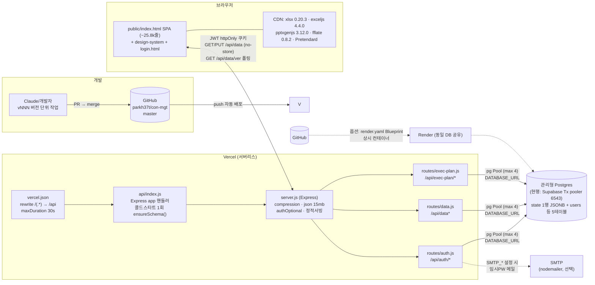

# 03. 아키텍처

> **대상 독자**: 본 시스템(컨버전스 2본부 월별 실적관리 대시보드, `con-mgt`)을 SaaS — 'Club School' AI 실적·인력관리 — 로 재구축·운영하려는 개발/운영팀.
> **정확성 원칙**: 본 문서의 모든 항목은 저장소 코드에서 직접 확인한 내용이며, 근거를 `(파일:라인)` 형식으로 표기했습니다. 라인 번호는 2026-07-07 기준 `master` 브랜치 스냅샷입니다.

---

## 목차

1. [기술 스택](#1-기술-스택)
2. [시스템 관계도](#2-시스템-관계도)
3. [인증·보안](#3-인증보안)
4. [API 전체 표](#4-api-전체-표)
5. [프론트엔드 구조](#5-프론트엔드-구조)
6. [개발·테스트 체계](#6-개발테스트-체계)

---

## 1. 기술 스택

### 1.1 언어·런타임

| 항목 | 값 | 근거 |
|---|---|---|
| 런타임 | Node.js **22 이상** (`engines.node: ">=22"`) | `package.json:7-9` |
| 모듈 방식 | ESM (`"type": "module"`) | `package.json:6` |
| .env 로딩 | Node 내장 `--env-file-if-exists=.env` (dotenv 미사용) | `package.json:11-13` |
| 언어 | JavaScript 단일 (백엔드·프론트 모두, TypeScript/빌드 단계 없음) | 저장소 전체 |

빌드 파이프라인이 **전혀 없다**는 점이 핵심입니다. 번들러·트랜스파일러 없이 소스가 곧 배포 산출물입니다. (Vercel Build Command 비움 — `README.md:88`)

### 1.2 프론트엔드

- **vanilla JS SPA 단일 파일**: `public/index.html` **25,785줄** (CSS·HTML·JS 인라인 일체형). 보조 페이지로 `public/login.html`(299줄), `public/classic.html`(2,131줄, 레거시 화면)이 있습니다.
- **디자인 시스템 자산** (`public/design-system/`):

| 파일 | 역할 | 근거 |
|---|---|---|
| `tokens.css` | 모든 visual primitive 의 single source of truth (색·간격·타이포 토큰) | 파일 헤더 주석 |
| `components.css` | 아토믹 컴포넌트 스타일 (`btn`, `card` 등 클래스 직접 사용) | 파일 헤더 주석 |
| `skin-cost-dashboard.css` | 코스트 대시보드 스킨 — `#pnl-dashboard` 스코프 한정 | 파일 헤더 주석 |
| `skin-manpower.css` | 맨파워 대시보드 스킨 — `#pnl-mp-dashboard` 스코프 한정 | 파일 헤더 주석 |
| `skin-proj-exec.css` | 프로젝트 실행관리 스킨 — `#pnl-proj-exec` + `#execDrawer` 스코프 | 파일 헤더 주석 |
| `app-shell.js` | 사이드바 + 탑바 공통 레이아웃 생성기. `NAV_GROUPS` 에 17개 화면 전부 선언 | `app-shell.js:34-77` |
| `icons.js` | Lucide 스타일 1.5px 스트로크 라인 아이콘 라이브러리 | 파일 헤더 주석 |
| `theme.js` | 테마 (다크모드 전면 비활성 — 사용자 결정) | 파일 헤더 주석 |
| `wylie-logo.png` | 로고 | — |

- **CDN 라이브러리** (전부 `defer` 로드, `public/index.html:30-36`):

| 라이브러리 | 버전 | CDN | 용도 | 근거 |
|---|---|---|---|---|
| SheetJS `xlsx` | **0.20.3** | cdn.sheetjs.com (공식) | 결산 엑셀 업로드 파싱. CVE-2023-30533(프로토타입 오염)·CVE-2024-22363(ReDoS) 패치 버전을 의도적으로 고정 | `index.html:30-32` |
| `exceljs` | **4.4.0** | cdnjs.cloudflare.com | 코스트엑셀·트래커 등 서식 있는 엑셀 생성 | `index.html:33` |
| `pptxgenjs` | **3.12.0** | cdn.jsdelivr.net | 월간회의·임원보고 PPTX 생성 | `index.html:34` |
| `fflate` | **0.8.2** | cdn.jsdelivr.net | 실행관리 엑셀 zip 후처리 (미로드 시 원본 그대로 폴백 — `index.html:18377`) | `index.html:36` |
| Pretendard 폰트 | v1.3.9 | jsdelivr (dynamic subset) | 본문 폰트 | `index.html:412-413` |

> ⚠️ SaaS 재구축 시 유의: CDN 의존이므로 **폐쇄망/온프레미스에서는 이 4개 라이브러리 + 폰트를 self-host** 해야 합니다(06 문서 참고). 프런트 CDN 의 `fflate 0.8.2` 와 서버 npm 의존성 `fflate ^0.8.3`(`package.json:26`)은 별개입니다.

### 1.3 백엔드

- **Express 4** (`express ^4.21.1`, `package.json:25`) 단일 앱. 진입점은 로컬/VM 이면 `server.js`, Vercel 이면 `api/index.js` 래퍼입니다.
- **npm 프로덕션 의존성** (`package.json:20-30`): `bcryptjs`(비밀번호 해시), `compression`(gzip/br — v160, `server.js:24-27`), `cookie-parser`, `exceljs`(서버측 실행관리 엑셀 sync), `express`, `fflate`, `jsonwebtoken`, `nodemailer`(임시PW 메일), `pg`.
- **라우트 모듈** (`server.js:48-50` 에서 마운트):

| 파일 | 마운트 경로 | 내용 |
|---|---|---|
| `routes/auth.js` | `/api/auth` | 로그인/로그아웃/me/비밀번호/프로필 + 회원가입 승인 플로우 + 비밀번호 재발급 + 회원 관리(admin) |
| `routes/data.js` | `/api/data` | state payload GET/PUT(낙관적 락)/ver 폴링/reset |
| `routes/exec-plan.js` | `/api/exec-plan` | 실행관리 엑셀: 표준 템플릿 다운로드, 서버측 셀 sync 다운로드, 원본 다운로드 |

- **미들웨어** (`middleware/auth.js`): `authOptional`(전역, `server.js:46`), `requireAuth`, `requireAdmin`, `requireWritePermission` 4종. 상세는 §3.
- **공통 처리**: `compression()`(`server.js:27`), `express.json({limit:'15mb'})`(`server.js:28`), `cookieParser()`(`server.js:29`), `trust proxy=1`(`server.js:23`), 5xx 원문 마스킹 에러 핸들러(v226, `server.js:78-84`).
- **정적 서빙**: `public/` 을 express.static 으로 서빙하되 **html 은 `no-cache, must-revalidate`**(핫픽스 직후 구버전 캐시 잔존 방지 — v114), js/css 는 프로덕션 1h 캐시 + ETag 재검증 (`server.js:54-64`).

### 1.4 DB — Postgres, "JSONB 단일 state 테이블" 철학

- 드라이버: `pg` Pool — **`max: 4`, `idleTimeoutMillis: 30초`** (`db.js:10-17`). 서버리스 다중 인스턴스를 고려한 소형 풀입니다.
- SSL: `DATABASE_URL` 에 `supabase` 또는 `sslmode=require` 가 포함되면 `{ rejectUnauthorized: false }` (`db.js:12-14`).
- `?` 플레이스홀더를 `$n` 으로 변환하는 경량 래퍼 `query/get/run` (`db.js:19-40`).
- **스키마 5개 테이블** — `ensureSchema()` 가 `CREATE TABLE IF NOT EXISTS` + `ALTER TABLE ADD COLUMN IF NOT EXISTS` 로 멱등 적용 (`db.js:42-114`):

| 테이블 | 역할 | 근거 |
|---|---|---|
| `users` | 계정. `role`(admin/member), `perms JSONB`, `division`, `mapped_person`, `must_change_password`, `status`, `last_login_at` (후속 컬럼은 SCHEMA_PATCH 로 보강) | `db.js:43-50, 98-108` |
| `state` | **업무 데이터 전체가 단 1행**. `id INTEGER PRIMARY KEY DEFAULT 1 CHECK (id = 1)` + `payload JSONB`(~1.6MB) + `updated_at`/`updated_by` | `db.js:52-57` |
| `pending_signups` | 회원가입 요청 큐 (admin 승인 대기) | `db.js:59-73` |
| `password_resets` | 비밀번호 재발급 요청 큐 (admin 승인 대기) | `db.js:75-83` |
| `login_attempts` | 로그인 실패 카운터 (rate limit DB 영속 — v159) | `db.js:85-94` |

**단일 행 JSONB 철학의 트레이드오프** (SaaS 재구축 시 가장 먼저 검토할 지점):

- 장점: 스키마 마이그레이션 거의 불필요(프론트 `_seedVersion` 마이그레이션으로 대체, §5.3), 백업·복원이 "1행 덤프"로 끝남, 프론트가 전체 상태를 한 번에 로드해 오프라인성 계산이 자유로움.
- 제약: (1) 저장 단위가 payload 전체 → 동시 편집은 행 버전(`xmin`) 기반 낙관적 락으로만 방어(§4.1). (2) 페이로드가 커질수록 GET/PUT 비용 선형 증가 — 이미 10MB 상한을 서버가 강제(`routes/data.js:63-65`). (3) **멀티테넌트 SaaS 로 가려면 `state` 1행 → 테넌트별 N행(`tenant_id` 키)으로 확장하는 것이 최소 변경 경로**입니다 (CHECK 제약 제거 + 조회/저장 쿼리에 tenant 조건 추가).

---

## 2. 시스템 관계도

### 2.1 구성 요소와 흐름

- **GitHub repo** (`parkh37t/con-mgt`, 배포 브랜치 `master`) → push 시 **Vercel 자동 배포** (CLAUDE.md 명시, 라이브: https://con-mgt-ruddy.vercel.app/).
- **Vercel 서버리스**: `vercel.json` 이 **모든 경로 `/(.*)` 를 `/api` 로 rewrite** 하고 함수 `api/index.js` 에 `maxDuration: 30`(초)을 부여합니다 (`vercel.json:3-10`). `api/index.js` 는 Express `app` 을 서버리스 핸들러로 export 하며, **콜드 스타트당 1회만 `ensureSchema()`** 를 수행합니다(promise 메모이즈 + 실패 시 재시도 리셋, `api/index.js:5-12`). `server.js` 도 자체적으로 `VERCEL` 환경변수 감지 시 동일한 schema-guard 미들웨어를 걸고 `app.listen()` 을 생략합니다 (`server.js:14, 32-44, 87-93`).
- **Postgres 위치**: 코드상 위치 가정은 없고 **`DATABASE_URL` 환경변수 하나로 결정**됩니다 (`db.js:5-11`). 미설정 시 즉시 `process.exit(1)` (`db.js:5-8`). 현행 운영 가정은 **Supabase 관리형 Postgres, Transaction pooler(포트 6543)** 입니다 (`.env.example:8-9`, `README.md:33-38`). 코드가 Supabase 전용 API 를 쓰지 않으므로 Neon/RDS/자체 Postgres 로 교체해도 연결 문자열만 바꾸면 됩니다 (SSL 휴리스틱 `db.js:12-14` 만 확인).
- **브라우저 SPA**: 최초 로드 시 `index.html` 1개 파일 + design-system 자산 + CDN 라이브러리 4종을 받고, 이후 `/api/data` 로 전체 상태를 로드해 클라이언트에서 모든 화면을 렌더링합니다.
- (참고) **Render 동시 배포 경로**도 유지되어 있습니다: `render.yaml`(Blueprint, `node seed.js && node server.js` 시작, `healthCheckPath: /healthz`) — 상시 컨테이너 모델. `scripts/verify-deploys.sh` 가 두 호스트를 동시 점검합니다.

### 2.2 다이어그램

---

## 3. 인증·보안

### 3.1 JWT 쿠키 인증

- **서명**: `jsonwebtoken`, **알고리즘 HS256 고정**(발급·검증 양쪽 — 알고리즘 혼동 공격 차단, v151) (`middleware/auth.js:17, 43`). 페이로드는 `{id, username, role}` 만 담습니다 (`middleware/auth.js:13-19`).
- **만료**: 수명 **3일**(`TOKEN_LIFETIME_SECS = 259200`) + **슬라이딩 갱신** — 남은 수명이 1일 미만이면 요청 처리 중 자동 재발급(Set-Cookie) (v155, `middleware/auth.js:10-11, 51-56`). 탈취 토큰 노출창을 30일→3일로 줄이되 활성 사용자는 재로그인 불필요.
- **쿠키 속성**: `httpOnly + sameSite:'lax' + secure(프로덕션만) + maxAge=수명` — 미들웨어와 로그인 라우트가 동일 옵션을 공유합니다 (`middleware/auth.js:22-29`, `routes/auth.js:27-32`).
- **매 요청 DB 재조회**: `authOptional` 이 토큰 검증 후 users 를 다시 SELECT → perms/status 변경이 즉시 반영되고, **`status='inactive'` 계정은 유효 토큰이 남아 있어도 즉시 차단**됩니다 (v151, `middleware/auth.js:44-49`).
- **프로덕션 시크릿 가드**: `NODE_ENV=production` 인데 `JWT_SECRET` 이 없거나 개발 기본값이면 **기동 자체를 거부**(`process.exit(1)`) (`server.js:16-19`).

### 3.2 로그인 rate limit (DB 영속)

- 실패 카운터를 인메모리가 아닌 **DB 테이블 `login_attempts` 에 영속**(v159) — 서버리스 다중 인스턴스/콜드스타트에서도 카운터가 공유됩니다 (`db.js:85-94`, `routes/auth.js:81-142`).
- 정책: **키 = `소문자아이디|req.ip`**, 윈도우 **10분**, 실패 **7회** 초과 시 429 + `Retry-After` (`routes/auth.js:86-94, 149-155`). IP 는 위조 가능한 XFF 헤더 대신 `trust proxy` 기반 `req.ip` 사용(v226, `routes/auth.js:90-93`, `server.js:23`).
- 실패 기록은 원자적 upsert(윈도우 경과 시 리셋), 기록 시 만료 행 자동 청소, 로그인 성공 시 즉시 카운터 삭제 (`routes/auth.js:119-142, 172`).
- **가용성 우선 fail-open**: DB 오류 시 차단하지 않고 통과시킵니다 (`routes/auth.js:85, 108-116`).
- **타이밍 사이드채널 완화**: 존재하지 않는 계정도 더미 해시로 동일한 bcrypt 비용을 치르게 하여 아이디 열거를 차단합니다 (v199, `routes/auth.js:22-25, 158-162`).

### 3.3 pending_signups 승인 플로우 / password_resets

- **가입**: `POST /api/auth/signup`(공개) → 이메일 형식 검증 + 중복 검사 → `pending_signups(status='pending', perms 전부 none)` 적재 (`routes/auth.js:249-274`).
- **승인**(admin): 임시 비밀번호를 **`crypto.randomInt` 기반**(Math.random 금지 — v157)으로 생성 (`routes/auth.js:44-65`) → `users` 에 `role='member'`, `must_change_password=TRUE` 로 INSERT → SMTP 설정 시 자동 메일 발송, 실패/미설정 시 admin 화면에 임시PW fallback 표시 (`routes/auth.js:285-323`, `utils/mailer.js`).
- **perms 화이트리스트 sanitize**(v157): 클라이언트가 보낸 perms 를 그대로 저장하지 않고 **허용 5모듈(`cost/report/manpower/project/exec`) × 3값(`none/read/write`)만 통과**, 누락 키는 `none`(최소 권한) (`routes/auth.js:67-79`).
- **비밀번호 찾기**: `POST /api/auth/forgot-password`(공개)는 **계정 존재 여부를 응답에 노출하지 않고**(enumeration 방지) 존재 계정만 admin 큐에 적재 → admin 이 resolve 하면 임시PW 재발급 + `must_change_password=TRUE` (`routes/auth.js:328-346, 357-387`).

### 3.4 권한 모델 (role + 영역별 read/write)

- 2계층: **시스템 role**(`admin`/`member`) + **영역별 perms JSONB** `{cost, report, manpower, project, exec}` × `none/read/write`.
- **쓰기 게이트**: `PUT /api/data` 는 `requireWritePermission` — admin 이거나 5개 영역 중 하나라도 `write` 면 허용 (`middleware/auth.js:76-89`, `routes/data.js:55`). **하위 호환 상속 규칙**: `report` 미지정 → `cost` 상속, `exec` 미지정 → `project` 상속 (`middleware/auth.js:80-85`).
- 프론트도 동일 규칙으로 UI 를 게이팅: 패널의 `perm-cost/perm-report/perm-manpower/perm-project/perm-exec` 클래스(`index.html:1953-2483`)와 `canWrite(area)`(`index.html:5939`), admin 전용 패널은 `real-admin-only`. 역할 프리셋(PM 등)은 `index.html:11914-11918`.
- admin 안전장치: **본인 admin 권한 self-demotion 금지**(`routes/auth.js:486-490`), **본인 계정 삭제 금지**(`routes/auth.js:531-533`).
- ⚠️ 서버 쓰기 게이트는 "payload 전체 PUT" 단위라서 **영역별 쓰기 권한의 세부 강제는 프론트 UI 게이팅에 의존**합니다(write 권한이 하나라도 있으면 payload 전체를 보낼 수 있음). SaaS 재구축 시 서버측 영역별 diff 검증 추가를 권장합니다.

### 3.5 /api/data no-store 정책 (v151/v163 — 학습된 결정)

- `GET /api/data` 는 **인증 필수**(v151 — 익명이 전체 손익·실명 데이터를 볼 수 있던 구멍 차단) + 응답 헤더 **`Cache-Control: no-store, no-cache, must-revalidate, max-age=0`** (`routes/data.js:8-21`).
- 사유: v161 에서 ETag/304(no-cache) 최적화를 시도했으나 **1.6MB 손익·실명 payload 가 브라우저 디스크 캐시에 잔존 → 공용 PC 에서 로그아웃 후에도 노출 여지** → v163 에서 되돌림(보안 우선, 본부장 결정). 전송량 절감은 v160 압축으로만 해결 (`routes/data.js:12-15`, `server.js:24-27`). **캐시 최적화로 민감 데이터를 디스크에 남기지 말 것** — 재구축 시에도 유지해야 할 원칙입니다.
- 같은 이유로 `GET /api/auth/me`(v165), `GET /api/data/ver` 도 no-store 입니다 (`routes/auth.js:200-203`, `routes/data.js:29`).

### 3.6 XSS 및 기타 방어

- **출력 이스케이프 3종** (`index.html:4060-4075`): `_esc`(innerHTML 컨텍스트, `&<>"'` 치환), `_escAttr`(속성 컨텍스트 — `_esc` 동일), `_escJs`(인라인 핸들러의 JS 문자열 컨텍스트 — `\`, `'`, `<` 이스케이프). 사용자 유래 문자열을 innerHTML 에 넣을 때 이 헬퍼를 경유하는 것이 코드 규약입니다.
- 보조 정규화: `_nfc`(macOS NFD 입력 정규화), `_normDivStr`(zero-width/NBSP 제거) (`index.html:4076-4085`).
- **5xx 응답 마스킹**: 내부/DB 오류 원문을 클라이언트에 노출하지 않음(v226, `server.js:78-84`).
- **업로드 DoS 방어**: `express.json` 15MB(`server.js:28`), state payload 10MB 초과 413(`routes/data.js:63-65`), 실행관리 xlsx 디코드 후 15MB 상한 + 파싱 실패 400(압축폭탄 완화, v226, `routes/exec-plan.js:103-113`).
- 프런트 xlsx 라이브러리는 CVE 패치 버전(0.20.3) 고정 (`index.html:30`).
- 파일명 sanitize: 다운로드 파일명에서 `\/:*?"<>|` 치환 (`routes/exec-plan.js:200-201, 216`).

---

## 4. API 전체 표

인증 열: `공개`(비로그인 가능) / `로그인`(requireAuth 또는 req.user 체크) / `쓰기권한`(requireWritePermission) / `admin`(requireAdmin).

### 4.1 데이터 (`routes/data.js`, mount `/api/data` — `server.js:49`)

| 메서드 | 경로 | 인증 | 용도 | 근거 |
|---|---|---|---|---|
| GET | `/api/data` | 로그인 | state payload 전체 + `updated_at` + `ver`(xmin) 반환. no-store | `data.js:8-21` |
| GET | `/api/data/ver` | 로그인 | 경량 버전 폴링 — payload 없이 xmin 만 반환(다중 PC 동기화용, v124) | `data.js:26-32` |
| PUT | `/api/data` | 쓰기권한 | payload 전체 저장. `{data, baseVer}` 수신, 낙관적 락(아래) + manpower 완전중복 dedupe + 10MB 상한 | `data.js:55-96` |
| POST | `/api/data/reset` | admin | payload 를 `defaultData()` 로 초기화 | `data.js:98-109` |

**낙관적 락(baseVer/409) 동작** — 별도 버전 컬럼 없이 **Postgres 시스템 컬럼 `xmin`(행 버전, UPDATE 마다 변경)을 동시성 토큰으로 사용**합니다:

1. GET 시 `xmin::text AS ver` 를 함께 반환 → 클라이언트가 `_serverVer` 로 보관 (`data.js:11`, `index.html:4203`).
2. PUT 시 `UPDATE ... WHERE id = 1 AND xmin::text = ?` — 그 사이 다른 사용자가 저장해 xmin 이 바뀌었으면 changes=0 → **409 + 서버 최신 payload/ver 반환** (`data.js:69-81`).
3. 클라이언트 정책(v125/v154): 409 수신 시 **"먼저 저장한 PC 우선"** — 자동 병합하지 않고 저장을 차단(`_conflictBlocked=true`), 로컬 변경분은 `localStorage('_cmgt_save_backup')` 에 백업, 새로고침/동기화로 서버 최신을 받아야 해제 (`index.html:5809-5820, 4057, 5780-5789`).
4. 저장 성공 시 응답의 새 `ver` 로 `_serverVer` 갱신 (`index.html:5832-5834`). 401/403 은 재시도 없이 백업 + 재로그인 유도 (`index.html:5822-5829`).

### 4.2 인증·계정 (`routes/auth.js`, mount `/api/auth` — `server.js:48`)

| 메서드 | 경로 | 인증 | 용도 | 근거 |
|---|---|---|---|---|
| POST | `/api/auth/login` | 공개 (rate limit) | 로그인 → JWT 쿠키 발급, `last_login_at` 갱신, 사용자·perms 반환 | `auth.js:144-193` |
| POST | `/api/auth/logout` | 공개 | 토큰 쿠키 삭제 | `auth.js:195-198` |
| GET | `/api/auth/me` | 공개(옵션 인증) | 현재 사용자 + 최신 perms/status. no-store(v165) | `auth.js:200-213` |
| PUT | `/api/auth/password` | 로그인 | 비밀번호 변경(현재 PW 확인 + 정책: 8자·영문·숫자) | `auth.js:215-231`, 정책 `auth.js:36-41` |
| PUT | `/api/auth/profile` | 로그인 | 본인 표시 이름만 변경(40자 제한) | `auth.js:235-244` |
| POST | `/api/auth/signup` | 공개 | 가입 요청 접수(pending) | `auth.js:249-274` |
| GET | `/api/auth/signups` | admin | 가입 요청 목록 | `auth.js:277-282` |
| POST | `/api/auth/signup/:id/approve` | admin | 승인 → 임시PW 생성·계정 생성·메일 발송(실패 시 fallback) | `auth.js:285-323` |
| POST | `/api/auth/signup/:id/reject` | admin | 가입 거부(사유 기록) | `auth.js:399-413` |
| POST | `/api/auth/forgot-password` | 공개 | 재발급 요청 접수(계정 존재 비노출) | `auth.js:328-346` |
| GET | `/api/auth/forgot-password` | admin | 재발급 요청 목록 | `auth.js:349-354` |
| POST | `/api/auth/forgot-password/:id/resolve` | admin | 임시PW 재발급 + must_change_password | `auth.js:357-387` |
| POST | `/api/auth/forgot-password/:id/reject` | admin | 재발급 거부 | `auth.js:390-396` |
| GET | `/api/auth/users` | admin | 회원 목록 | `auth.js:418-423` |
| POST | `/api/auth/users` | admin | 회원 직접 추가(자동/수동 비밀번호) | `auth.js:426-467` |
| PUT | `/api/auth/users/:id` | admin | perms/매핑/본부/역할/상태/표시명/role 변경 (self-demotion 금지) | `auth.js:470-499` |
| POST | `/api/auth/users/:id/reset-password` | admin | 임시PW 재발급 | `auth.js:502-525` |
| DELETE | `/api/auth/users/:id` | admin | 회원 삭제(본인 금지) | `auth.js:528-537` |

### 4.3 실행관리 엑셀 (`routes/exec-plan.js`, mount `/api/exec-plan` — `server.js:50`)

| 메서드 | 경로 | 인증 | 용도 | 근거 |
|---|---|---|---|---|
| GET | `/api/exec-plan/template` | 로그인 | 표준 실행관리 템플릿 xlsx(base64 내장 `templates/exec-template-v2-b64.js`) 다운로드 | `exec-plan.js:89-94` |
| POST | `/api/exec-plan/sync-download` | 로그인 | 업로드 원본(또는 빈 템플릿)에 프로젝트 메타·인력/손익 매트릭스를 ExcelJS 로 주입 후 서식·수식 보존 다운로드 (15MB 상한, shared formula 정규화, 최대 19명 잘림 헤더 보고) | `exec-plan.js:96-208`, `injectExecData:21-86`, `EXEC_MAX_ROWS:12` |
| POST | `/api/exec-plan/raw-download` | 로그인 | 버저닝 이력 원본 그대로 다운로드 | `exec-plan.js:211-223` |

### 4.4 페이지·기타 (`server.js`)

| 메서드 | 경로 | 인증 | 용도 | 근거 |
|---|---|---|---|---|
| GET | `/healthz` | 공개 | 헬스체크 `{ok, env}` | `server.js:52` |
| GET | `/` | 공개* | 메인 SPA(index.html). *화면 자체는 로그인 게이트가 프론트에서 처리, 데이터는 §3.5 로 보호 | `server.js:67` |
| GET | `/classic` | 공개 | 레거시 화면 | `server.js:68` |
| GET | `/login` | 공개 | 로그인/가입/비밀번호 찾기 페이지 | `server.js:69` |
| GET | `/admin` | admin (아니면 `/login?next=/admin` 리다이렉트) | 관리자 진입 | `server.js:70-76` |

---

## 5. 프론트엔드 구조

### 5.1 패널(pnl-*) 목록과 역할

화면 전환은 SPA 내부에서 `.pnl` div 의 show/hide 로 이루어지며(`showTab`), 사이드바는 `design-system/app-shell.js` 의 `NAV_GROUPS`(17개 화면, `app-shell.js:34-77`)가 생성합니다. 패널 정의는 `index.html:1953-2483`:

| 패널 id | 권한 클래스 | 화면 (사이드바 라벨) |
|---|---|---|
| `pnl-dashboard` | perm-cost | 코스트 대시보드 (월별 손익, 분리/통합 뷰) |
| `pnl-labor` | perm-cost | 인건비 |
| `pnl-invoice` | perm-cost | 매출세금계산서 |
| `pnl-payment` | perm-cost | 입금 |
| `pnl-purchase` | perm-cost | 매입 (턴키) |
| `pnl-expense` | perm-cost | 직접비 · 간접비 |
| `pnl-contract` | perm-cost | 25년이월·26년계약 (누적 계약매출) |
| `pnl-report` | perm-report | 보고자료 (월간회의/임원보고 PPTX·첨부·트래커 다운로드 허브) |
| `pnl-mp-dashboard` | perm-manpower | 맨파워 대시보드 |
| `pnl-mp-schedule` | perm-manpower | 역할별 투입 일정 |
| `pnl-mp-monthly` | perm-manpower | 월별 투입실적 |
| `pnl-mp-rates` | perm-manpower | 표준단가 |
| `pnl-proj-list` | perm-project | 프로젝트 / 영업 현황 |
| `pnl-proj-weekly` | perm-project | 주간보고 · 이슈 |
| `pnl-proj-exec` | perm-exec | 프로젝트 실행관리 (P&L 시뮬레이션 `#execDrawer` 포함) |
| `pnl-admin-users` | real-admin-only | 회원 관리 |
| `pnl-admin-perms` | real-admin-only | 권한 관리 |
| `pnl-design-system` | (없음) | 디자인 시스템 쇼케이스 |

### 5.2 렌더 함수 네이밍 규칙

**`render<도메인><뷰>()`** 패턴의 전역 함수가 각 패널/위젯을 innerHTML 로 재생성합니다. 대표 목록(전수는 `grep "function render" public/index.html`):

- 실적: `renderDashboard`(7253), `renderLabor`(7630), `renderInvoice`(7663), `renderPayment`(7679), `renderPurchase`(7695), `renderExpense`(7719), `renderContract`(7752), `renderIntegratedDashboard`(23639), `renderChart`(24729), `renderTop5Margin`(24759), `renderProjectMarginTable`(24799)
- 맨파워: `renderManpowerDashboard`(8323), `renderManpowerKpiCards`(8084), `renderManpowerAvailMatrix`(8116), `renderManpowerForecast`(8228), `renderManpowerMonthly`(8770), `renderStandardRates`(8933), `renderManpowerSchedule`(9108)
- 프로젝트: `renderProjectList`(10308), `renderWeeklyReport`(10881), `renderProjectDetail`(11564), `renderProjectExecList`(13175), `renderExecDetail`(15391)
- 보고서: `renderReportTab`(20694), `renderReportPreview`(20744)
- 관리: `renderAdminUsers`(11987), `renderAdminPerms`(12179), `renderUserArea`(24963), `renderDesignSystem`(3110)

### 5.3 상태 관리

- **전역 `data`**: 서버 `state.payload` 의 클라이언트 사본. `let data = defaultData()` 플레이스홀더로 시작해 `init()` 의 `loadFromServer()` 가 교체 (`index.html:4171, 4203`).
- **`currentDivision`**: 본부 토글(컨버전스 2본부/3본부). localStorage 영속, 실적/프로젝트/맨파워 화면에 적용(임원보고는 통합) (`index.html:2670-2672`). 본부별 데이터는 `data._divData[본부명]` 에 분리 저장됩니다 (`index.html:22390`).
- **동시성 상태**: `_serverVer`(서버 xmin), `_baseSnapshot`(마지막 저장 성공 시점 사본), `_conflictBlocked`(409 후 저장 차단 플래그) (`index.html:4056-4057`). 저장은 디바운스 후 `PUT /api/data` + 백오프 재시도 (`index.html:5800-5849`).
- **버전 폴링 동기화**: focus/주기마다 `GET /api/data/ver` 로 xmin 만 확인 → 다르면 `loadFromServer()` 재동기화 (`index.html:6494-6533`).
- **캐시·무효화 함수**: 파생 계산 메모이즈 2계와 그 무효화 —
  - `_divForecastCache` + `_invalidateForecast()` (`index.html:6103`) — 본부 예측 캐시. 데이터 변경/본부 swap 시 호출 (`index.html:5953, 2935`).
  - `_PNL_DATA` + `_invalidatePnLCache()` (`index.html:12814`) — 실행관리 P&L 캐시(+ `_execDataVer` 매트릭스 메모이즈 동반 무효화).
- **클라이언트측 데이터 마이그레이션**: `loadFromServer` 후 `_seedVersion` 필드 기준의 순차 마이그레이션 블록(v7 → … → v43+)이 payload 스키마를 진화시킵니다 (`index.html:4212` 이후 다수). **반드시 오름차순 실행** — 내림차순 배치로 v37 이 영원히 스킵된 버그 이력이 주석으로 남아 있습니다 (`index.html:4874-4883`).

### 5.4 보고서 생성기 위치

모두 `public/index.html` 인라인(브라우저에서 CDN pptxgenjs/ExcelJS 로 생성), 보고자료 패널(`pnl-report`)에서 트리거:

| 산출물 | 함수 | 위치 | 비고 |
|---|---|---|---|
| **월간회의 PPTX (v1.1 · 20슬라이드)** | `downloadMonthlyMeeting()` | `index.html:21680` (생성부 21488~) | 최종본 v1.1 통파재현 + 선택 월 라이브 반영 |
| **월간회의 데이터 트래커 XLSX** | `_downloadMeetingTracker(month)` | `index.html:21760` (개요 21701) | 업로드 원본 7시트 통파재현. 월간회의 PPTX 와 **세트 자동 다운로드** (`index.html:21696-21698`) |
| **임원보고 PPTX (11슬라이드)** | `downloadMonthlyReport()` | `index.html:20866` (템플릿 주석 20862-20864) | 13.33"×7.5" 16:9, 본부 통합 관점 |
| **첨부자료 XLSX (4시트)** | `downloadAttachmentExcel()` | `index.html:22140` (개요 22125) | 매출Fcst/영업상세/프로젝트/AX |
| **코스트엑셀 (다운로드)** | `downloadExcel()` | `index.html:22383-22420` | 통합/2본부/3본부 월별 손익 + 누적 계약매출 + 본부별 월별 상세, 수식 포함 |
| **코스트엑셀 (업로드)** | `uploadExcel()` → `processExcelUpload()` | `index.html:22423-22426, 22448` | 결산 월 마감 입력 경로(06 문서 §5.5) |
| 맨파워 엑셀 | `downloadManpowerExcel()` | `index.html:20181` | — |
| 실행관리 엑셀 | `downloadExecGenerated(pid)` 등 | `index.html:17557-17574` | 서버 `/api/exec-plan/*` 와 연동 |

---

## 6. 개발·테스트 체계

### 6.1 버전 단위(vNNN) 워크플로 (CLAUDE.md 규약)

1. 모든 코드 변경은 **버전 단위(vNNN)** 로 진행하고, 해당 버전의 단위 테스트 `_vNNN_test.cjs` 를 함께 작성합니다.
2. **전체 회귀**: `_v*_test.cjs` 전체를 실행해 직전 baseline 대비 **신규 실패 0** 을 확인합니다(일부 테스트는 프론트 드리프트로 사전 존재 실패 — baseline 과 동일 집합이면 통과로 간주). `node --check` 구문 검사도 필수.
3. master 기준 새 브랜치(`claude/<주제>`) → PR → squash/rebase 머지 → 브랜치 폐기(브랜치 재사용 금지). master 이력 선형 유지.
4. 커밋 허용 파일은 소스/테스트/문서만 — 실데이터·진단 산출물(`_live*`, `_tmp_*`, `_BACKUP*`)은 `.gitignore` 로 커밋 금지.

### 6.2 회귀 테스트 자산 — `_v*_test.cjs` 188개

- 저장소 루트에 **188개**의 `_v*_test.cjs` 파일(v52~v234, 실측 `ls _v*_test.cjs | wc -l`)이 있으며, 정적 단언(소스 문자열/구조 검사)과 jsdom 런타임 검증이 혼재합니다.
- 대형 통합 테스트: `integration_test.cjs`(`npm test`), `scenario_test.cjs`, `integrated_test.cjs` (`package.json:15-17`). 통합/시나리오 테스트는 `xlsx` 가 필요하며 프로덕션 `npm ci` 와 분리하기 위해 별도 안내 주석이 있습니다 (`package.json:19`) — 현재는 `jsdom ^29.1.1`, `xlsx ^0.18.5` 가 devDependencies 에 있습니다 (`package.json:31-34`).

### 6.3 jsdom 하네스 — `_test_harness.cjs`

`public/index.html` 의 **실제 함수를 그대로 실행**해 검증하는 영구 하네스입니다 (`_test_harness.cjs:1-89`):

- index.html 의 인라인 `<script>` 를 추출해 jsdom `window.eval` 로 로드하고, 메인 스크립트에 `__hook.evalIn`(직접-eval 훅)을 심어 **top-level `let data` 등 lexical 스코프에 접근**합니다 (`_test_harness.cjs:27-77`). (window.eval 의 top-level let/const 는 바깥에서 접근 불가하다는 제약을 우회하는 핵심 장치.)
- 앱의 지연 init 크래시를 막기 위해 `setTimeout/rAF/addEventListener` 를 무력화하고, Node ExcelJS 가 jsdom Date 를 거부하므로 `window.Date = Date` 로 고정합니다 (`_test_harness.cjs:12-14, 39, 66-68`).
- 픽스처: 기본 합성 픽스처 `_test_fixture.json`(커밋됨). `_tmp_*`/`_live*` 실데이터 픽스처는 커밋 금지이며 **부재 시 SKIP 으로 정상 종료**해 CI 회귀 신호를 오염시키지 않습니다 (v200, `_test_harness.cjs:49-59`).
- 사용법: `const { evalIn } = require('./_test_harness.cjs').loadApp();` → `evalIn('JSON.stringify(_buildExecMatrix(data.projects[0]))')`.

### 6.4 백엔드/E2E

- 백엔드·DB 검증이 필요하면 로컬 Postgres(`/usr/lib/postgresql/16/bin`)를 임시 기동해 e2e 확인이 가능합니다(CLAUDE.md 테스트 메모).
- 배포 후 스모크: `scripts/verify-deploys.sh` 가 Render/Vercel 두 호스트의 상태코드·리다이렉트를 curl 로 일괄 검증합니다.
