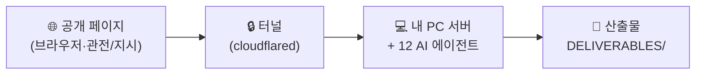

# APEX 가상 사무실 — 사용 매뉴얼

12명의 AI 에이전트가 **G1~G6 게이트 파이프라인**으로 프로젝트를 수행하는 가상 사무실입니다.
사용법은 두 가지 — **① 공개 링크로 그냥 보기**, **② 내 PC에서 실제 에이전트에게 일 시키기**.

---

## 🔗 공개 링크 (북마크)

| 화면 | 주소 |
| --- | --- |
| 메인 대시보드 | https://parkh37t.github.io/clubschool/ |
| **가상 사무실 (핵심)** | https://parkh37t.github.io/clubschool/?view=virtual-office |
| 픽셀 사무실 (단독) | https://parkh37t.github.io/clubschool/office.html |
| 조직도 (릴스형) | https://parkh37t.github.io/clubschool/team.html |

로그인 없이 **브라우저 주소창**에 넣으면 바로 열립니다.

---

## 🧭 두 가지 사용법

- **👀 그냥 보기** — 위 링크만 열면 자체 데모가 자동 재생됩니다. 준비물·비용 없음. 단, **실제로 일하지는 않습니다.**
- **⚙️ 실제로 일 시키기** — 내 PC에서 **서버 + 터널**을 켜고, 공개 페이지를 그 주소에 `?api=`로 연결하면 **진짜 에이전트가 문서를 만듭니다.**

### 실제 실행 구조



> 화면은 **창구**일 뿐, 실제 계산·문서 생성은 **내 PC**에서 일어납니다.
> 공개 사이트 혼자서는 실행 불가 — API 키·서버가 브라우저에 있으면 안 되니까요(보안).

---

## ▶ 서비스 시작 (Windows)

**준비물 (최초 1회):** Node.js 20+ · git · cloudflared · Anthropic API 키

```powershell
# 최초 1회 — 저장소 받고 서버 부품 설치
git clone https://github.com/parkh37t/clubschool.git
cd clubschool/server
npm.cmd install
```
> PowerShell에서 `npm`이 보안정책으로 막히면 `npm.cmd`를 쓰세요.

### 1) 서버 켜기 · *이 창은 켜둠*

```powershell
cd clubschool/server

# 무료 확인용(mock) — 키 불필요:
node office-server.mjs

# 실제 실행(live) — 새 키를 넣고:
$env:ANTHROPIC_API_KEY="sk-ant-새키"
$env:OFFICE_MODE="live"
node office-server.mjs          # → (모드: live) 가 뜨면 성공
```

### 2) 터널 켜기 · *새 PowerShell 창*

```powershell
cloudflared tunnel --url http://localhost:8787
```
출력에 뜨는 **`https://….trycloudflare.com`** 주소를 복사하세요. **켤 때마다 주소가 바뀝니다.**

### 3) 브라우저에서 연결

주소창에 공개 주소 + `&api=` + 방금 복사한 터널 주소:

```
https://parkh37t.github.io/clubschool/?view=virtual-office&api=<터널주소>
```
지시 콘솔에 **“백엔드 연결됨”**이 뜨면 성공.

### 4) 지시하고 관전하기

지시 콘솔에 **과제명 · 목표** 입력 → **RFP 텍스트 붙여넣기** 또는 **📎 파일 첨부**(PDF·워드·텍스트) → 게이트(G1~G6) 선택 → **지시 보내기**.
→ 화면이 실시간 반영되고, 결과 파일은 PC의 `DELIVERABLES/<과제명>/` 에 쌓입니다.

---

## ■ 서비스 멈추기

| 대상 | 방법 |
| --- | --- |
| 🖥️ 서버 창 | 창 클릭 → `Ctrl + C` (또는 창 닫기) |
| 🔒 터널 창 | 창 클릭 → `Ctrl + C` (또는 창 닫기) |
| 🌐 브라우저 | 탭 닫기 |

멈추면 공개 화면은 **자동으로 데모로 돌아갑니다.**

---

## ⚠️ 주의사항

- **API 키는 내 PC 서버에만.** 채팅·화면·저장소에 붙이거나 캡처하지 마세요. 노출되면 [Anthropic 콘솔](https://console.anthropic.com)에서 삭제(Revoke) 후 재발급.
- **live는 지시 1건마다 API 요금**이 듭니다. 연습은 `mock`(무료)으로, 첫 실행은 게이트 1~2개만.
- **터널 주소는 켤 때마다 바뀝니다.** 매번 새 주소로 `?api=` 연결하세요.
- **코드가 바뀌면** 저장소에서 `git pull` 후 서버를 다시 켜세요.
- PC·서버·터널이 **켜져 있는 동안만** 실제 실행됩니다.

---

## 📎 참고 문서

- 서버 오케스트레이터 상세: [`server/README.md`](server/README.md)
- 배포: [`DEPLOY.md`](DEPLOY.md) · [`QUICK_DEPLOY.md`](QUICK_DEPLOY.md)
- 프로젝트 개요/규칙: [`CLAUDE.md`](CLAUDE.md)
